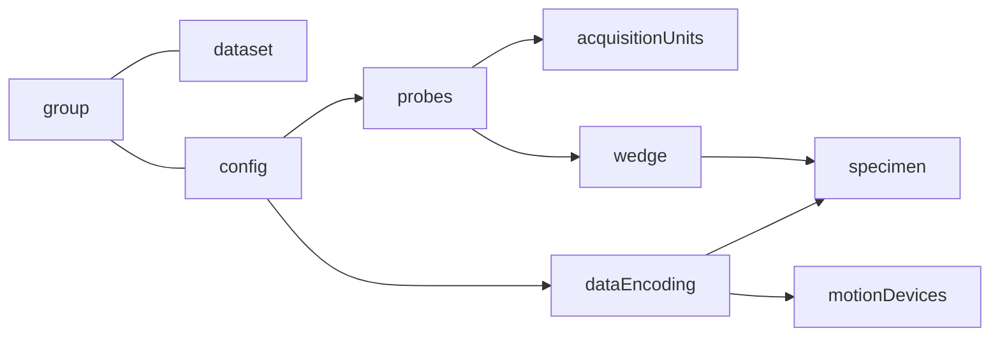

# File structure 
(X- “evident nde dataset formats.pptx”, “NDE Format Git” ) 

```
Internal file hierarchy view.

├── Domain
│   ├── Setup  [JSON Metadata]
│   └── DataGroups
│       └── 0
│           └── Datasets
│               └── 0
│                   ├── DataType A [N Dimensions]
│                   └── DataType B [N Dimensions]
├── Applications 
│   └── AppName
│       └── Custom Datasets
```

### Metadata
Interpretation of the data can be achieved by reading a JSON structure which can be accessed at the following dataset path: /Domain/Setup.

#### Data
* Any shared data types can be read or write from /Domain/DataGroups path.
* Datasets can be associated with a confguration but his basic interpretation is independent.
* Standard JSON objects are defined to describe dataset properties.

---
Graph representation of the JSON.


---

Dataset are grouped by configuration and their dimensions are described into the JSON.

```yaml
JSON Group object example containing dataset and a phased array configuration.

{
  "groups": [
    {
      "id": 0,
      "name": "Gr-1",
      "dataset": {
        "storageMode": "Paintbrush",
        "ascan": {
          "velocity": 5890,
          "skewAngle": 0.0,
          "refractedAngle": 0.0,
          "amplitude": {
            "path": "/Domain/DataGroups/0/Datasets/0/Amplitude",
            "dimensions": [...],
            "dataValue": {...},
            "dataSampling": {...}
          },
          "status": {
            "path": "/Domain/DataGroups/0/Datasets/0/Status",
            "dimensions": [...],
            "dataValue": {...}
          }
        },
        "gateCscans": [
          {
            "gateId": 1,
            "path": "/Domain/DataGroups/0/Datasets/1/CScan",
            "dimensions": [...]
      }
      "paut": {    <----- phased array configuration
        "beams": [
          ...  
        ]
        ...
      }
    }
  ]
}
```

