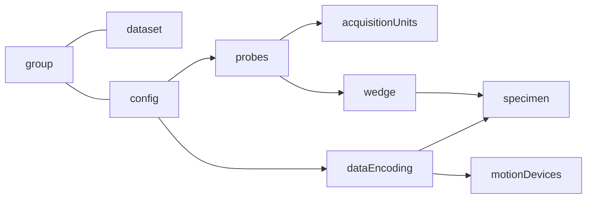

# Mission statement

The aim of this project is to share NDT data between multiple stakeholders. Data are stored using HDF5 file format combined to a JSON text format to describe the metadata associated.

### Scenarios concept
Set of predefined conventions to keep simple things simple.
Scenarios available are *General Weld* and *General Mapping*.

### File structure
```
Internal file hierarchy view.

├── Domain
│   ├── Setup  [JSON Metadata]
│   └── DataGroups
│       └── 0
│           └── Datasets
│               └── 0
│                   ├── DataType A [N Dimensions]
│                   └── DataType B [N Dimensions]
├── Applications 
│   └── AppName
│       └── Custom Datasets
```
#### Metadata
Interpretation of the data can be achieved by reading a JSON structure which can be accessed at the following dataset path: /Domain/Setup.

#### Data
* Any shared data types can be read or write from /Domain/DataGroups path.
* Datasets can be associated with a confguration but his basic interpretation is independent.
* Standard JSON objects are defined to describe dataset properties.

---
Graph representation of the JSON.


---
Dataset are grouped by configuration and thiers dimensions are described into the JSON.

```yaml
JSON Group object example containing dataset and a phased array configuration.

{
  "groups": [
    {
      "id": 0,
      "name": "Gr-1",
      "dataset": {
        "storageMode": "Paintbrush",
        "ascan": {
          "velocity": 5890,
          "skewAngle": 0.0,
          "refractedAngle": 0.0,
          "amplitude": {
            "path": "/Domain/DataGroups/0/Datasets/0/Amplitude",
            "dimensions": [...],
            "dataValue": {...},
            "dataSampling": {...}
          },
          "status": {
            "path": "/Domain/DataGroups/0/Datasets/0/Status",
            "dimensions": [...],
            "dataValue": {...}
          }
        },
        "gateCscans": [
          {
            "gateId": 1,
            "path": "/Domain/DataGroups/0/Datasets/1/CScan",
            "dimensions": [...]
      }
      "paut": {    <----- phased array configuration
        "beams": [
          ...  
        ]
        ...
      }
    }
  ]
}
```


#### Standard objects

| Root objects  | Descriptions                                         |
|------------------------| -----------------------------------------------------|
| $schema                | Schema associated with the JSON                      |
| version                | File format version                                  |
| scenario               | Conventions used                                     |
| groups                 | Datasets metadata and configuration                  |
| dataEncodings          | Representation of the data vs the specimen           |
| specimens              |                                                      |
| probes                 |                                                      |
| wedges                 |                                                      |
| acquisitionUnits       |                                                      |
| motionDevices          |                                                      |

| group objects   | Descriptions |
| -------- | ----------- |
| dataset | ...  |
| ut | ...  |
| paut | ...  |
| fmc | ...  |

| dataset objects   | Descriptions |
| -------- | ----------- |
| ascan | ... |
| gateCscan | ... |
| firingSource | ... |
| elementaryAscan | ... |
| tfm | ... |
| pci | ... |
---

### Documentation 


<a href="https://globalscientificsolutions.sharepoint.com/:w:/t/PASolutions322/EX2yNbazQ7lKrHWMGwn7bl0BGZLyq_Uj5knynBCjOROF9g?e=ZoJM2W" target="_blank">Plate and weld general conventions (short documentation)</a>

<a href="https://olympusssa.sharepoint.com/:w:/r/sites/KlB/Shared%20Documents/TW/Unified%20File%20Format/Unified%20File%20Format%20general%20conventions.docx?d=w00b5672e7bbd466a92128bafd94ad257&csf=1&web=1&e=35tfA3" target="_blank">General conventions</a>

<a href="https://globalscientificsolutions-my.sharepoint.com/:w:/g/personal/jonathan_cote_evidentscientific_com/EQUpcALjWgpEn5VTaHXJ-EwBWEQiKwElMWDMCBVjQZYp1w?e=Gdi7Ry&ovuser=e6d7ba17-4378-433f-96fa-a48c4590ca82%2Ceric.aubin%40olympus-ossa.com&clickparams=eyJBcHBOYW1lIjoiVGVhbXMtRGVza3RvcCIsIkFwcFZlcnNpb24iOiIyNy8yMjEwMjgwNzIwMCIsIkhhc0ZlZGVyYXRlZFVzZXIiOmZhbHNlfQ%3D%3D" target="_blank">Universal File Format</a>

 
|  |  |  |
| - | - |- |

|  |
| -

|  |  |
| - | -

|  |
| - 

---

### Versioning
Versioning...

#### Validation
Validation...

#### Compatibility
Compatibility...

---

### Security
Integrity, authenticity, confidentiality...

---

### Examples
#### Minimum required
How to create a simple .nde file.
TODO

---

### Changelog
All notable changes to the format will be documented in this file.
It is based on [Keep a Changelog](https://keepachangelog.com/en/1.0.0/), and adheres to [Semantic Versioning](https://semver.org/spec/v2.0.0.html).

#### [Unreleased]

#### [3.0.0-Beta] - 2022-12-01
#### Added
- [EAB] Schema version 3.0.0-Beta + compatibility code to upgrade from previous version.
- [1] New *dataset* object including an uniform description of each axes.
- [1] *linearPitchCatch, sectorialPitchCatch, compoundPitchCatch* specialization.
- [1] *boxGate* in *fmc/tfm/analysis* object.
- [1] *analysis* object in *ut, paut and fmc/tfm* to include modifications to be applied on original data.
- [1] *mapGain* object in *fmc/tfmConfig*.
- [1] *beams/gain* in *ut/analysis and paut/analysis* object.
- [1] *angle* propertie to *focusing* object.
- [1] *Unfocused* and *Projection* choices added to *focusing/mode* propertie.
- [1] *conventionalSquare* probe object.
- [2] *paut/custom* object to support .law file configuration.
- [2] Custom overlay...
- [2] Thickness parameters...
- [2] *clicker motiondevice*...
- [EAB] Reuse *tcg* object in *ut/analysis and paut/analysis* object. 
- [EAB] Reuse *gates and beams/gates* in *ut/analysis and paut/analysis* object.
  
#### Changed
- [1] *dataGroups* list renamed to *groups*.
- [1] *ascanStart* and *ascanLength* properties moved outside of *ultrasoundAxis*.
- [1] Move acquisition unit properties out of *omniScanX3* and *focusPX* object.
- [MSL] Move specific parameters from *ultrasound/conventionalPulseEcho* to *ut/pulseEcho* object.
- [MSL] Move specific parameters from *ultrasound/conventionalPitchCatch* to *ut/pitchCatch* object.
- [MSL] Move specific parameters from *ultrasound/tofd* to *ut/tofd* object.
- [MSL] *ut* replace *ultrasound/conventionalPulseEcho*, *ultrasound/conventionalPitchCatch* and *ultrasound/tofd*.
- [MSL] Move specific parameters from *ultrasound/sectorialPulseEcho* to *paut/sectorialPulseEcho* object.
- [MSL] Move specific parameters from *ultrasound/linearPulseEcho* to *paut/linearPulseEcho* object.
- [MSL] Move specific parameters from *ultrasound/compoundPulseEcho* to *paut/compoundPulseEcho* object.
- [MSL] *paut* replace *ultrasound/sectorialPulseEcho*, *ultrasound/linearPulseEcho* and *ultrasound/compoundPulseEcho*.
- [MSL] *fullMatrixCapture* object renamed to *fmc*.
- [MSL] *fullMatrixCapture/tfmDescription* renamed *fmc/tfmConfig*.
- [EAB] Code examples updated.
  
#### Removed
- [1] *datasets* list from any configuration specialization.
- [1] *ultrasoundAxis* including *ascanResolution* from beam object.
- [1] *amplitudePercentAxis* from any configuration specialization.
- [1] *analysisBeamGain* from *processes* list.
 
### [2.2.13] - 2022-10-01
#### Added
- TODO

#### Changed
- TODO

#### Removed
- TODO

### [2.2.12] - 2022-09-01
- Initial version supported.
