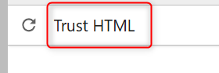
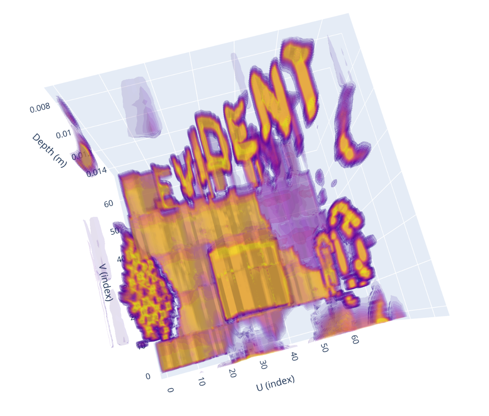

---
hide:
- toc
---

# Displaying 0° Raster Scan Data in 3D

To learn how to generate a display 0° raster scan data stored in a .nde data file in 3D, follow the steps outlined below, based on this [example file](../examples/example-files/index.md#composite-wheel-probe-scanning-using-phased-array-ultrasonic-testing-paut) provided for a wheel probe scanning. 

Start by loading the [Setup](../json-metadata/setup/index.md) JSON formatted dataset from the .nde file and parse it to a Python dictionary. Note that for this exercise, we will first load all the required modules. 

```python
import micropip
await micropip.install("plotly") 
import h5py
import json
import numpy as np
import plotly.graph_objects as go
import matplotlib.pyplot as plt
from IPython.display import FileLink

nde_file = h5py.File('CFRP_Plate_PA-Lin0_sk90-Analysis-4.1.nde', 'r')

# Navigate to the path in the HDF5 file where the Setup JSON dataset is stored
setup_json = nde_file['Public/Setup'][()]
# Decode the JSON string
setup_json = setup_json.decode('utf-8')
# Parse the JSON string into a Python dictionary
setup_data = json.loads(setup_json)

```
Then, iterate through groups to retrieve group names, ids, and datasets and print the related datasets information.  

``` python
for group in setup_data.get('groups', []):
    group_id = group.get('id')
    group_name = group.get('name')
    
    print(f"Group ID: {group_id}, Group Name: {group_name}")
    
    # Retrieve datasets
    datasets = group.get('datasets', [])
    for dataset in datasets:
      dataset_id = dataset.get('id')
      dataset_class = dataset.get('dataClass')
      dataset_path = dataset.get('path')
      print(f"  Dataset ID: {dataset_id}, '"
            f" Data Class: {dataset_class}, '"
            f" Data Path: {dataset_path}")
```

The above code should output the following: 

``` { .bash .no-copy }
Group ID: 0, Group Name: GR-1
  Dataset ID: 0, ' Data Class: AScanAmplitude, ' Data Path: /Public/Groups/0/Datasets/0-AScanAmplitude
  Dataset ID: 1, ' Data Class: AScanStatus, ' Data Path: /Public/Groups/0/Datasets/1-AScanStatus
  Dataset ID: 2, ' Data Class: FiringSource, ' Data Path: /Public/Groups/0/Datasets/2-FiringSource
```

We see that the file contains one group named *GR-1* and three datasets. A-scans will be stored in a dataset assigned a *AScanAmplitude* Data Class and its path is `/Public/Groups/0/Datasets/0-AScanAmplitude`

Let's now display the size of this specific dataset, still from the Setup dataset metadata.


``` python
# Retrieve AScanAmplitude dataset dimensions
dimensions = setup_data['groups'][0]['datasets'][0].get('dimensions', [])
print("AScanAmplitude Dataset Dimensions:")
for dimension in dimensions:
    axis = dimension.get('axis')
    quantity = dimension.get('quantity')
    resolution = dimension.get('resolution')
    print(f" Axis: {axis}, Quantity: {quantity}, Resolution: {resolution}")
```

The above code should output the following: 

``` { .bash .no-copy }
AScanAmplitude Dataset Dimensions:
 Axis: UCoordinate, Quantity: 641, Resolution: 0.001
 Axis: VCoordinate, Quantity: 271, Resolution: 0.0008000000000000043
 Axis: Ultrasound, Quantity: 524, Resolution: 5.0000000000000004e-08
```

So we now know that we have 641 x 271 = 173 711 A-scans recorded at different positions along the U and V axes and that each A-scan has a length of 524 points, each point being spaced by 50 nanoseconds. 


Let's now use this boilerplate application, whose code was mostly generated using AI, to simply display the raw A-Scans data in 3D: 

``` python
depth_m_range = (0.007, 0.015)   # (min_m, max_m), e.g. (0.005, 0.020) for 5–20 mm

# Downsampling for HTML export
target_vox = 64                   # ~64³ for smooth interactivity
html_path  = "ascans_3d.html"

# --- Load volume ---
vol = np.array(nde_file['/Public/Groups/0/Datasets/0-AScanAmplitude'])

U, V, T = vol.shape
vol = np.nan_to_num(vol)

# --- Axes construction ---
u = np.arange(U, dtype=np.float32)
v = np.arange(V, dtype=np.float32)
t = np.arange(T, dtype=np.float32)

# Time and depth axes (meters)
dt_s = setup_data['groups'][0]['datasets'][0]['dimensions'][2]['resolution']
sound_speed_m_s = setup_data['groups'][0]['processes'][0]['ultrasonicPhasedArray']['velocity']

t_axis_s = np.arange(T, dtype=np.float32) * dt_s
depth_m = (t_axis_s * sound_speed_m_s / 2.0)  # two-way travel depth (meters)

# --- Select depth portion ---
zmin, zmax = depth_m_range
if zmin > zmax:
    zmin, zmax = zmax, zmin

# Indices corresponding to the physical range
i0 = int(np.clip(np.searchsorted(depth_m, zmin, side="left"), 0, T-1))
i1 = int(np.clip(np.searchsorted(depth_m, zmax, side="right")-1, 0, T-1))

# Apply cropping
vol = vol[:, :, i0:i1+1]
t   = t[i0:i1+1]
T   = vol.shape[2]
if depth_m is not None:
    depth_m = depth_m[i0:i1+1]

# --- Downsampling for HTML export ---
su = max(1, U // target_vox)
sv = max(1, V // target_vox)
st = max(1, T // target_vox)
vol_ds = vol[::su, ::sv, ::st]

# Flip along V-axis
vol_ds = vol_ds[:, ::-1, :]

U2, V2, T2 = vol_ds.shape

# Downsampled axes (use physical depth if available)
u_ds = np.arange(U2, dtype=np.float32)
v_ds = np.arange(V2, dtype=np.float32)
if depth_m is not None:
    z_lin = depth_m
    z_ds  = z_lin[::st]
    z_title = "Depth (m)"
    z_range = [float(z_ds.min()), float(z_ds.max())]
else:
    z_ds = np.arange(T2, dtype=np.float32)
    z_title = "Time/Depth (index)"
    z_range = [float(z_ds.min()), float(z_ds.max())]

# 3D grid
uu, vv, zz = np.meshgrid(u_ds, v_ds, z_ds, indexing="ij")

# Robust isosurface range
p2, p98 = np.percentile(vol_ds, [2, 98])
if not np.isfinite(p2) or not np.isfinite(p98) or p98 <= p2:
    p2, p98 = float(vol_ds.min()), float(vol_ds.max() + 1e-3)

# --- Plotly 3D volume figure ---
fig = go.Figure(data=go.Volume(
    x=uu.ravel(), y=vv.ravel(), z=zz.ravel(),
    value=vol_ds.ravel(),
    isomin=p2, isomax=p98,
    opacity=0.12, surface_count=15,
    caps=dict(x_show=False, y_show=False, z_show=False)
))
fig.update_layout(
    title=f"3D A-Scans — Depth slice [{z_range[0]:.4g}, {z_range[1]:.4g}] ({U2}×{V2}×{T2})",
    scene=dict(
        xaxis_title="U (index)",
        yaxis_title="V (index)",
        zaxis_title=z_title,
        zaxis=dict(range=z_range[::-1])
    ),
    height=720,
    margin=dict(l=0, r=0, t=40, b=0)
)

# --- Export as standalone HTML ---s
fig.write_html(html_path, include_plotlyjs="cdn")
FileLink(html_path)
```

The application will generate an HTML file with a 3D viewer you can open using any web browser. Just click on the link outputted by the app to open it in your Jupyter Notebook and click **Trust HTML**



Wait a few seconds, you should now see: 

<figure markdown="span">
    { width = "200"}
</figure>


Feel free to play with the code, modify parameters, and explore how the results change, experimentation is the best way to learn!


