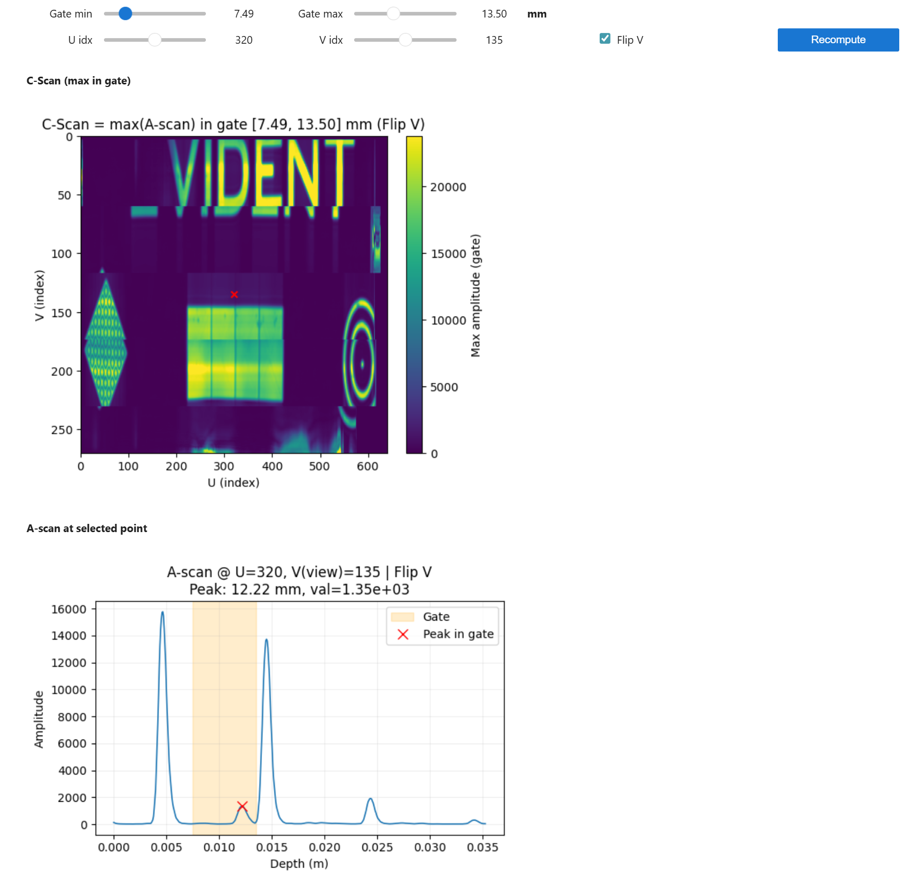

---
hide:
- toc
---

# Gate-Based C-Scan from 0° Raster Scan Data

To learn how to generate a C-scan computed as max(A-scan) inside a gate at each (U,V) location of 0° Raster Scan .nde data file, follow the steps outlined below, based on this [example file](../examples/example-files/index.md#composite-wheel-probe-scanning-using-phased-array-ultrasonic-testing-paut) provided for a wheel probe scanning. 

Start by loading the [Setup](../json-metadata/setup/index.md) JSON formatted dataset from the .nde file and parse it to a Python dictionary. Note that for this exercise, we will first load all the required modules. 

```python
import micropip
await micropip.install("ipywidgets")
import h5py
import json
import numpy as np
import matplotlib.pyplot as plt
import ipywidgets as widgets
from IPython.display import display, clear_output

nde_file = h5py.File('CFRP_Plate_PA-Lin0_sk90-Analysis-4.1.nde', 'r')

# Navigate to the path in the HDF5 file where the Setup JSON dataset is stored
setup_json = nde_file['Public/Setup'][()]
# Decode the JSON string
setup_json = setup_json.decode('utf-8')
# Parse the JSON string into a Python dictionary
setup_data = json.loads(setup_json)

```
Then, iterate through groups to retrieve group names, ids, and datasets and print the related datasets information.  

``` python
for group in setup_data.get('groups', []):
    group_id = group.get('id')
    group_name = group.get('name')
    
    print(f"Group ID: {group_id}, Group Name: {group_name}")
    
    # Retrieve datasets
    datasets = group.get('datasets', [])
    for dataset in datasets:
      dataset_id = dataset.get('id')
      dataset_class = dataset.get('dataClass')
      dataset_path = dataset.get('path')
      print(f"  Dataset ID: {dataset_id}, '"
            f" Data Class: {dataset_class}, '"
            f" Data Path: {dataset_path}")
```

The above code should output the following: 

``` { .bash .no-copy }
Group ID: 0, Group Name: GR-1
  Dataset ID: 0, ' Data Class: AScanAmplitude, ' Data Path: /Public/Groups/0/Datasets/0-AScanAmplitude
  Dataset ID: 1, ' Data Class: AScanStatus, ' Data Path: /Public/Groups/0/Datasets/1-AScanStatus
  Dataset ID: 2, ' Data Class: FiringSource, ' Data Path: /Public/Groups/0/Datasets/2-FiringSource
```

We see that the file contains one group named *GR-1* and three datasets. A-scans will be stored in a dataset assigned a *AScanAmplitude* Data Class and its path is `/Public/Groups/0/Datasets/0-AScanAmplitude`

Let's now display the size of this specific dataset, still from the Setup dataset metadata.


``` python
# Retrieve AScanAmplitude dataset dimensions
dimensions = setup_data['groups'][0]['datasets'][0].get('dimensions', [])
print("AScanAmplitude Dataset Dimensions:")
for dimension in dimensions:
    axis = dimension.get('axis')
    quantity = dimension.get('quantity')
    resolution = dimension.get('resolution')
    print(f" Axis: {axis}, Quantity: {quantity}, Resolution: {resolution}")
```

The above code should output the following: 

``` { .bash .no-copy }
AScanAmplitude Dataset Dimensions:
 Axis: UCoordinate, Quantity: 641, Resolution: 0.001
 Axis: VCoordinate, Quantity: 271, Resolution: 0.0008000000000000043
 Axis: Ultrasound, Quantity: 524, Resolution: 5.0000000000000004e-08
```

So we now know that we have 641 x 271 = 173 711 A-scans recorded at different positions along the U and V axes and that each A-scan has a length of 524 points, each point being spaced by 50 nanoseconds. 


Let's now use this boilerplate application, whose code was mostly generated using AI, to simply generate C-Scans from the raw A-Scans contained in the file by simply extracting the maximum amplitude from a gate: 

``` python
# =====================================================
# HELPER FUNCTIONS
# =====================================================

def apply_flip(vol_in, v_axis_in, flip_v: bool):
    """Return (volume, v_axis) taking into account vertical flip."""
    if flip_v:
        return vol_in[:, ::-1, :], v_axis_in[::-1]
    return vol_in, v_axis_in


def compute_cscan(vol_view, g0i, g1i):
    """Compute the C-scan as max(A-scan) within the gate [g0i, g1i]."""
    if g0i > g1i:
        g0i, g1i = g1i, g0i
    sub = vol_view[:, :, g0i:g1i+1]
    return sub.max(axis=2)


# =====================================================
# LOAD DATA
# =====================================================
vol = np.array(nde_file['/Public/Groups/0/Datasets/0-AScanAmplitude'])

U, V, T = vol.shape
vol = np.nan_to_num(vol)

# U and V axes (indices; replace with physical units if available)
u_axis = np.arange(U, dtype=np.float32)
v_axis = np.arange(V, dtype=np.float32)

# Time axis and depth axis (meters)
dt_s = setup_data['groups'][0]['datasets'][0]['dimensions'][2]['resolution']
sound_speed_m_s = setup_data['groups'][0]['processes'][0]['ultrasonicPhasedArray']['velocity']

t_axis_s = np.arange(T, dtype=np.float32) * dt_s
depth_m = (t_axis_s * sound_speed_m_s / 2.0)  # round-trip depth in meters

# Converters: depth(mm) <-> index
to_index = lambda z_mm: int(np.clip(round(((z_mm / 1000.0) * 2.0 / sound_speed_m_s) / dt_s), 0, T-1))
from_index = lambda i: depth_m[i] * 1000.0  # convert m → mm for display


# =====================================================
# WIDGETS (in millimeters, short labels)
# =====================================================
g0_idx = int(0.25 * T)
g1_idx = int(0.50 * T)

gate_min = widgets.FloatSlider(
    value=from_index(g0_idx),
    min=depth_m[0] * 1000.0,
    max=depth_m[-1] * 1000.0,
    step=(depth_m[1] - depth_m[0]) * 1000.0 if T > 1 else 0.01,
    description="Gate min",
    continuous_update=False,
    readout_format=".2f"
)
gate_max = widgets.FloatSlider(
    value=from_index(g1_idx),
    min=depth_m[0] * 1000.0,
    max=depth_m[-1] * 1000.0,
    step=(depth_m[1] - depth_m[0]) * 1000.0 if T > 1 else 0.01,
    description="Gate max",
    continuous_update=False,
    readout_format=".2f"
)
# Add a label to show the unit (mm)
gate_unit_label = widgets.HTML(value="<b>mm</b>")

u_sel = widgets.IntSlider(value=U // 2, min=0, max=U - 1, step=1, description="U idx", continuous_update=False)
v_sel = widgets.IntSlider(value=V // 2, min=0, max=V - 1, step=1, description="V idx", continuous_update=False)
flip_v_toggle = widgets.Checkbox(value=False, description="Flip V")
recalc_btn = widgets.Button(description="Recompute", button_style="primary")

out_cscan = widgets.Output()
out_ascan = widgets.Output()


# =====================================================
# REDRAW FUNCTION
# =====================================================
def redraw_all(*_):
    # Gate → indices (from mm)
    g0i = to_index(gate_min.value)
    g1i = to_index(gate_max.value)
    g0i, g1i = max(0, min(g0i, T - 1)), max(0, min(g1i, T - 1))

    # Apply flip V
    vol_view, v_axis_view = apply_flip(vol, v_axis, flip_v_toggle.value)

    # C-scan from vol_view
    cs = compute_cscan(vol_view, g0i, g1i)

    # Display range
    cs_vmin, cs_vmax = np.percentile(cs, [2, 98])
    if cs_vmax <= cs_vmin:
        cs_vmax = cs_vmin + 1e-6

    # --- C-scan plot ---
    with out_cscan:
        clear_output(wait=True)
        plt.figure(figsize=(6, 5))
        plt.imshow(cs.T, origin="lower",
                   extent=(u_axis[0], u_axis[-1], v_axis_view[0], v_axis_view[-1]),
                   aspect="auto", vmin=cs_vmin, vmax=cs_vmax, cmap="viridis")
        plt.colorbar(label="Max amplitude (gate)")
        plt.xlabel("U (index)")
        plt.ylabel("V (index)")
        gate_desc = f"[{gate_min.value:.2f}, {gate_max.value:.2f}] mm"
        flip_txt = " (Flip V)" if flip_v_toggle.value else ""
        plt.title(f"C-Scan = max(A-scan) in gate {gate_desc}{flip_txt}")
        plt.scatter([u_sel.value], [v_axis_view[v_sel.value]], s=30, c="r", marker="x")
        plt.show()

    # --- A-scan plot (x-axis in meters) ---
    with out_ascan:
        clear_output(wait=True)
        y = vol_view[u_sel.value, v_sel.value, :]

        i_start, i_end = sorted([g0i, g1i])
        gate_vals = y[i_start:i_end + 1]
        if gate_vals.size > 0:
            peak_rel = int(np.argmax(gate_vals))
            peak_idx = i_start + peak_rel
            peak_val = y[peak_idx]
        else:
            peak_idx, peak_val = i_start, 0.0

        plt.figure(figsize=(6, 4))
        plt.plot(depth_m, y, lw=1.2)
        plt.axvspan(depth_m[i_start], depth_m[i_end], color="orange", alpha=0.2, label="Gate")
        plt.plot([depth_m[peak_idx]], [peak_val], "rx", ms=8, label="Peak in gate")
        plt.xlabel("Depth (m)")
        plt.ylabel("Amplitude")
        flip_txt2 = " | Flip V" if flip_v_toggle.value else ""
        plt.title(f"A-scan @ U={u_sel.value}, V(view)={v_sel.value}{flip_txt2}\n"
                  f"Peak: {depth_m[peak_idx]*1000.0:.2f} mm, val={peak_val:.3g}")
        plt.legend(loc="best")
        plt.grid(True, alpha=0.2)
        plt.tight_layout()
        plt.show()


# =====================================================
# WIRING EVENTS
# =====================================================
for w in (gate_min, gate_max, u_sel, v_sel, flip_v_toggle, recalc_btn):
    if isinstance(w, widgets.Button):
        w.on_click(redraw_all)
    else:
        w.observe(redraw_all, names="value")

# Initial rendering
redraw_all()

# =====================================================
# DISPLAY UI
# =====================================================
ui = widgets.VBox([
    widgets.HBox([gate_min, gate_max, gate_unit_label]),
    widgets.HBox([u_sel, v_sel, flip_v_toggle, recalc_btn])
])
display(ui)
display(widgets.HTML("<h4>C-Scan (max in gate)</h4>"))
display(out_cscan)
display(widgets.HTML("<h4>A-scan at selected point</h4>"))
display(out_ascan)

```

You should end up with the following application:

<figure markdown="span">
    { width = "300"}
</figure>

Feel free to play with the code, modify parameters, and explore how the results change, experimentation is the best way to learn!

