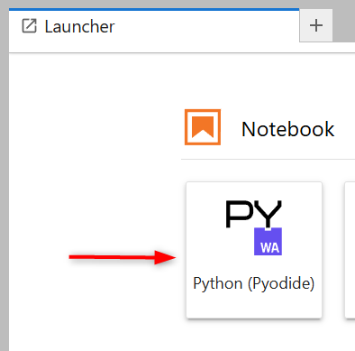
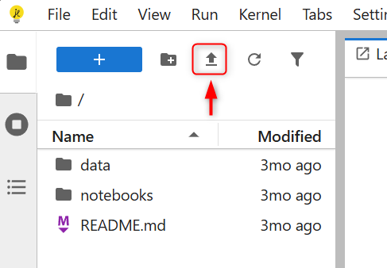
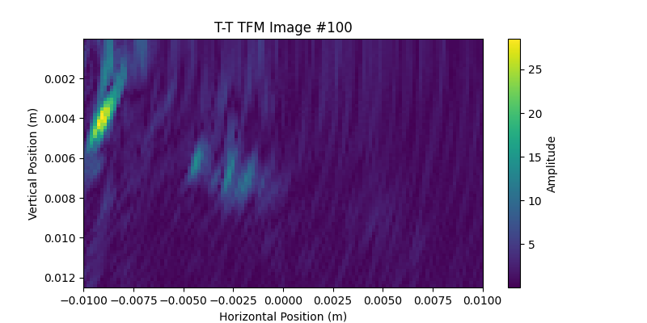

# Hands-on Lab

!!! info "ASNT 2025 Short Course A"
    <figure markdown="span">
        { width="300" }
    </figure>

    This content was created as supporting material for [ASNT 2025 Annual Conference Short Course A: *Demystifying the Open File Format for NDE Data*](https://asnt.eventsair.com/asnt-2025/short-courses) and is free to use under the [MIT License](https://raw.githubusercontent.com/Evident-Industrial/NDE_Open_File_Format/refs/heads/main/LICENSE).

Learn how to read and write NDE files using simple and accessible tools. No coding skills or software installation are required, you only need your laptop and an internet connection.

## Setting up your environment

For this short course, you will use the Python programming language through **JupyterLite**, a JupyterLab distribution that runs entirely in your web browser. It provides a simple and user-friendly way to experiment with Python in an interactive environment.

1. Download the following example files to your computer:
      - **Weld_Plate_UT-sk90-4.1.nde** | [:material-download: Download](https://nde-public-files.s3.ca-central-1.amazonaws.com/4.1/Weld_Plate_UT-sk90-4.1.nde) | [:material-eye: View](https://myhdf5.hdfgroup.org/view?url=https://nde-public-files.s3.ca-central-1.amazonaws.com/4.1/Weld_Plate_UT-sk90-4.1.nde)
      - **Weld_Plate_4TFM_sk90-4.1.nde** | [:material-download: Download](https://nde-public-files.s3.ca-central-1.amazonaws.com/4.1/Weld_Plate_4TFM_sk90-4.1.nde) | [:material-eye: View](https://myhdf5.hdfgroup.org/view?url=https://nde-public-files.s3.ca-central-1.amazonaws.com/4.1/Weld_Plate_4TFM_sk90-4.1.nde)
      - **CFRP_Plate_PA-Lin0_sk90-Analysis-4.1.nde** | [:material-download: Download](https://nde-public-files.s3.ca-central-1.amazonaws.com/4.1/CFRP_Plate_PA-Lin0_sk90-Analysis-4.1.nde) | [:material-eye: View](https://myhdf5.hdfgroup.org/view?url=https://nde-public-files.s3.ca-central-1.amazonaws.com/4.1/CFRP_Plate_PA-Lin0_sk90-Analysis-4.1.nde)
      - Bonus, courtesy of [P. Holloway](https://www.hollowayndt.com/): **corrosion_holloway.nde** | [:material-download: Download](https://nde-public-files.s3.ca-central-1.amazonaws.com/short-course/corrosion_holloway.nde) | [:material-eye: View](https://myhdf5.hdfgroup.org/view?url=https://nde-public-files.s3.ca-central-1.amazonaws.com/short-course/corrosion_holloway.nde) 
2. Go to [https://jupyter.org/try-jupyter/lab/](https://jupyter.org/try-jupyter/lab/) and create a new **Python (Pyodide)** notebook.
    <figure markdown="span">
    { width="200" }
    </figure>
3. Upload the downloaded files to JupyterLite:
    <figure markdown="span">
    { width="200" }
    </figure> 

- [x] You are now ready to explore .nde files!

## Reading NDE files

-   __Exercise 1__ – Reading UT A-Scans

    ---

    

    In this exercise, you will learn how to read A-Scans from a manual weld scan using conventional ultrasonic testing (UT).

    [:material-cursor-default-click: Go to this exercise](reading-ut-ascans.md)

-   __Exercise 2__ – Reading TFM Images

    ---

    

    In this exercise, you will learn how to read images from a manual weld scan using the Total Focusing Method (TFM).

    [:material-cursor-default-click: Go to this exercise](reading-tfm-images.md)

-   __Exercise 3__ – Generating a C-Scan from 0° Raster Scan Data

    ---

    

    In this exercise, you will learn how to create a simple C-Scan image generation tool using A-Scans from a 0° raster scan.

    [:material-cursor-default-click: Go to this exercise](generating-csan.md)

-   __Exercise 4__ – Displaying 0° Raster Scan Data in 3D

    ---

    

    In this exercise, you will learn how to create a basic 3D visualization of 0° raster scan data.

    [:material-cursor-default-click: Go to this exercise](3d-display.md)

