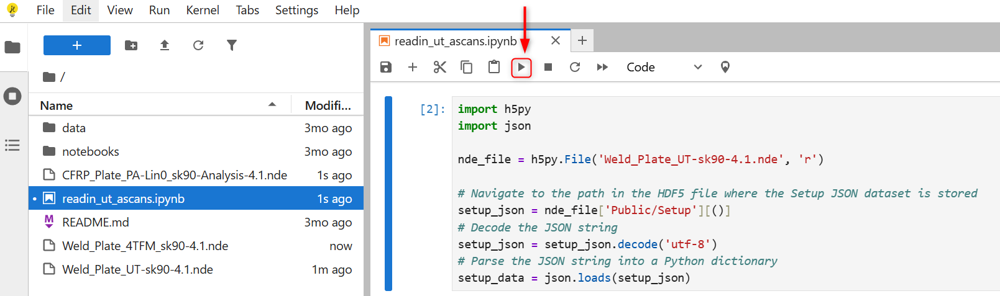
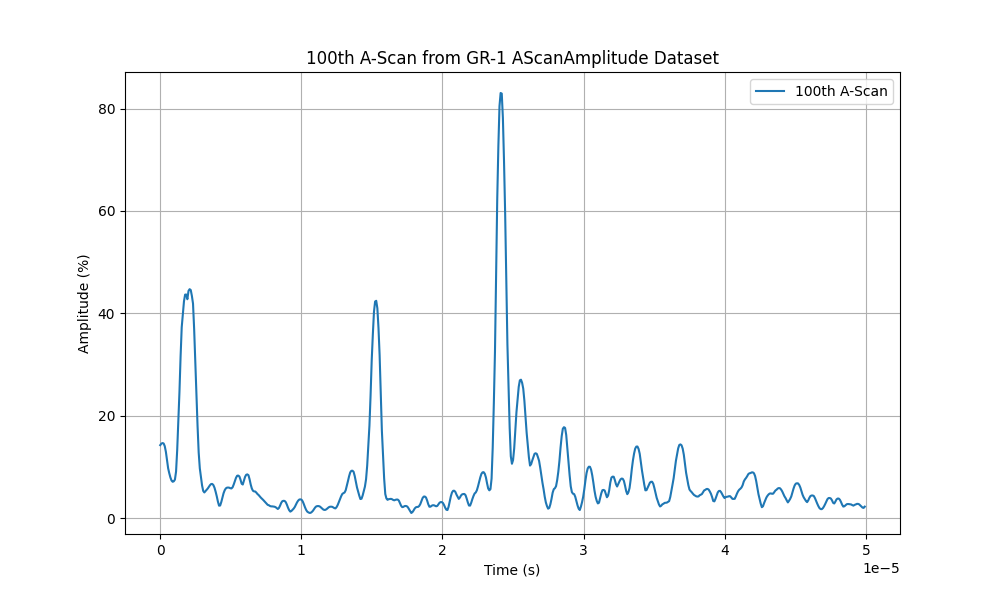
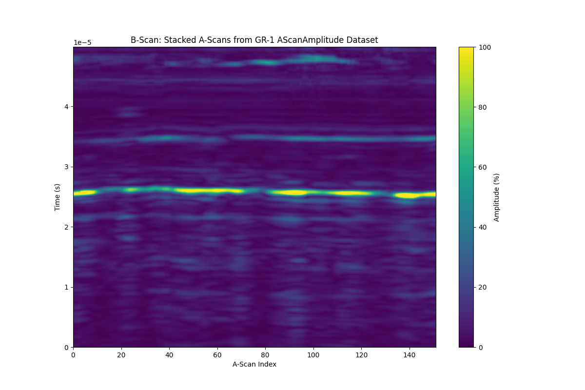

---
hide:
- toc
---

# Reading A-Scans from a UT scan 

To learn how to display A-scan signals from an .nde data file, follow the steps outlined below, based on this [example file](../examples/example-files/index.md#manual-weld-scanning-using-conventional-ultrasonic-testing-ut) provided for a simple UT manual weld scan. 

Start by loading the [Setup](../json-metadata/setup/index.md) JSON formatted dataset from the .nde file and parse it to a Python dictionary. 

``` python
import h5py
import json

nde_file = h5py.File('Weld_Plate_UT-sk90-4.1.nde', 'r')

# Navigate to the path in the HDF5 file where the Setup JSON dataset is stored
setup_json = nde_file['Public/Setup'][()]
# Decode the JSON string
setup_json = setup_json.decode('utf-8')
# Parse the JSON string into a Python dictionary
setup_data = json.loads(setup_json)
```

!!! tip "How I do that?"

    <figure markdown="span">
        { width="400" }
    </figure>

    Simply copy/paste this code section in your JupyterLite notebook and hit the "run" button to execute this section of the code 

Then, iterate through groups to retrieve group names, ids, and datasets and print the related datasets information.  

``` python
for group in setup_data.get('groups', []):
    group_id = group.get('id')
    group_name = group.get('name')
    
    print(f"Group ID: {group_id}, Group Name: {group_name}")
    
    # Retrieve datasets
    datasets = group.get('datasets', [])
    for dataset in datasets:
      dataset_id = dataset.get('id')
      dataset_class = dataset.get('dataClass')
      dataset_path = dataset.get('path')
      print(f"  Dataset ID: {dataset_id}, '"
            f" Data Class: {dataset_class}, '"
            f" Data Path: {dataset_path}")
```

The above code should output the following: 

``` { .bash .no-copy }
Group ID: 0, Group Name: GR-1
  Dataset ID: 0, Data Class: AScanAmplitude, Data Path: /Public/Groups/0/Datasets/0-AScanAmplitude
  Dataset ID: 1, Data Class: AScanStatus, Data Path: /Public/Groups/0/Datasets/1-AScanStatus
```

We see that the file contains one group, named *GR-1* and two datasets. A-scans will be stored in a dataset assigned a *AScanAmplitude* Data Class and its path is `/Public/Groups/0/Datasets/0-AScanAmplitude`

Let's now display the size of this specific dataset, still from the Setup dataset metadata.


``` python
# Retrieve AScanAmplitude dataset dimensions
dimensions = setup_data['groups'][0]['datasets'][0].get('dimensions', [])
print("AScanAmplitude Dataset Dimensions:")
for dimension in dimensions:
    axis = dimension.get('axis')
    quantity = dimension.get('quantity')
    resolution = dimension.get('resolution')
    print(f" Axis: {axis}, Quantity: {quantity}, Resolution: {resolution}")
```

The above code should output the following: 

``` { .bash .no-copy }
AScanAmplitude Dataset Dimensions:
 Axis: UCoordinate, Quantity: 151, Resolution: 0.001
 Axis: VCoordinate, Quantity: 1, Resolution: 0.001
 Axis: Ultrasound, Quantity: 624, Resolution: 8e-08
```

So we now know that we have 151 A-scans recorded at different positions along the U axis and that each A-scan has a length of 624 points, each point being spaced by 80 nanoseconds.  

Let's plot the 100th A-scan: 

``` python

import matplotlib.pyplot as plt
import numpy as np

ascans = np.array(nde_file['/Public/Groups/0/Datasets/0-AScanAmplitude'])

# Retrieve dimensions for the Ultrasound axis

ultrasound_offset = setup_data['groups'][0]['datasets'][0]['dimensions'][2]['offset']
ultrasound_resolution = setup_data['groups'][0]['datasets'][0]['dimensions'][2]['resolution']
num_points_per_ascan = setup_data['groups'][0]['datasets'][0]['dimensions'][2]['quantity']

# Amplitude scaling with corresponding units
unit_min = setup_data['groups'][0]['datasets'][0]['dataValue']['unitMin']
unit_max = setup_data['groups'][0]['datasets'][0]['dataValue']['unitMax']

# Original dataset scaling
original_min = setup_data['groups'][0]['datasets'][0]['dataValue']['min']
original_max = setup_data['groups'][0]['datasets'][0]['dataValue']['max']

# Normalize the A-Scan amplitudes from the original scale (0 to 32767) to the new scale (0.0 to 200.0)
normalized_ascans = ((ascans - original_min) / (original_max - original_min)) * (unit_max - unit_min) + unit_min

# Generate the time axis using the ultrasound offset and resolution
time_axis = np.linspace(
      ultrasound_offset, 
      ultrasound_offset + num_points_per_ascan * ultrasound_resolution, 
      num_points_per_ascan
  )

AScan_U_increment = 99

# Plot the 100th A-Scan
plt.figure(figsize=(10, 6))
plt.plot(time_axis, normalized_ascans[AScan_U_increment, 0, :], label=f"{AScan_U_increment+1}th A-Scan")
plt.title(f"{AScan_U_increment+1}th A-Scan from GR-1 AScanAmplitude Dataset")
plt.xlabel("Time (s)")
plt.ylabel("Amplitude (%)")
plt.grid(True)
plt.legend()
plt.show()

```

!!! tip 

    Index starts at 0 in Python

You should end up with the following figure:



Alternatively, we could also plot the B-scan:

``` python
# Plot the B-Scan (image of stacked A-Scans)
plt.figure(figsize=(12, 8))
plt.imshow(normalized_ascans[:, 0, :].T, aspect='auto', cmap='viridis',
           extent=[0, ascans.shape[0], time_axis[0], time_axis[-1]],
           vmin=unit_min, vmax=unit_max)  # Set amplitude scale using unitMin/unitMax)
plt.colorbar(label="Amplitude (%)")
plt.title("B-Scan: Stacked A-Scans from GR-1 AScanAmplitude Dataset")
plt.xlabel("A-Scan Index")
plt.ylabel("Time (s)")
plt.grid(False)
plt.show()
```

You should end up with the following figure:



Feel free to play with the code, modify parameters, and explore how the results change, experimentation is the best way to learn!