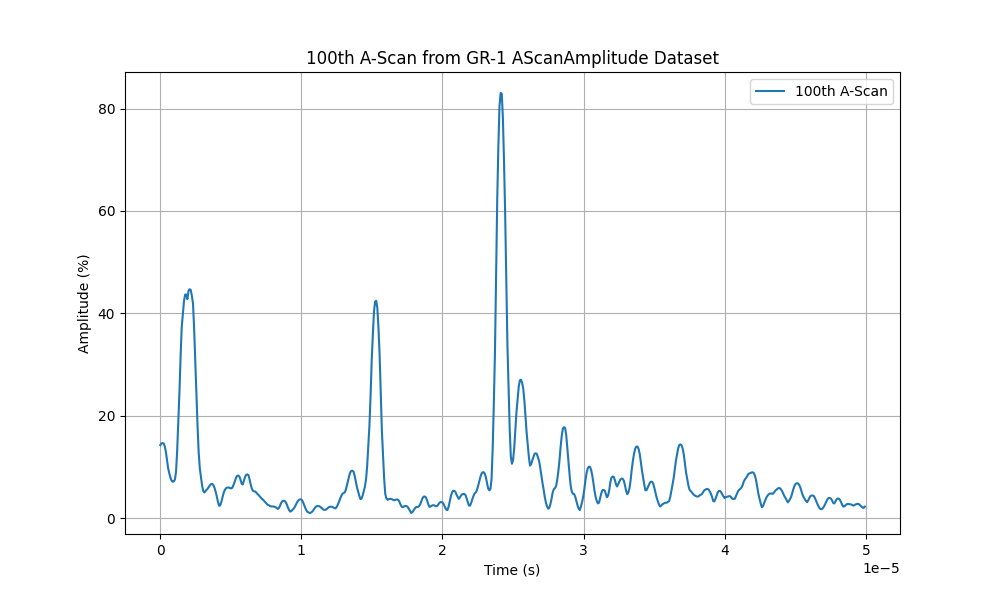

# Code Samples

## Reading NDE files

Some examples of reading codes are provided below so you can get a look at the file structure and gain a better understanding of the steps required.

-   __Reading UT A-Scans__

    ---

    

    In this example, you will learn how to read A-scans from a manual weld scan using conventional ultrasonic testing (UT).

    [:material-cursor-default-click: Go to this example](reading-ut-ascans.md)

-  __Reading TFM Images__

    ---

    

    In this example, you will learn how to read images from a manual weld scan using the total focusing method (TFM). 

    [:material-cursor-default-click: Go to this example](reading-tfm-images.md)
    

## Writing NDE files
Some examples of writing codes are provided below to demonstrate the file structure and give you a better understanding of the steps required.

-   __Writing UT A-Scans__

    ---

    

    In this example, you will learn how to write an .nde file from a collection of UT A-scans.

    [:material-cursor-default-click: Go to this example](writing-ut-ascans.md)

-  __Writing FMC A-Scans__

    ---

    

    In this example, you will learn how to write an FMC to an .nde file. 

     [:material-cursor-default-click: Go to this example](writing-fmc-ascans.md)
    

