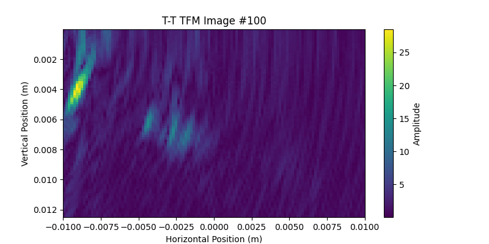

# Reading TFM Images

To learn how to display a TFM image from an .nde data file, follow the steps outlined below, which are based on this  [example file](../example-files/index.md#manual-weld-scanning-using-the-total-focusing-method-tfm) of a manual weld scan using the total focusing method (TFM). 


Start by loading the [Setup](../../json-metadata/setup/index.md) JSON formatted dataset from the .nde file and parse it to a Python dictionary. 

``` python
import h5py
import json
import matplotlib.pyplot as plt
import numpy as np

nde_file = h5py.File('Weld_Plate_4TFM_sk90-4.1.nde', 'r')

# Navigate to the path in the HDF5 file where the Setup JSON dataset is stored
setup_json = nde_file['Public/Setup'][()]
# Decode the JSON string
setup_json = setup_json.decode('utf-8')
# Parse the JSON string into a Python dictionary
setup_data = json.loads(setup_json)
```

Then, iterate through groups to retrieve group names, ids, datasets, and related processes. Selecting only TFM (totalFocusingMethod) processes, we will extract the associated path name (also called view, mode or waveset) and print the related datasets information.  

``` python
for group in setup_data.get('groups', []):
    group_id = group.get('id')
    group_name = group.get('name')

    print(f"Group ID: {group_id}, Group Name: {group_name}")

    # Retrieve datasets
    datasets = group.get('datasets', [])
    # Retrieve processes
    processes = group.get('processes', [])
    for process in processes:
        if process.get('totalFocusingMethod'):
            path_name = process['totalFocusingMethod']['pathName']
            print(f'TFM Path Name: {path_name}')
            for output in process['outputs']:
                dataset_id = output['datasetId']
                dataset_path = datasets[dataset_id]['path']
                dataset_class = output['dataClass']
                print(f"  Dataset ID: {dataset_id},"
                      f" Data Class: {dataset_class},"
                      f" Data Path: {dataset_path}")

                for dimension in datasets[dataset_id]['dimensions']:
                    axis = dimension.get('axis')
                    offset = np.round(dimension.get('offset'), 6)
                    quantity = dimension.get('quantity')
                    resolution = np.round(dimension.get('resolution'), 6)
                    print(f"     Axis: {axis}, "
                          f"Offset: {offset}, "
                          f"Quantity: {quantity}, "
                          f"Resolution: {resolution}")
```

The above code should output the following: 

``` bash
Group ID: 0, Group Name: None
Group ID: 1, Group Name: None
TFM Path Name: T-T
  Dataset ID: 0, Data Class: TfmValue, Data Path: /Public/Groups/1/Datasets/0-TfmValue
     Axis: UCoordinate, Offset: 0.0, Quantity: 201, Resolution: 0.001
     Axis: VCoordinate, Offset: -0.01, Quantity: 119, Resolution: 0.000169
     Axis: WCoordinate, Offset: 1e-05, Quantity: 80, Resolution: 0.000158
  Dataset ID: 1, Data Class: TfmStatus, Data Path: /Public/Groups/1/Datasets/1-TfmStatus
     Axis: UCoordinate, Offset: 0.0, Quantity: 201, Resolution: 0.001
     Axis: VCoordinate, Offset: -0.01, Quantity: 119, Resolution: 0.000169
     Axis: WCoordinate, Offset: 1e-05, Quantity: 80, Resolution: 0.000158
Group ID: 2, Group Name: None
TFM Path Name: TT-T
...
```

We see that the file contains multiple groups, and TFM groups start at Group ID = 1. Each TFM waveset (or path) corresponds to one group. Two datasets are associated with each waveset (one with *TfmValue* data class and one with *TfmStatus* data class) with matching dimensions. 

As an example, for the T-T waveset, we now know that we have 201 increments against the U axis (spaced by 1 mm) and that each TFM image has a dimension of 119 (V axis) x 80 (W axis) pixels. The vertical resolution of each image is 1.58 mm and the horizontal resolution is 1.69 mm. 

Let's plot the 100th TFM image of this scan: 


``` python
TFMs = np.array(nde_file['/Public/Groups/1/Datasets/0-TfmValue'])

W_size = setup_data['groups'][1]['datasets'][0]['dimensions'][2]['quantity']
W_min = setup_data['groups'][1]['processes'][0]['totalFocusingMethod']['rectangularGrid']['zImagingLimits']['min']
W_max = setup_data['groups'][1]['processes'][0]['totalFocusingMethod']['rectangularGrid']['zImagingLimits']['max']

V_resolution = setup_data['groups'][1]['datasets'][0]['dimensions'][1]['resolution']
V_size = setup_data['groups'][1]['datasets'][0]['dimensions'][1]['quantity']
V_min = setup_data['groups'][1]['processes'][0]['totalFocusingMethod']['rectangularGrid']['yImagingLimits']['min']
V_max = setup_data['groups'][1]['processes'][0]['totalFocusingMethod']['rectangularGrid']['yImagingLimits']['max']

# Calculate the axis range in meters
vertical_axis = np.linspace(W_min, W_max, W_size)
horizontal_axis = np.linspace(V_min, V_max, V_size)

TFM_U_increment = 100

# Plot the TFM image
plt.figure(figsize=(8, 8))
plt.imshow(TFMs[TFM_U_increment, :, :].T,
           extent=[horizontal_axis.min(), horizontal_axis.max(), vertical_axis.max(), vertical_axis.min()],
           cmap='viridis', aspect='equal')  # aspect='equal' ensures aspect ratio of 1

# Axis labels
plt.xlabel('Horizontal Position (m)')
plt.ylabel('Vertical Position (m)')

# Add colorbar
plt.colorbar(label='Amplitude')

# Show plot
plt.title(f'T-T TFM Image #{TFM_U_increment}')
plt.show()
```

You should end up with the following figure:



