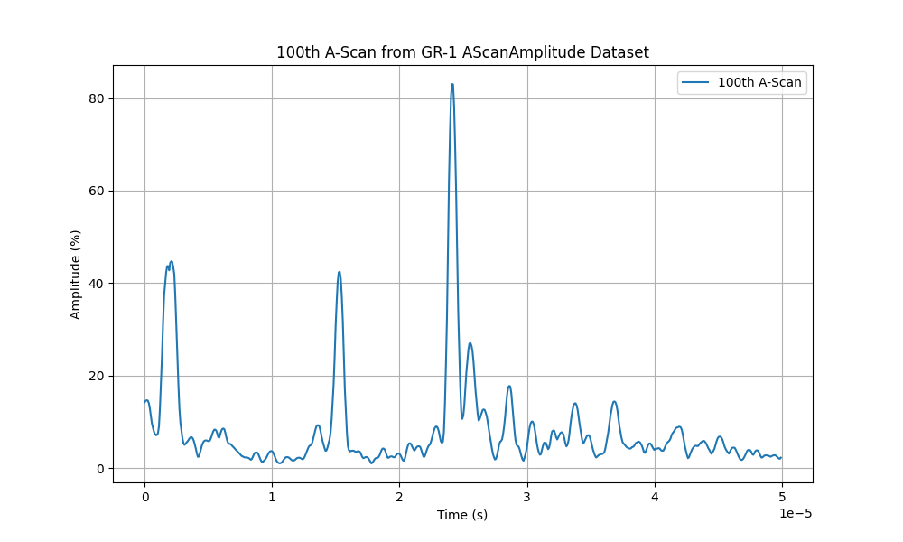
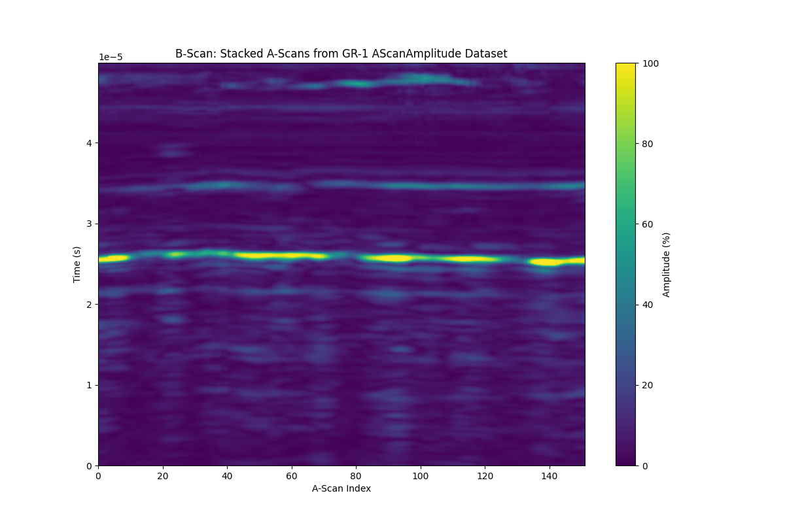

# Reading A-Scans from a UT scan 

Let's take the [example file](../example-files/index.md#manual-weld-scanning-using-conventional-ultrasound) provided for simple UT Manual Weld Scanning and see how we can display some A-Scans from this file. 

Start by loading the [Setup](../../json-metadata/setup/index.md) JSON formatted dataset from the .nde file and parse it to a Python dictionary. 

``` python
import h5py
import json

nde_file = h5py.File('Manual_Weld_UT.nde', 'r')

# Navigate to the path in the HDF5 file where the Setup JSON dataset is stored
setup_json = nde_file['Public/Setup'][()]
# Decode the JSON string
setup_json = setup_json.decode('utf-8')
# Parse the JSON string into a Python dictionary
setup_data = json.loads(setup_json)
```

Then, iterate through groups to retrieve group names, ids, and datasets and print the related datasets information.  

``` python
for group in setup_data.get('groups', []):
    group_id = group.get('id')
    group_name = group.get('name')
    
    print(f"Group ID: {group_id}, Group Name: {group_name}")
    
    # Retrieve datasets
    datasets = group.get('datasets', [])
    for dataset in datasets:
      dataset_id = dataset.get('id')
      dataset_class = dataset.get('dataClass')
      dataset_path = dataset.get('path')
      print(f"  Dataset ID: {dataset_id}, '"
            f" Data Class: {dataset_class}, '"
            f" Data Path: {dataset_path}")
```

The above code should output the following: 

``` bash
Group ID: 0, Group Name: GR-1
  Dataset ID: 0, Data Class: AScanAmplitude, Data Path: /Public/Groups/0/Datasets/0-AScanAmplitude
  Dataset ID: 1, Data Class: AScanStatus, Data Path: /Public/Groups/0/Datasets/1-AScanStatus
```

We see that the file contains one group, named *GR-1* and two datasets. A-Scans will be stored in a dataset having a *AScanAmplitude* Data Class and its path is `/Public/Groups/0/Datasets/0-AScanAmplitude`

Let's now display the size of this specific dataset, still from the Setup dataset metadata.


``` python
# Retrieve AScanAmplitude dataset dimensions
dimensions = setup_data['groups'][0]['datasets'][0].get('dimensions', [])
print("AScanAmplitude Dataset Dimensions:")
for dimension in dimensions:
    axis = dimension.get('axis')
    quantity = dimension.get('quantity')
    resolution = dimension.get('resolution')
    print(f" Axis: {axis}, Quantity: {quantity}, Resolution: {resolution}")
```

The above code should output the following: 

``` bash
AScanAmplitude Dataset Dimensions:
 Axis: UCoordinate, Quantity: 401, Resolution: 0.001
 Axis: VCoordinate, Quantity: 1, Resolution: 0.001
 Axis: Ultrasound, Quantity: 568, Resolution: 6.000000000000001e-08
```

So we now know that we have 401 A-Scans registered at different position along the U axis and that each A-Scan has a length of 568 points, each points being spaced by 60 nanoseconds.  

Let's plot the 200th A-Scan: 

``` python

import matplotlib.pyplot as plt
import numpy as np

ascans = np.array(nde_file['/Public/Groups/0/Datasets/0-AScanAmplitude'])

# Retrieve dimensions for the Ultrasound axis (from Setup JSON)

ultrasound_offset = setup_data['groups'][0]['datasets'][0]['dimensions'][2]['offset']
ultrasound_resolution = setup_data['groups'][0]['datasets'][0]['dimensions'][2]['resolution']
num_points_per_ascan = setup_data['groups'][0]['datasets'][0]['dimensions'][2]['quantity']

# Amplitude scaling (from Setup JSON)
unit_min = setup_data['groups'][0]['datasets'][0]['dataValue']['unitMin']
unit_max = setup_data['groups'][0]['datasets'][0]['dataValue']['unitMax']

# Original dataset (from Setup JSON)
original_min = setup_data['groups'][0]['datasets'][0]['dataValue']['min']
original_max = setup_data['groups'][0]['datasets'][0]['dataValue']['max']

# Normalize the A-Scan amplitudes from the original scale (0 to 32767) to the new scale (0.0 to 200.0)
normalized_ascans = ((ascans - original_min) / (original_max - original_min)) * (unit_max - unit_min) + unit_min

# Generate the time axis using the ultrasound offset and resolution
time_axis = np.linspace(
      ultrasound_offset, 
      ultrasound_offset + num_points_per_ascan * ultrasound_resolution, 
      num_points_per_ascan
  )

# Plot the 200th A-Scan
    plt.figure(figsize=(10, 6))
    plt.plot(time_axis, ascans[199, 0, :], label="200th A-Scan")
    plt.title("200th A-Scan from GR-1 AScanAmplitude Dataset")
    plt.xlabel("Time (s)")
    plt.ylabel("Amplitude")
    plt.grid(True)
    plt.legend()
    plt.show()

```

You should end up with the following figure:



Alternatively, we could also plot the B-Scan:

``` python
# Plot the B-Scan (image of stacked A-Scans)
plt.figure(figsize=(12, 8))
plt.imshow(normalized_ascans[:, 0, :].T, aspect='auto', cmap='viridis',
           extent=[0, ascans.shape[0], time_axis[0], time_axis[-1]],
           vmin=unit_min, vmax=unit_max)  # Set amplitude scale using unitMin/unitMax)
plt.colorbar(label="Amplitude (%)")
plt.title("B-Scan: Stacked A-Scans from GR-1 AScanAmplitude Dataset")
plt.xlabel("A-Scan Index")
plt.ylabel("Time (s)")
plt.grid(False)
plt.show()
```

You should end up with the following figure:

