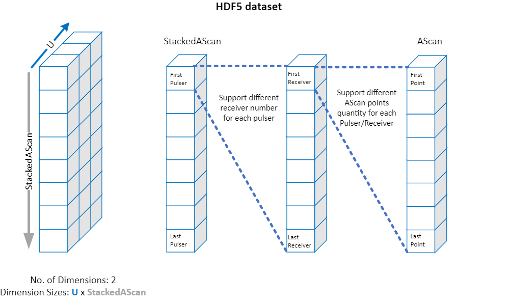

# Writing FMC A-Scans

To learn how to write elementary A-scans from an FMC acquisition to an .nde file, follow this simple procedure: 

- [x] JSON formatted [**Properties**](../../json-metadata/properties/index.md) dataset:
    - Create the dataset according to the **Properties** [data model](../../json-metadata/properties/data-model.md)
    - Validate the dataset structure against the [Properties JSON Schema](../../json-metadata/properties/schema_doc.md)
- [x] JSON formatted [**Setup**](../../json-metadata/setup/index.md) dataset:
    - Create the dataset according to the **Setup** [data model](../../json-metadata/setup/data-model/index.md)
    - Validate this JSON against the [Setup JSON Schema](../../json-metadata/setup/schema_doc.md)
- [x] Collect elementary A-scans to be saved in a **AScanAmplitude** dataset
- [x] Save the datasets according to the .nde [HDF5 structure](../../hdf5-structure/index.md)


## JSON formatted **Properties** dataset

### Create the dataset

According to the [**Properties**](../../json-metadata/properties/index.md) dataset [data model documentation](../../json-metadata/properties/data-model.md), the only required properties are the `$schema`,  `creationDate`, and `formatVersion` in the **file** object and the related method in the **methods** array. 

The **Properties** dataset results in the following: 

``` json
{
   "$schema": "./Properties-Schema-4.0.0.json",
   "file":{
      "creationDate": "2024-10-16T20:28:30+01:00",
      "formatVersion": "4.0.0"
   },
   "methods":["UT"]
}
```

### Validate the dataset structure

Then, validate the JSON file against the **Properties** [JSON Schema](../../json-metadata/properties/schema_doc.md), assuming you saved the above [**Properties**](../../json-metadata/properties/index.md) JSON under `properties_fmc.json`: 

``` python
import fastjsonschema
import json

properties = json.load(open('properties_fmc.json', 'r'))
properties_schema = json.load(open('Properties-Schema-4.0.0.json', 'r'))
properties_validator = fastjsonschema.compile(properties_schema)

try:
    properties_validator(properties)
    print('Properties JSON succeeded validation')
except fastjsonschema.JsonSchemaException as e:
    print(f"Properties JSON failed validation: {e}")
```

The above validation should not return any error codes. 

## JSON formatted **Setup** dataset

### Create the dataset

According to the [**Setup**](../../json-metadata/setup/index.md) dataset [data model documentation](../../json-metadata/setup/data-model/index.md), there are a couple of objects we need to populate to end up with a valid dataset: 

``` json
{
    "$schema": "...",
    "version": "...",
    "scenario": "...",
    "groups": [],
    "acquisitionUnits": [],
    "dataMappings": [],
    "specimens": [],
    "probes": [],
    "wedges": []
}
```

The first three properties are straightforward and reference the schema version used to validate the JSON, the version of the file format and the scenario used. As we are not scanning a weld, let's adopt the *General Mapping* scenario conventions: 

``` json
{
  "$schema": "./Setup-Schema-4.0.0.json",
  "version": "4.0.0",
  "scenario": "General Mapping",
}
```

The remaining objects and arrays cover: 

- The definition of the groups, datasets, and processes: in our case a single group, a `AScanAmplitude` dataset, and an [ultrasonicMatrixCapture](../../json-metadata/setup/data-model/groups/processes/ultrasonicMatrixCapture.md) acquisition process
- The definition of the [acquisition unit](../../json-metadata/setup/data-model/acquisition-units.md): in the example below, the OmniScan X4 64x128
- The definition of a [specimen](../../json-metadata/setup/data-model/specimens.md): in the example below,  a 25 mm thick mild steel plate 
- The definition of the [probe](../../json-metadata/setup/data-model/probes.md): in the example below, a 5L64 linear array
- The definition of the [wedge](../../json-metadata/setup/data-model/wedges.md): as we will be in contact, we will define a wedge with most of its dimensions equal to 0

As the process of creating these JSON objects and arrays can be tedious the first time, the following template incorporates the above parameters to facilitate this demonstration.

??? example "**Setup** template"

    ``` json
    --8<-- "docs/examples/code-samples/setup_fmc.json"
    ```

### Validate the dataset structure

Then, validate the JSON file against the **Setup** [JSON Schema](../../json-metadata/setup/schema_doc.md), assuming you saved the above [**Setup**](../../json-metadata/setup/index.md) JSON under `setup_fmc.json`: 

``` python
setup = json.load(open('setup_fmc.json', 'r'))
setup_schema = json.load(open('Setup-Schema-4.0.0.json', 'r'))

setup_validator = fastjsonschema.compile(setup_schema)

try:
    setup_validator(setup)
    print('Setup JSON succeeded validation')
except fastjsonschema.JsonSchemaException as e:
    print(f"Setup JSON failed validation: {e}")
```

The above validation should not return any error codes. 

## Collect elementary A-scans

Collect an FMC using the instrument of your choice and make sure you format the matrix of elementary A-scans following this structure: 



Your FMC matrix should be a 2 dimensional array with the following dimensions:

- **First dimension**: Number of mechanical positions
- **Second dimension**: $AScanLength \times N_{Emitters} \times N_{Receivers}$

Assuming your fmc array is called `fmc`, the definition of the array would be:

``` python
fmc = np.empty(shape=(1, AScan_length * Nb_elmt_Tx * Nb_elmt_Rx ))

# FMC Acquisition
def acquire_fmc_frame()
    # place holder for your fmc acquisition process
    return fmc 

fmc[0, :] = acquire_fmc_frame()
```

## Save the datasets according to the .nde HDF5 structure

We now need to create the .nde file using the HDF5 library following the [HDF5 Structure](../../hdf5-structure/index.md) specific to any .nde file. The **Properties** JSON will be saved at the root of this structure, the **Setup** JSON will be saved under the `/Public/` path, and the A-scans will be saved in Group 0 under `/Public/Groups/0/Datasets`. 

``` python 
with h5py.File('ut_ascans.nde', 'w') as hdf5_file:
    # Create the file structure
    public_section = hdf5_file.create_group('Public')
    groups_section = public_section.create_group('Groups')
    group_0 = groups_section.create_group('0')
    group_0_datasets = group_0.create_group('Datasets')

    # Convert the JSON data to a string
    setup_string = json.dumps(setup, indent=4)
    properties_string = json.dumps(properties, indent=4)

    # Save the JSON data under the respective path
    hdf5_file.create_dataset('Public/Setup', data=setup_string, dtype=h5py.string_dtype('utf-8', len(setup_string)))
    hdf5_file.create_dataset('Properties', data=properties_string, dtype=h5py.string_dtype('utf-8', len(properties_string)))

    # Save the NumPy ascans under Group 0 datasets with AScanAmplitude DataClass
    group_0_datasets.create_dataset('0-AScanAmplitude', data=fmc)

    print("Data successfully saved to .NDE")
```

You should end up with the following file:


