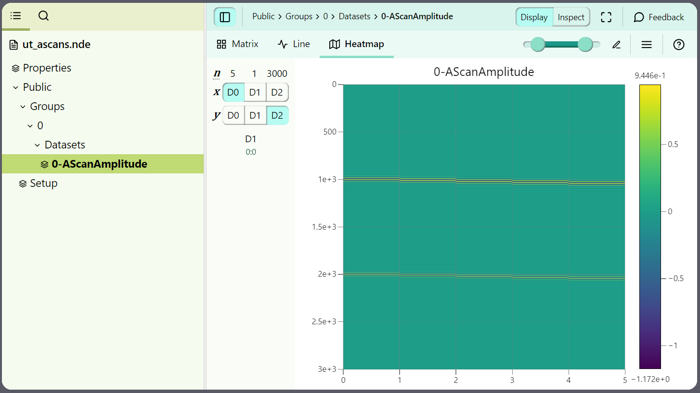

# Writing UT A-Scans

Let's follow this simple procedure for writing UT A-Scans to an .nde file: 

- [x] JSON formatted [**Properties**](../../json-metadata/properties/index.md) dataset:
    - Create the dataset according to the **Properties** [data model](../../json-metadata/properties/data-model.md)
    - Validate the dataset structure against the [Properties JSON Schema](../../json-metadata/properties/schema_doc.md)
- [x] JSON formatted [**Setup**](../../json-metadata/setup/index.md) dataset:
    - Create the dataset according to the **Setup** [data model](../../json-metadata/setup/data-model/index.md)
    - Validate this JSON against the [Setup JSON Schema](../../json-metadata/setup/schema_doc.md)
- [x] Simulate or collect A-Scans to be saved in a **AScanAmplitude** dataset
- [x] Save datasets according to the .NDE [HDF5 structure](../../hdf5-structure/index.md)

## JSON formatted **Properties** dataset

### Create the dataset

Following the [**Properties**](../../json-metadata/properties/index.md) dataset [data model documentation](../../json-metadata/properties/data-model.md), the only required properties are the `$schema`,  `creationDate` and `formatVersion` in the **file** object and the related method in the **methods** array. 

The **Properties** dataset results in the following: 

``` json
{
   "$schema": "./Properties-Schema-4.0.0.json",
   "file":{
      "creationDate": "2024-10-16T20:28:30+01:00",
      "formatVersion": "4.0.0"
   },
   "methods":["UT"]
}
```

### Validate the dataset structure

Then, check that the JSON file validate against the **Properties** [JSON Schema](../../json-metadata/properties/schema_doc.md), assuming you saved the above [**Properties**](../../json-metadata/properties/index.md) JSON under `properties_ut_ascans.json`: 

``` python
import fastjsonschema
import json

properties = json.load(open('properties_ut_ascans.json', 'r'))
properties_schema = json.load(open('NDE-Properties.json', 'r'))
properties_validator = fastjsonschema.compile(properties_schema)

try:
    properties_validator(properties)
    print('Properties JSON succeeded validation')
except fastjsonschema.JsonSchemaException as e:
    print(f"Properties JSON failed validation: {e}")
```

The above validation should not return any error code. 

## JSON formatted **Setup** dataset

### Create the dataset

Following the [**Setup**](../../json-metadata/setup/index.md) dataset [data model documentation](../../json-metadata/setup/data-model/index.md), there are a couple of object we need to populate to end up with a valid dataset: 

``` json
{
    "$schema": "...",
    "version": "...",
    "scenario": "...",
    "groups": [],
    "acquisitionUnits": [],
    "dataMappings": [],
    "specimens": [],
    "probes": [],
    "wedges": []
}
```

The first three properties are straightforward and reference the schema version used to validate the JSON, the version of the file format and the scenario used. As we are not scanning a weld, let's adopt the *General Mapping* scenario conventions: 

``` json
{
  "$schema": "./Setup-Schema-4.0.0.json",
  "version": "4.0.0",
  "scenario": "General Mapping",
}
```

The remaining objects and arrays cover: 

- The definition of groups, its datasets and processes: in our case a single group, a `AScanAmplitude` dataset and an [ultrasonicConventional](../../json-metadata/setup/data-model/groups/processes/ultrasonicConventional.md) acquisition process
- The definition of the [acquisition unit](../../json-metadata/setup/data-model/acquisition-units.md): in the example below, the OmniScan X4 64x128
- The definition of a [specimen](../../json-metadata/setup/data-model/specimens.md): in the example below,  a 25 mm thick mild steel plate 
- The definition of the [probe](../../json-metadata/setup/data-model/probes.md): in the example below, a C109 fingertip contact probe
- The definition of the [wedge](../../json-metadata/setup/data-model/wedges.md): as we will be in contact, we will define a wedge with most of its dimensions equal to 0

As the process of creating these JSON objects can be tedious the first time, we'll provide a template incorporating the above parameters to facilitate this demonstration.

??? example "**Setup** template"

    ``` json
    --8<-- "docs/examples/code-samples/setup_ut_ascans.json"
    ```

### Validate the dataset structure

Then, check that the JSON file validate against the **Setup** [JSON Schema](../../json-metadata/setup/schema_doc.md), assuming you saved the above [**Setup**](../../json-metadata/setup/index.md) JSON under `setup_ut_ascans.json`: 

``` python
setup = json.load(open('setup_ut_ascans.json', 'r'))
setup_schema = json.load(open('NDE-FileFormat-Schema-4.0.0.json', 'r'))

setup_validator = fastjsonschema.compile(setup_schema)

try:
    setup_validator(setup)
    print('Setup JSON succeeded validation')
except fastjsonschema.JsonSchemaException as e:
    print(f"Setup JSON failed validation: {e}")
```

The above validation should not return any error code. 


## Simulate or collect A-Scans

We will generate 5 fake A-Scans corresponding to 5 theoretical scanner positions. Each A-Scan will have a 5 MHz center frequency, a 60 % bandwidth and 3000 samples. Fake A-Scans will be stored in a 5 x 1 x 3000 numpy array named `ascans` that we will use as our `AScanAmplitude` type dataset. 

As the generation of fake A-Scans is out of the scope of this documentation, we simply provide the example code below for your convenience.

??? example "Fake A-Scans generation"

    ``` python
    # Constants
    sampling_rate = 100e6  # 100 MHz sampling rate
    time_window = 30e-6  # 30 microseconds time window
    frequency = 5e6  # 5 MHz center frequency
    num_ascans = 5  # Number of A-Scans (U Axis size)
    echo_amplitudes = [1, 0.7]  # Relative amplitude of the two echoes
    bandwidth = 0.6*frequency
    gaussian_width = sigma_t = 1 / (2 * np.pi * bandwidth)
    V_Axis = 1 # Size of the V axis
    Ultrasound_Axis = round(time_window*sampling_rate)

    # Time array
    t = np.linspace(0, time_window, int(sampling_rate * time_window))

    # Gaussian modulated sinusoid function 
    def gaussian_modulated_sinusoid(t, center, frequency, width):
        gauss = np.exp(-((t - center) ** 2) / (2 * width ** 2))
        sinusoid = np.sin(2 * np.pi * frequency * (t - center))
        return gauss * sinusoid

    # Generate A-Scans with varying echo positions
    ascans = np.empty(shape=(num_ascans,V_Axis,Ultrasound_Axis))

    for i in range(num_ascans):
        # Echo positions slightly shifted for each A-Scan
        echo_positions = [10e-6 + i * 0.1e-6, 20e-6 + i * 0.1e-6]

        # Generate A-Scan
        ascan = np.zeros_like(t)
        for echo_pos, amplitude in zip(echo_positions, echo_amplitudes):
            ascan += amplitude * gaussian_modulated_sinusoid(t, echo_pos, frequency, gaussian_width)

        ascans[i, 0, :] = ascan
    ```


## Save datasets according to the .NDE HDF5 structure

We now need to create the .NDE file using the HDF5 library following the [HDF5 Structure](../../hdf5-structure/index.md) specific to any .NDE file. The **Properties** JSON will be saved at the root of this structure, the **Setup** JSON will be saved under the `/Public/` path and the A-Scans will be saved in Group 0 under `/Public/Groups/0/Datasets`. 

``` python 
with h5py.File('ut_ascans.nde', 'w') as hdf5_file:
    # Create the file structure
    public_section = hdf5_file.create_group('Public')
    groups_section = public_section.create_group('Groups')
    group_0 = groups_section.create_group('0')
    group_0_datasets = group_0.create_group('Datasets')

    # Convert the JSON data to a string
    setup_string = json.dumps(setup, indent=4)
    properties_string = json.dumps(properties, indent=4)

    # Save the JSON data under the respective path
    hdf5_file.create_dataset('Public/Setup', data=setup_string, dtype=h5py.string_dtype('utf-8', len(setup_string)))
    hdf5_file.create_dataset('Properties', data=properties_string, dtype=h5py.string_dtype('utf-8', len(properties_string)))

    # Save the NumPy ascans under Group 0 datasets with AScanAmplitude DataClass
    group_0_datasets.create_dataset('0-AScanAmplitude', data=ascans)

    print("Data successfully saved to .NDE")
```

You should end up with the following file:




