# Example Files

## Ultrasonic Testing Examples

### [General weld](../../json-metadata/setup/data-model/scenarios.md#general-weld-scenario) scenario

#### Manual weld scanning using conventional ultrasonic testing (UT)

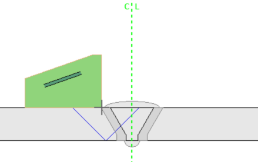{width="400"}

In this example, a weld bead on a 11 mm thick stainless steel plate is manually scanned using a [C540](https://ims.evidentscientific.com/en/probes/single-and-dual-element) 2.25 MHz single-element angle beam transducer mounted on a ABSA-5T-45 45° wedge. The transducer's position is recorded using a wheel encoder.  

UT **Weld_Plate_UT-sk90-4.2.nde** | [:material-download: Download ](https://nde-public-files.s3.ca-central-1.amazonaws.com/4.2/Weld_Plate_UT-sk90-4.2.nde) | [:material-eye: View ](https://myhdf5.hdfgroup.org/view?url=https://nde-public-files.s3.ca-central-1.amazonaws.com/4.2/Weld_Plate_UT-sk90-4.2.nde)

#### Manual weld scanning using *parallel* time-of-flight diffraction (TOFD)

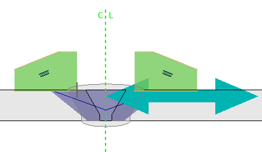{width="400"}

In this example, a 10 mm thick steel pipe comprising a girth weld is manually scanned using a pair of C563 10 MHz single-element angle beam transducers mounted on ST1-70L 70° wedges. The scanning direction is perpendicular to the weld bevel (and parallel to the direction of the beam). The transducer's position is recorded using a wire encoder.  

UT **Weld_Plate_ToFD_Parallel-4.2.nde** | [:material-download: Download ](https://nde-public-files.s3.ca-central-1.amazonaws.com/4.2/Weld_Plate_ToFD_Parallel-4.2.nde) | [:material-eye: View ](https://myhdf5.hdfgroup.org/view?url=https://nde-public-files.s3.ca-central-1.amazonaws.com/4.2/Weld_Plate_ToFD_Parallel-4.2.nde)

#### Manual weld scanning using phased array ultrasonic testing (PAUT)

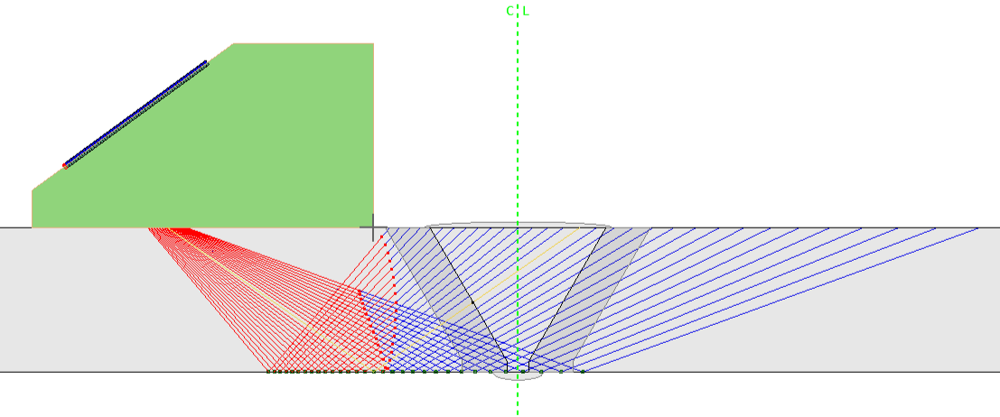{width="400"}

In this first example, a weld bead on a 26 mm thick stainless steel plate is manually scanned using a [5L64-A32](https://ims.evidentscientific.com/fr/probes/phased-array/weld-series) 5 MHz 64-element probe mounted on a SA32-N55S 36° wedge. The probe's position is recorded using a wire encoder. This example comprises a conventional sectorial scan with one group. 

UT **Weld_Plate_PA-Sect_sk90-4.2.nde** | [:material-download: Download ](https://nde-public-files.s3.ca-central-1.amazonaws.com/4.2/Weld_Plate_PA-Sect_sk90-4.2.nde) | [:material-eye: View ](https://myhdf5.hdfgroup.org/view?url=https://nde-public-files.s3.ca-central-1.amazonaws.com/4.2/Weld_Plate_PA-Sect_sk90-4.2.nde)

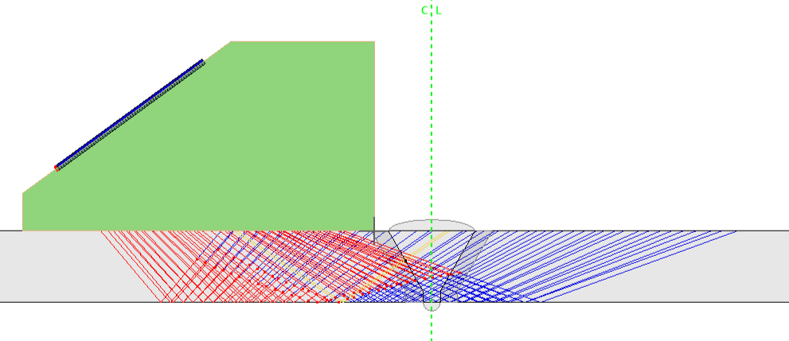{width="400"}

In this second example, a weld bead on a 12.5 mm thick stainless steel plate is manually scanned using a [5L64-A32](https://ims.evidentscientific.com/fr/probes/phased-array/weld-series) 5 MHz 64-element probe mounted on a SA32-N55S 36° wedge. The probe's position is recorded using a wire encoder. This example comprises a compound sectorial scan with two groups (8 and 16 elements).

UT **Weld_Plate_PA-Comp_sk90-2gr-4.2.nde** | [:material-download: Download ](https://nde-public-files.s3.ca-central-1.amazonaws.com/4.2/Weld_Plate_PA-Comp_sk90-2gr-4.2.nde) | [:material-eye: View ](https://myhdf5.hdfgroup.org/view?url=https://nde-public-files.s3.ca-central-1.amazonaws.com/4.2/Weld_Plate_PA-Comp_sk90-2gr-4.2.nde)

#### Manual weld scanning using the total focusing method (TFM)

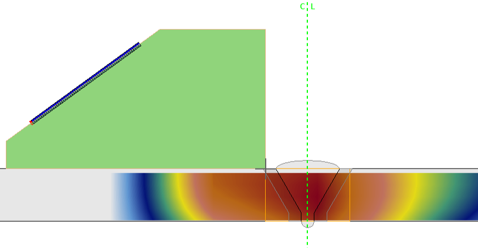{width="400"}

In this example, a weld bead on a 12.5 mm thick stainless steel plate is manually scanned using a [5L64-A32](https://ims.evidentscientific.com/fr/probes/phased-array/weld-series) 5 MHz 64-element probe mounted on a SA32-N55S 36° wedge. The probe's position is recorded using a wire encoder. Two group configurations are provided.

Four TFM wavesets/groups: T-T, TT-T, TT-TT, TT-TTT:

UT **Weld_Plate_4TFM_sk90-4.2.nde** | [:material-download: Download ](https://nde-public-files.s3.ca-central-1.amazonaws.com/4.2/Weld_Plate_4TFM_sk90-4.2.nde) | [:material-eye: View ](https://myhdf5.hdfgroup.org/view?url=https://nde-public-files.s3.ca-central-1.amazonaws.com/4.2/Weld_Plate_4TFM_sk90-4.2.nde)

One PCI waveset/group: T-T:

UT **Weld_Plate_PCI_sk90-4.2.nde** | [:material-download: Download ](https://nde-public-files.s3.ca-central-1.amazonaws.com/4.2/Weld_Plate_PCI_sk90-4.2.nde) | [:material-eye: View ](https://myhdf5.hdfgroup.org/view?url=https://nde-public-files.s3.ca-central-1.amazonaws.com/4.2/Weld_Plate_PCI_sk90-4.2.nde)

#### Semiautomated weld scanning using time-of-flight diffraction (TOFD) and phased array ultrasonic testing (PAUT)

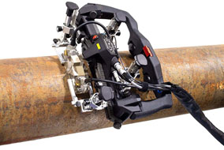{width="250"}
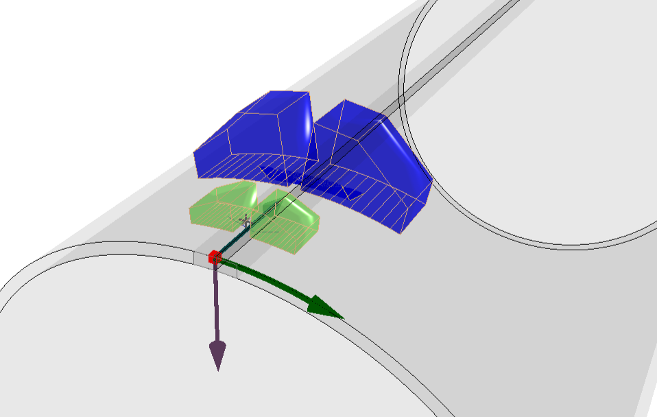{width="300"}

In this example, a 6.15 mm thick steel pipe comprising a longitudinal weld is scanned using the [AxSEAM](https://ims.evidentscientific.com/en/products/industrial-scanners/axseam) scanner and a pair of C563 10 MHz probes mounted on ST1-70L-IHC 70° wedges for TOFD and a pair of 5L32-A31 5 MHz 32-element probes mounted on SA31-N55S 36° wedges. The probe position is recorded using the scanner encoder. 

UT **Weld_COD_2PA-ToFD-4.2.nde** | [:material-download: Download ](https://nde-public-files.s3.ca-central-1.amazonaws.com/4.2/Weld_COD_2PA-ToFD-4.2.nde) | [:material-eye: View ](https://myhdf5.hdfgroup.org/view?url=https://nde-public-files.s3.ca-central-1.amazonaws.com/4.2/Weld_COD_2PA-ToFD-4.2.nde)

#### Semiautomated weld **raster** scanning using phased array ultrasonic testing (PAUT)

{width="250"}
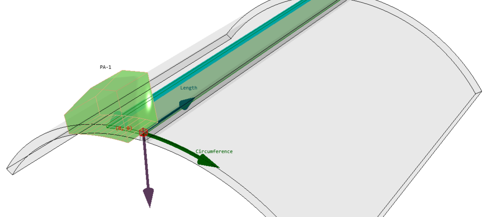{width="300"}

In this example, a 6.35 mm thick steel pipe comprising a longitudinal weld is scanned using the [AxSEAM](https://ims.evidentscientific.com/en/products/industrial-scanners/axseam) scanner and a [5L32-A31](https://ims.evidentscientific.com/fr/probes/phased-array/weld-series) 5 MHz 64-element probe mounted on a SA31-N55S 36° wedge. The probe position is recorded using the scanner encoder. 

UT **Weld_COD_PA-Raster-4.2.nde** | [:material-download: Download ](https://nde-public-files.s3.ca-central-1.amazonaws.com/4.2/Weld_COD_PA-Raster-4.2.nde) | [:material-eye: View ](https://myhdf5.hdfgroup.org/view?url=https://nde-public-files.s3.ca-central-1.amazonaws.com/4.2/Weld_COD_PA-Raster-4.2.nde)

#### Girth weld scanning using the total focusing method (TFM)

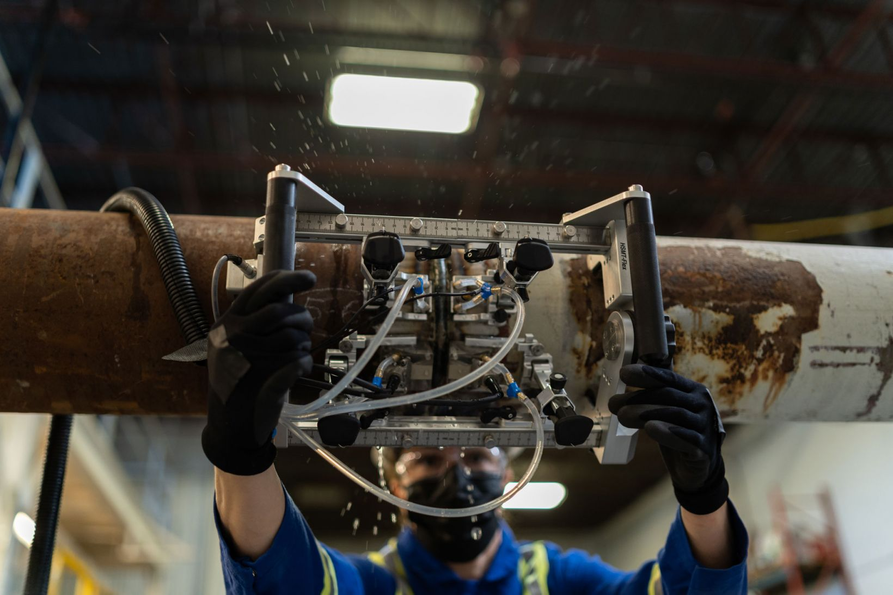{width="250"}
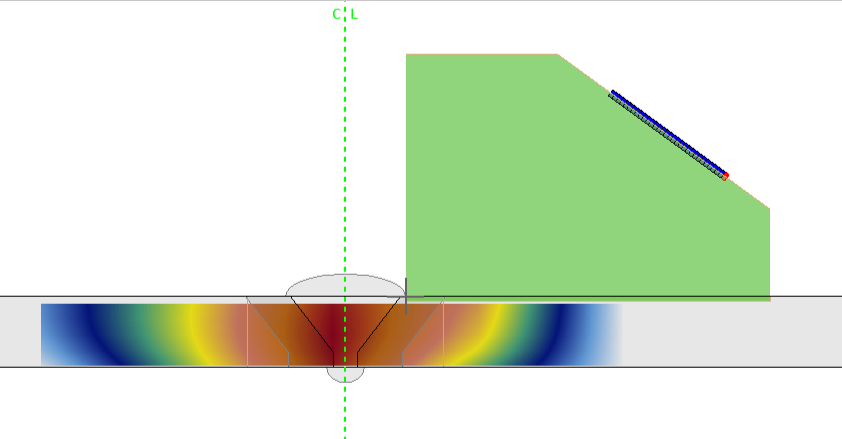{width="300"}

In this example, a 9.5 mm thick steel pipe comprising a circumferential weld is scanned using the [HSMT-Flex](https://ims.evidentscientific.com/en/products/industrial-scanners/hsmt-flex) scanner and a pair of 5L32-A31 5 MHz 32-element probes mounted on SA31-N55S 36° wedges. TFM is performed simultaneously from both sides of the weld bead. The probe position is recorded using the scanner encoder. A post-acquisition analysis was also performed on this file, adding gain to the data. 

UT **Weld_AOD_DualTFM-Analysis-4.2.nde** | [:material-download: Download ](https://nde-public-files.s3.ca-central-1.amazonaws.com/4.2/Weld_AOD_DualTFM-Analysis-4.2.nde) | [:material-eye: View ](https://myhdf5.hdfgroup.org/view?url=https://nde-public-files.s3.ca-central-1.amazonaws.com/4.2/Weld_AOD_DualTFM-Analysis-4.2.nde)

### [General mapping](../../json-metadata/setup/data-model/scenarios.md#general-mapping-scenario) scenario

#### Corrosion inspection using conventional ultrasonic testing (UT)

In this example, a 5.47 mm thick steel pipe is scanned using the [MapROVER](https://ims.evidentscientific.com/en/products/industrial-scanners/maprover) scanner and a D790 5 MHz dual element transducer. The probe's position is recorded using the scanner encoders.

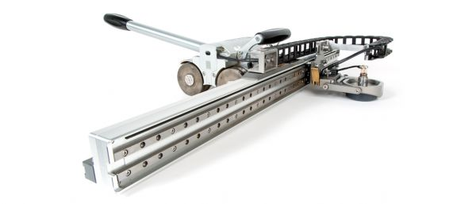{width="250"}
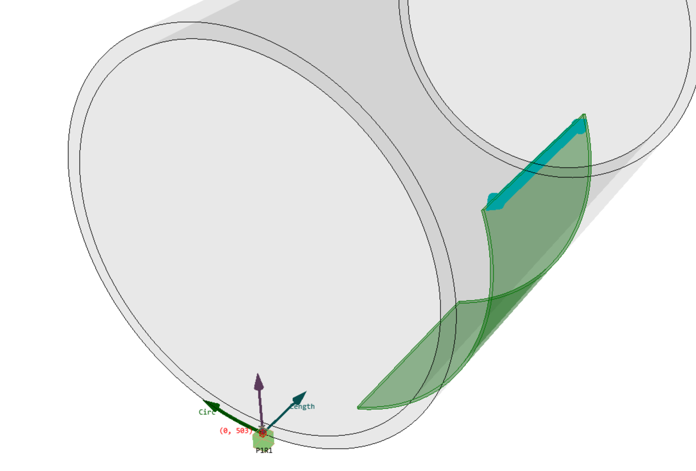{width="200"}

UT **Corr_COD_UT-Raster-4.2.nde** | [:material-download: Download ](https://nde-public-files.s3.ca-central-1.amazonaws.com/4.2/Corr_COD_UT-Raster-4.2.nde) | [:material-eye: View ](https://myhdf5.hdfgroup.org/view?url=https://nde-public-files.s3.ca-central-1.amazonaws.com/4.2/Corr_COD_UT-Raster-4.2.nde)

#### Composite wheel probe scanning using phased array ultrasonic testing (PAUT) 

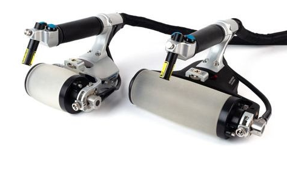{width="250"}
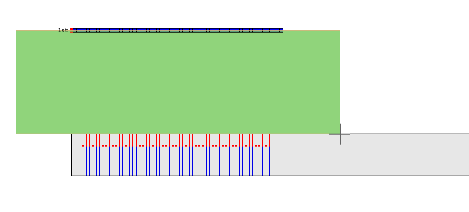{width="400"}

In this example, a 10 mm thick plexiglass plate engraved with letters is scanned using the [RollerFORM](https://ims.evidentscientific.com/en/products/industrial-scanners/rollerform) scanner and a 3.5L64-IWP1 3.5 MHz 64-element probe, mimicking the inspection of a carbon fiber reinforced polymer (CFRP) plate. The probe position is recorded using the scanner encoder. A post-acquisition analysis was also performed on this file, adding gain to the data. 

Using PAUT:

UT **CFRP_Plate_PA-Lin0_sk90-Analysis-4.2.nde** | [:material-download: Download ](https://nde-public-files.s3.ca-central-1.amazonaws.com/4.2/CFRP_Plate_PA-Lin0_sk90-Analysis-4.2.nde) | [:material-eye: View ](https://myhdf5.hdfgroup.org/view?url=https://nde-public-files.s3.ca-central-1.amazonaws.com/4.2/CFRP_Plate_PA-Lin0_sk90-Analysis-4.2.nde)

#### Composite X-Y scanning using the total focusing method (TFM) 

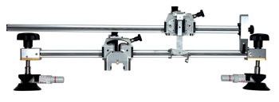{width="250"}
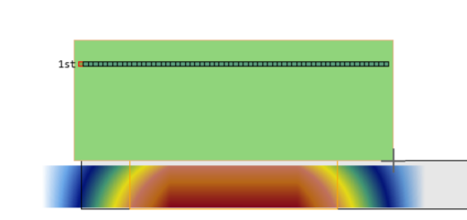{width="400"}

In this example, a 10 mm thick plexiglass plate engraved with letters is scanned using the Glider scanner and a 5L64-NW1 5 MHz 64-element probe mounted on a SNW1-0L 0° wedge, mimicking the inspection of a carbon fiber reinforced polymer (CFRP) plate. The probe position is recorded using the scanner encoder. Two group configurations are provided.

Using TFM:

UT **CFRP_Plate_TFM-Raster_sk90-4.2.nde** | [:material-download: Download ](https://nde-public-files.s3.ca-central-1.amazonaws.com/4.2/CFRP_Plate_TFM-Raster_sk90-4.2.nde) | [:material-eye: View ](https://myhdf5.hdfgroup.org/view?url=https://nde-public-files.s3.ca-central-1.amazonaws.com/4.2/CFRP_Plate_TFM-Raster_sk90-4.2.nde)

Using phase coherence imaging (PCI):

UT **CFRP_Plate_PCI-Raster_sk90-4.2.nde** | [:material-download: Download ](https://nde-public-files.s3.ca-central-1.amazonaws.com/4.2/CFRP_Plate_PCI-Raster_sk90-4.2.nde) | [:material-eye: View ](https://myhdf5.hdfgroup.org/view?url=https://nde-public-files.s3.ca-central-1.amazonaws.com/4.2/CFRP_Plate_PCI-Raster_sk90-4.2.nde)

#### Corrosion inspection using phased array ultrasonic testing (PAUT)

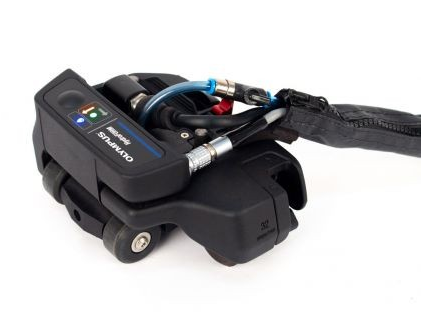{width="250"}
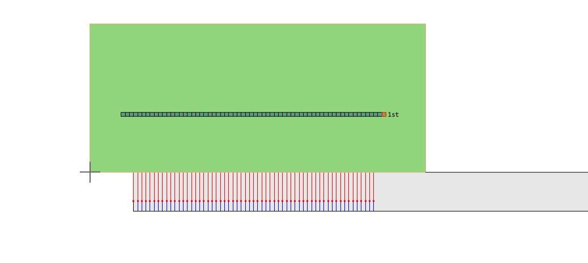{width="400"}

In this example, a 9.5 mm thick steel plate is scanned using the [HydroFORM](https://ims.evidentscientific.com/en/products/industrial-scanners/hydroform) scanner and a 7.5L64-I8 7.5 MHz 64-element probe. The probe's position is recorded using the scanner encoder.

UT **Corr_Plate_PA-Lin0_sk270-4.2.nde** | [:material-download: Download ](https://nde-public-files.s3.ca-central-1.amazonaws.com/4.2/Corr_Plate_PA-Lin0_sk270-4.2.nde) | [:material-eye: View ](https://myhdf5.hdfgroup.org/view?url=https://nde-public-files.s3.ca-central-1.amazonaws.com/4.2/Corr_Plate_PA-Lin0_sk270-4.2.nde)

#### Pipe elbow corrosion inspection using phased array ultrasonic testing (PAUT)

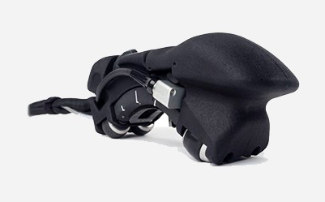{width="250"}
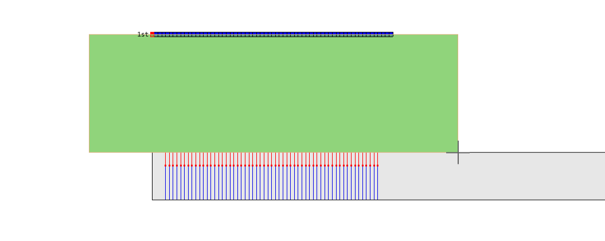{width="400"}

In this example, a 5.5 mm thick elbow pipe is scanned using the [FlexoFORM](https://ims.evidentscientific.com/en/products/industrial-scanners/flexoform) scanner and a 7.5L64-FA1 7.5 MHz 64-element probe. The probe's position is recorded using the scanner encoder. Note that in this case a plate geometry is used, as each element of the probe is maintained normal to the pipe surface for each scanner position. A post-acquisition analysis was also performed on this file, adding gain to the data. 

UT **Corr_COD_PA-Lin0_sk90-Analysis-4.2.nde** | [:material-download: Download ](https://nde-public-files.s3.ca-central-1.amazonaws.com/4.2/Corr_COD_PA-Lin0_sk90-Analysis-4.2.nde) | [:material-eye: View ](https://myhdf5.hdfgroup.org/view?url=https://nde-public-files.s3.ca-central-1.amazonaws.com/4.2/Corr_COD_PA-Lin0_sk90-Analysis-4.2.nde)

#### Full matrix capture (FMC) acquisition

In this example, a 7.5L60-PWZ1 7.5 MHz 60-element probe is positioned in contact with a steel block containing side-drilled holes. The probe's position is fixed. A single FMC is collected.

UT **fmc.nde** | [:material-download: Download ](https://nde-public-files.s3.ca-central-1.amazonaws.com/4.2/fmc.nde) | [:material-eye: View ](https://myhdf5.hdfgroup.org/view?url=https://myhdf5.hdfgroup.org/view?url=https://nde-public-files.s3.ca-central-1.amazonaws.com/4.2/fmc.nde)

---

## Eddy Current Testing Examples

### [General mapping](../../json-metadata/setup/data-model/scenarios.md#general-mapping-scenario) scenario

#### Manual Surface Crack Inspection

High-frequency surface crack detection at 1 MHz using a low-pass filter with a cut-off frequency of 300 Hz. The acquisition is time-based.

ET **Surface_Crack_EC_1MHz-4.3.nde** | [:material-download: Download ](https://nde-public-files.s3.ca-central-1.amazonaws.com/4.3/Surface_Crack_EC_1MHz-4.3.nde) | [:material-eye: View ](https://myhdf5.hdfgroup.org/view?url=https://nde-public-files.s3.ca-central-1.amazonaws.com/4.3/Surface_Crack_EC_1MHz-4.3.nde)

#### Manual Subsurface Inspection with Dual Frequencies

Low-frequency subsurface defect detection using two frequencies (11 and 2.7 kHz) for applications such as rivet line inspection on aircraft structures. Two independent low-pass filters with a cut-off frequency of 100 Hz are applied to each frequency signal. A mixed signal (*F1-F2*) is also provided for display. The acquisition is time-based.

ET **Subsurface_Dual_Freq_EC-4.3.nde** | [:material-download: Download ](https://nde-public-files.s3.ca-central-1.amazonaws.com/4.3/Subsurface_Dual_Freq_EC-4.3.nde) | [:material-eye: View ](https://myhdf5.hdfgroup.org/view?url=https://nde-public-files.s3.ca-central-1.amazonaws.com/4.3/Subsurface_Dual_Freq_EC-4.3.nde)

#### Manual Bolt Hole Inspection with Figure 6 Representation

Bolt hole defect detection using a rotating scanner at 500 kHz. A low-pass filter with a cut-off frequency of 400 Hz and a high-pass filter at 125 Hz produce a Figure 6 signal on the impedance plane. The scanner rotation speed is 1500 RPM.

ET **Bolt_Hole_EC_Figure6-4.3.nde** | [:material-download: Download ](https://nde-public-files.s3.ca-central-1.amazonaws.com/4.3/Bolt_Hole_EC_Figure6-4.3.nde) | [:material-eye: View ](https://myhdf5.hdfgroup.org/view?url=https://nde-public-files.s3.ca-central-1.amazonaws.com/4.3/Bolt_Hole_EC_Figure6-4.3.nde)

#### Encoded Eddy Current Array (ECA) Subsurface Inspection

A 32-element Eddy Current Array probe operating at 18 kHz (2 mm pitch) for subsurface defect detection. A temporal low-pass filter at 150 Hz is applied to each channel before spatial sampling to generate the C-scan. The C-scan covers 500 mm in the scanning direction (1 mm resolution) by 62 mm in the array direction (2 mm resolution). An encoder controls spatial sampling along the scanning direction.

ET **Subsurface_ECA_18kHz-4.3.nde** | [:material-download: Download ](https://nde-public-files.s3.ca-central-1.amazonaws.com/4.3/Subsurface_ECA_18kHz-4.3.nde) | [:material-eye: View ](https://myhdf5.hdfgroup.org/view?url=https://nde-public-files.s3.ca-central-1.amazonaws.com/4.3/Subsurface_ECA_18kHz-4.3.nde)

