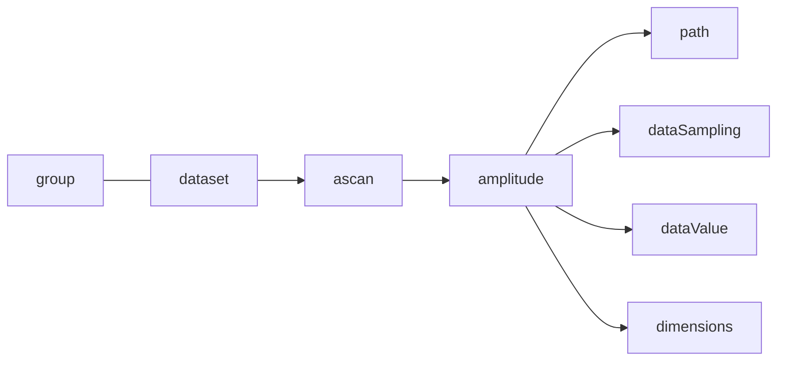

# HDF5 Dataset

Interpretation of the data can be achieved by reading a JSON structure, which can be accessed at the following dataset path: /Domain/Setup.



Example of the path of an ultrasound amplitude A-scan:

- The path contain the HDF5 path linking this particular group to its dataset.

```json
		"path": "/Domain/DataGroups/0/Datasets/0/Amplitude"
```

- The dataSampling gives the value range to be considered in the dataset.

```json
            "dataSampling": {
              "min": 0,
              "max": 32767
            }
```

- The dataValue gives the same range as dataSampling with units.

```json
            "dataValue": {
              "min": 0,
              "max": 200,
              "unit": "Percent"
            }
```

# Dimensions

The dimensions describe the different axes of the dataset ([see referential system explanation](/NDE_Open_File_Format/docs/conventions/conventions.html)).

It is an array of dimension [objects](/NDE_Open_File_Format/docs/general-concepts/objects/objects.html) that are always given in the same order as the HDF5 data has been created (dim 0, 1, 2).

These dimensions can vary depending on the the group and scan types.

# Phased Array One Line Scan

For an example, see this zero degree one line scan inspection, which has an [Independent storageMode](/NDE_Open_File_Format/docs/schema_doc.html#groups_items_oneOf_i1_dataset_storageMode).


```json
           "dimensions": [
              {
                "axis": "UCoordinate",
                "quantity": 22,
                "resolution": 0.001
              },
              {
                "axis": "Beam",
                "beams": [
                  {
                    "velocity": 3240.0,
                    "skewAngle": 90.0,
                    "refractedAngle": 45.0,
                    "uCoordinateOffset": 0.004,
                    "vCoordinateOffset": -0.069689058139837418,
                    "ultrasoundOffset": 0.0
                  },
                  {
                    "velocity": 3240.0,
                    "skewAngle": 90.0,
                    "refractedAngle": 45.0,
                    "uCoordinateOffset": 0.004,
                    "vCoordinateOffset": -0.069111085619919382,
                    "ultrasoundOffset": 0.0
                  },
                  {
                    "velocity": 3240.0,
                    "skewAngle": 90.0,
                    "refractedAngle": 45.0,
                    "uCoordinateOffset": 0.004,
                    "vCoordinateOffset": -0.068533113100001347,
                    "ultrasoundOffset": 0.0
                  }
                ]
              },
              {
                "axis": "Ultrasound",
                "quantity": 620,
                "resolution": 1.3E-07
              }
            ]
```

# Phased Array Zero Degree Raster

For an example, see this phased array raster inspection, which has a [Paintbrush storageMode](/NDE_Open_File_Format/docs/schema_doc.html#groups_items_oneOf_i1_dataset_storageMode).


```json
        "dimensions": [
          {
            "axis": "UCoordinate",
            "offset": 0.0,
            "quantity": 351,
            "resolution": 0.001
          },
          {
            "axis": "VCoordinate",
            "offset": -0.07455,
            "quantity": 114,
            "resolution": 0.001
          },
          {
            "axis": "Ultrasound",
            "offset": 0.0,
            "quantity": 568,
            "resolution": 2E-08
          }
        ]
```

# TFM

For an example, see this TFM inspection, which has a [Paintbrush storageMode](/NDE_Open_File_Format/docs/schema_doc.html#groups_items_oneOf_i1_dataset_storageMode).


```json
"dimensions": [
    {
      "axis": "UCoordinate",
      "offset": 0.0,
      "quantity": 1055,
      "resolution": 0.001
    },
    {
      "axis": "VCoordinate",
      "offset": -0.012969999999999999,
      "quantity": 175,
      "resolution": 0.00015120689655172411
    },
    {
      "axis": "WCoordinate",
      "offset": 0.0,
      "quantity": 64,
      "resolution": 0.00015111111111111111
    }
]
```

# FMC

FMC's status is experimental. Its particularity is that it uses a StackedAScan axis. All A-scans from one cycle are stored one after the other. It starts from the first pulser with every received A-scan in the received order and so on.


```json
"dimensions": [
    {
        'axis': 'UCoordinate',
        'quantity': 1,
        'resolution': 0.001,
        'offset': 0.0
    },
    {
        'axis': 'StackedAScan',
        'quantity': 8192000,
        'resolution': 1e-08
    }
]
```
