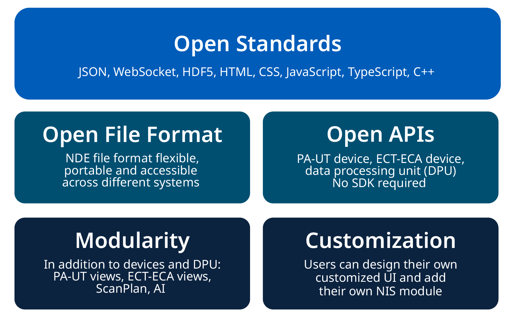

# NDE and UNIS Open Platform

<figure markdown="span">
  {width="300"}
</figure>

The .NDE file format is one of the primary interfaces of the Unified NDT Inspection Software (UNIS) platform currently being developed by [Evident](https://www.evidentscientific.com/en/). It was first introduced on the OmniScan X3 in October 2022 with the release of MXU 5.11. The .NDE file format will be supported by all future NDT software applications developed by Evident.

<figure markdown="span">
  {width="500"}
</figure>

UNIS is an open platform that can be used by all stakeholders in the NDT world to enable [NDE 4.0 and accelerate software development](https://www.ndt.net/article/ecndt2023/presentation/ECNDT2023_PRESENTATION_364.pdf). It is based on open standards and technologies, allowing data exchange through an open file format, and provide open APIs to control Evident instruments. It enables modularity and customization, fostering innovation for all Evident customers. 

<figure markdown="span">
  {width="600"}
</figure>

The UNIS Platform is composed of four main components:

- The .NDE File Format
- The Device and its API
- The Data Processing Unit (DPU) - the core of the platform.
- The resulting application or User Interface (UI).

<figure markdown="span">
  {width="600"}
</figure>

**Want to learn more about the UNIS platform?** [**Please reach out to us**](mailto:nde_support@evidentscientific.com). 