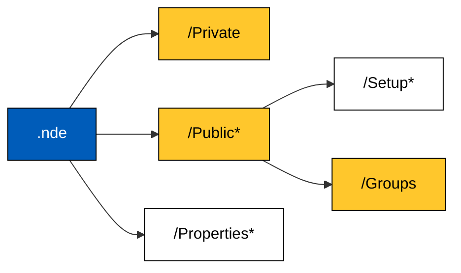

The HDF5 Library serves as the backbone of the NDE File Format. The NDE File Format uses the HDF5 library along with the data model defined in this documentation to provide a consistent, flexible and powerful format for the NDT Industry. 

The .nde inherits from the **hierarchical** characteristic of the HDF5 framework, hence its data model can be represented as a **tree structure** similar to a file system structure with folders and files. Within the HDF5 framework, folders are called **groups** and files are called **datasets**.

Each .nde file should follow this basic structure: 

!!! tip inline end

    Click on the **Private**, **Public**, **Setup**, **Groups** or **Properties** blocks to learn more. 

Each one of the structure layers represents either an HDF5 [group](https://support.hdfgroup.org/documentation/hdf5/latest/_h5_d_m__u_g.html#subsubsec_data_model_abstract_group)  (yellow rectangle) or a [dataset](https://support.hdfgroup.org/documentation/hdf5/latest/_h5_d_m__u_g.html#subsubsec_data_model_abstract_dataset)  (white rectangle). Mandatory groups and datasets are highlighted by a `*` at the end of their name. 

Any .nde file can be opened using a regular HDF5 reader such as [HDFView](https://www.hdfgroup.org/downloads/hdfview/) or [MyHDF5](https://myhdf5.hdfgroup.org/), allowing you to explore its structure and have a first look at its content. Learn more by exploring some of our [example files](../examples/example-files/index.md).

