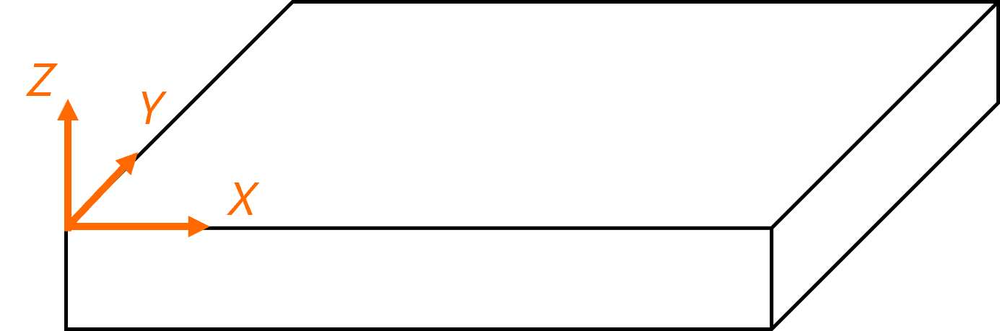
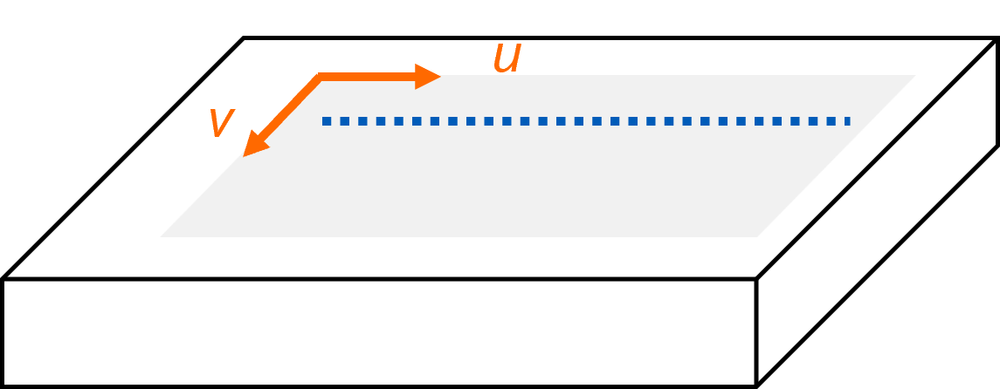
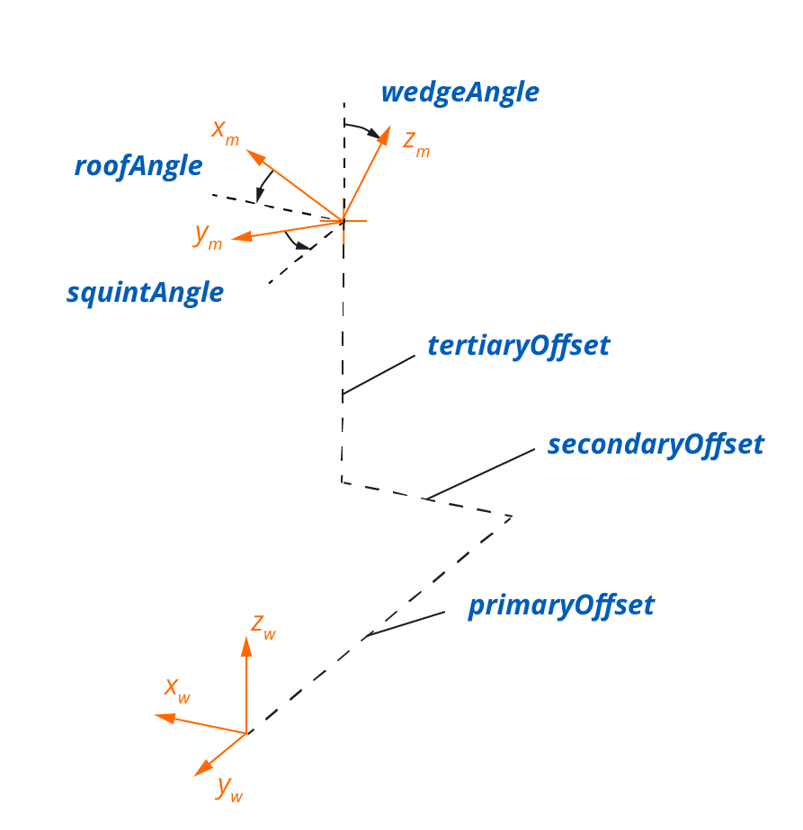

# Conventions

## Units

Angles are expressed in degrees, while all other units in the dataset use the International System (SI), such as meters and seconds, unless otherwise indicated by a "unit" key. For example, the "Bitfield" and "Percent" units are used for the A-Scans in the dataset object. 

| Quantity                 | Symbol, usual script (common) | Units              |
| ------------------------ | ----------------------------- | ------------------ |
| **Distance, positions**  | X, Y, Z                       | meter [m]          |
| **Time**                 | t                             | second [s]         |
| **Mass**                 | M                             | kilogram [kg]      |
| **Speed**                | c                             | [m/s]              |
| **Angle**                | α, β, γ, θ, φ                 | degree [°]         |
| **Density**              | ρ                             | [kg/m3] |
| **Gain**                 | G                             | dB                 |

## Axes and Coordinate Systems

The following coordinate systems are defined and used for storing and locating the position of each element in space. A transformation, such as through the use of homogeneous coordinates and transformation matrices can be defined between each coordinate systems using the parameters stored in the **Setup** JSON formatted dataset. 

### Global referential coordinate system 

$(X,Y,Z)$

{width="300px"}

- It is independent of the acquisition and serves to position the data on the specimen in the real world.
- *Origin and orientation*: Arbitrary and stays the same across files for a given specimen. It is usually defined by the user on the specimen with some marking or physical reference in the specimen environment.

<ins>*NOTE*</ins>: Currently, the $X$, $Y$, and $Z$ axis are not used nor defined in the NDE file, but to show inspection results in 3D, one would have to translate everything to this coordinate system. 

### Specimen surface coordinate system

$(U,V,W)$

{width="300px"}

For scenarios in which probe positioning is in direct relation to the surface, the position on the surface of a specimen, $(X, Y, Z)$ in global coordinates, is transformed into $(U,V)$ surface orthogonal curvilinear coordinates. Take note that depending on the scenario, the $(U,V)$ may be directly in distance unit (meter), but this is not systematic. 

To the $(U,V)$ surface mapping coordinates a depth axis $W$ is added. The depth $W$ is defined as being normal to the local $(U,V)$ coordinates and follows the right-hand rule for sign definition, resulting in a $(U,V,W)$ coordinate system 

- The $W$ axis is normal to the surface and always points inside the material.
- The $U$ axis is defined relative to the specimen's feature (per scenario). Its orientation is arbitrary.
- The $V$ axis is perpendicular to $U$ and its orientation can be inferred with the right-hand rule from the cross product of $U$ and $W$. 

### Local coordinate system

$(u,v,w)$

{width="300px"}

A local coordinate system $(u,v)$ is associated with each scanned area on the specimen surface $(U,V)$. Additionally, the use of $(u,v)$ coordinates is enforced as a way to disambiguate the notions of “scan axis” and “index axis,” which are interpreted depending on the scenario. 

- The path mechanically followed at the surface of the specimen by the scanner can be referenced in the local coordinate system for simple paths such as one-line and raster scanning.
- The local $(u,v)$ curvilinear coordinates (not necessarily in distance units) are linked to the position encoders (in distance units).
- The parameter $u$ is often along the continuous scanning axis, while the $v$ parameter describes the orthogonal direction.
- The parameter $w$ is along the specimen's local normal. 
- Multiple wedges coordinate systems $(x_w, y_w, z_w)$ attached to a scanner can be defined using the appropriate offsets with respect to the local frame.

###  Wedge coordinate system

$(x_w, y_w, z_w)$ 

{width="300px"}

- The wedge coordinate system $(x_w, y_w, z_w)$  is typically positioned directly on the surface $(U,V)$ through the local frame $(u,v)$, and thus links the probe position to the specimen.
- *Origin and orientation*: See appropriate wedge object conventions with the appropriate technology (ex. UT/PAUT)  for details.

<ins>*NOTE*</ins>: The term *wedge* is used to describe any device that maintain constant positioning of a probe relative to an inspected surface.

###  Mounting location coordinate system

$(x_m, y_m, z_m)$

{width="300px"}

A mounting location coordinate system $(x_m, y_m, z_m)$ is positioned from the wedge reference frame using three offsets (primaryOffset, secondaryOffset and tertiaryOffset) and three angles (wedgeAngle, squintAngle and roofAngle). See the [mountingLocations array](./data-model/wedges.md#mountinglocations-array) section for more information. 

###  Probe coordinate system

$(x_p, y_p, z_p)$

{width="500px"}

The origin of the probe coordinate system $(x_p, y_p, z_p)$ corresponds to the center of the first element. The probe *Primary Axis* is along $y_p$ and the probe *Secondary Axis* is along $x_p$.

*Origin and orientation*: See appropriate probe object conventions with the appropriate technology (ex. UT/PAUT) for details.

### Other axes

Beams Axis:

  -  An axis used in the HDF5 dataset rather than a physical one where each element contains one beam's incidence position on the specimen. It is used in PAUT scenarios when the beams do not fit well in a $U$, $V$ grid. Giving the coordinate by beams simplifies their use in these scenarios. 

Ultrasound Axis: 

  - Time-based information sampled by an ultrasonic acquisition system. The positioning in the global coordinates requires accounting for ray tracing and part velocities.

Encoding Axis: 

  - Relates to encoder displacement, coupling to specimen and/or global coordinates is scenario dependant.

## Storage mode

There are two disctinct ways to work with **discreteGrid** when storing a given dataset. 

**storageMode: "Independent"** is used to store the complete data acquisition sequence in reference to a $(u,0)$ trajectory. For example, a scanner comprizing many different PAUT probes each individually offset relative to the $(u,v)$ reference system could all relate to the same discreteGrid with **independant** storage mode. In this case the positioning of the data on or in the specimen requires some processing of individual beams or sensors position.

**storageMode: "Paintbrush"** is used to store individual beams or sensor information directly on the corresponding $(u,v)$ position. Practically, **Paintbrush** is only possible under some hypotheses:

- All beams or sensors operates under the same condition. For example, paint brush is possible with linear pulse-echo PAUT but is not with sectorial pulse-echo PAUT.
- All beams or sensors can be associated with a surface position. For example, FMC acquisition can't be stored as Paintbrush because individual ascan of the FMC don't have defined surface positionning.
- Beams or sensors surface positionning should fit perfectly on the underlying coordinate system grid. Accordingly, the **discreteGrid** coordinate system grid typically has to be created according to a probe and scanning system characteristic for a **Painbrush** storage.

The main advantage of **Paintbrush** storage is that data is natively mapped on a specimen surface.

## UT/PAUT Conventions

### General Concepts and Hypothesis

- Material is considered linear, homogeneous, and isotropic by default.
- Coupling layers are incapable of transmitting shear waves by default.
- Probe with single nominal center frequency by default.
