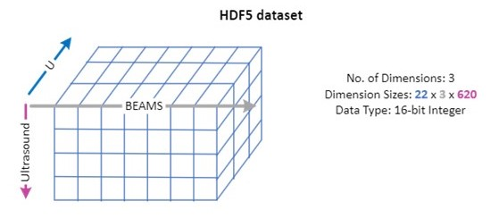

# Datasets related arrays and objects

A dataset is a container for data of homogeneous nature, characterized by standardized data classes, with its volume necessitating storage within the HDF5 structure. Through the process it originates, it establishes a connection between the data and physical reality (time/space). 

## **datasets** array

The **datasets** array describes datasets properties and how they relate to the acquisition and post-processing processes.

| Property                  | Type    | Description                                                                                                                   |
| :------------------------ | :------ | :---------------------------------------------------------------------------------------------------------------------------- |
| **id**                    | integer | The unique dataset id within the group                                                                                        |
| **name**                  | string  | The name of the dataset                                                                                                       |
| **storageMode**           | string  | One of `Independent` or `Paintbrush`. See the [storageMode conventions](../../conventions.md#storage-mode).                   |
| **dataTransformations**   | array   | A [dataTransformations](#datatransformations-array) array describing the various operations to perform on the dataset         |
| **path**                  | string  | The path to the dataset in the HDF5 structure                                                                                 |
| **dataClass**             | string  | One of `AScanAmplitude`, `AScanStatus`, `TfmValue`, `TfmStatus`, `FiringSource`, `CScanPeak`, `CScanStatus`, `CScanTime`      |
| **dataValue** `required`  | object  | A [dataValue](#datavalue-object) object                                                                                       |
| **dimensions** `required` | array   | One of the following array configuration: [`UCoordinate`, `VCoordinate`, `Ultrasound`], [`UCoordinate`, `Beam`, `Ultrasound`] |

### **dataTransformations** array

The **dataTransformations** array always reference the last process of the processes chain to consider for all transformations that should be applied to the dataset. See the [typical groups structure examples](../groups/index.md#examples-of-typical-groups-structure). 

| Property                 | Type    | Description                                                                      |
| :----------------------- | :------ | :------------------------------------------------------------------------------- |
| **processId** `required` | integer | The processId of the last process in the chain                                   |
| **groupId**              | integer | The groupId of the last process in the chain (not required if in the same group) |

``` json title="Example"
"dataTransformations": [
  {
    "processId": 1
  }
]
```

### **dataValue** object

The **dataValue** object describes the range or possible values a dataset can take. 

**For `AScanAmplitude`, `TfmValue`, `CScanPeak`, `CScanStatus` and `CScanTime` data classes (dataClass)**

| Property               | Type    | Description                                                     |
| :--------------------- | :------ | :-------------------------------------------------------------- |
| **min** `required`     | number  | Minimum value possible of the dataset                           |
| **max** `required`     | number  | Maximum value possible of the dataset                           |
| **unitMin** `required` | integer | Minimum value possible of the dataset in the corresponding unit |
| **unitMax** `required` | integer | Maximum value possible of the dataset in the corresponding unit |
| **unit** `required`    | string  | One of: `Percent`, `Coherence`, `Seconds`                       |

To map a value from the range [min, max] to [unitMin, unitMax], use the following formula:

$$ 
x_{scaled}= \left( \frac{x - \text{min}}{\text{max} - \text{min}} \right) \times (\text{unitMax} - \text{unitMin}) + \text{unitMin} 
$$

``` json title="Example"
"dataValue": {
  "min": 0,
  "max": 32767,
  "unitMin": 0.0,
  "unitMax": 200.0,
  "unit": "Percent"
}
```

**For `AScanStatus`, `TfmStatus` and `CScanStatus` data classes (dataClass)**

| Property                 | Type    | Description                     |
| :----------------------- | :------ | :------------------------------ |
| **hasData** `required`   | integer | Has data status value           |
| **noSynchro** `required` | integer | No synchronisation status value |
| **saturated** `required` | integer | Saturated status value          |
| **unit** `required`      | string  | One of: `Bitfield`              |

Note: A bitfield type array is a compact way to store multiple small values or flags using only a few bits per item. Each item’s value is accessed or modified using bitwise operations to read or write specific bits.

``` json title="Example"
"dataValue": {
  "hasData": 1, //(1)!
  "saturated": 2, //(2)!
  "noSynchro": 4, //(3)!
  "unit": "Bitfield"
}
```

1. **hasData** is encoded on the first bit (binary value of 001 corresponding to a decimal value of 1)
2. **saturated** is encoded on the second bit (binary value of 010 corresponding to a decimal value of 2)
3. **noSynchro** is encoded on the third bit (binary value of 100 corresponding to a decimal value of 4)

So hasData + saturated converts to: 

| Property            | Binary | Decimal (dataset) |
| :------------------ | :----: | :---------------: |
| hasData + saturated |  101   |         5         |


### **dimensions** array 

The **dimensions** array describes the different dimensions (axes) of the dataset(s).

!!! info "Important"
    **Dimensions are always given in the same order as the HDF5 dataset dimensions**

**For `UCoordinate`, `VCoordinate`, `WCoordinate`, `Ultrasound` and `StackedAScan` axes (axis)**

| Property                  | Type    |  Unit  | Description                                                                               |
| :------------------------ | :------ | :----: | :---------------------------------------------------------------------------------------- |
| **axis** `required`       | string  |   -    | One of `UCoordinate`, `VCoordinate`, `WCoordinate`, `Ultrasound`,`StackedAScan` |
| **offset**                | number  | m or s | Offset to position the dataset                                                            |
| **quantity** `required`   | integer |   -    | Size of the dataset against this axis (dimension)                                         |
| **resolution** `required` | number  | m or s | Resolution of the dataset against this axis (dimension)                                   |

``` json title="Example"
"dimensions": [
  {
    "axis": "UCoordinate",
    "offset": 0.0,
    "quantity": 101,
    "resolution": 0.001
  },
  {
    "axis": "VCoordinate",
    "offset": 0.0,
    "quantity": 57,
    "resolution": 0.001
  },
  {
    "axis": "Ultrasound",
    "offset": -1.01E-06,
    "quantity": 364,
    "resolution": 2E-08
  }
]
```
**For `Beam` axis**

| Property              | Type   | Description                   |
| :-------------------- | :----- | :---------------------------- |
| **axis** `required`   | string | One of `Beam`                 |
| **beams**  `required` | array  | A [beams](#beams-array) array |

#### **beams** array 

| Property                          | Type    | Unit | Description                                       |
| :-------------------------------- | :------ | :--: | ------------------------------------------------- |
| **id**                            | integer |  -   | The unique beam id within the acquisition process |
| **velocity** `required`           | number  | m/s  | The velocity used to calculate focal laws         |
| **skewAngle** `required`          | number  |  °   | The beam skew angle                               |
| **refractedAngle** `required`     | number  |  °   | The beam refracted angle in the specimen          |
| **uCoordinateOffset**  `required` | number  |  m   | The beam exit point offset w.r.t to $u$ axis      |
| **vCoordinateOffset** `required`  | number  |  m   | The beam exit point offset w.r.t to $v$ axis      |
| **ultrasoundOffset** `required`   | number  |  s   | The beam offset w.r.t to time (ultrasound) axis   |

``` json title="Example"
"dimensions": [
  {
    "axis": "UCoordinate",
    "quantity": 301,
    "resolution": 0.001
  },
  {
    "axis": "Beam",
    "beams": [
      {
        "velocity": 3240.0,
        "skewAngle": 90.0,
        "refractedAngle": 40.0,
        "uCoordinateOffset": 0.0,
        "vCoordinateOffset": -0.03868746281893342,
        "ultrasoundOffset": 0.0
      },
      {
        "velocity": 3240.0,
        "skewAngle": 90.0,
        "refractedAngle": 41.0,
        "uCoordinateOffset": 0.0,
        "vCoordinateOffset": -0.038554784991032057,
        "ultrasoundOffset": 0.0
      },
      {...}]},
  {
    "axis": "Ultrasound",
    "quantity": 1700,
    "resolution": 2E-08
  }
]
```

Note: The **uCoordinateOffset** and **vCoordinateOffset** are only applicable when the surface of the wedge matches the specimen surface on which offsets are referenced. 

These dimensions can vary depending on the the group and scan types.

### Typical datasets dimensions

Examples of typical datasets dimensions for common applications.

####  Phased Array One Line Scan



```json
"dimensions": [
  {
    "axis": "UCoordinate",
    "quantity": 22,
    "resolution": 0.001
  },
  {
    "axis": "Beam",
    "beams": [
      {
        "velocity": 3240.0,
        "skewAngle": 90.0,
        "refractedAngle": 45.0,
        "uCoordinateOffset": 0.004,
        "vCoordinateOffset": -0.069689058139837418,
        "ultrasoundOffset": 0.0
      },
      {
        "velocity": 3240.0,
        "skewAngle": 90.0,
        "refractedAngle": 45.0,
        "uCoordinateOffset": 0.004,
        "vCoordinateOffset": -0.069111085619919382,
        "ultrasoundOffset": 0.0
      },
      {
        "velocity": 3240.0,
        "skewAngle": 90.0,
        "refractedAngle": 45.0,
        "uCoordinateOffset": 0.004,
        "vCoordinateOffset": -0.068533113100001347,
        "ultrasoundOffset": 0.0
      }
    ]
  },
  {
    "axis": "Ultrasound",
    "quantity": 620,
    "resolution": 1.3E-07
  }
]
```

#### Phased Array Zero Degree Raster


```json
"dimensions": [
  {
    "axis": "UCoordinate",
    "offset": 0.0,
    "quantity": 351,
    "resolution": 0.001
  },
  {
    "axis": "VCoordinate",
    "offset": -0.07455,
    "quantity": 114,
    "resolution": 0.001
  },
  {
    "axis": "Ultrasound",
    "offset": 0.0,
    "quantity": 568,
    "resolution": 2E-08
  }
]
```

#### TFM


```json
"dimensions": [
    {
      "axis": "UCoordinate",
      "offset": 0.0,
      "quantity": 1055,
      "resolution": 0.001
    },
    {
      "axis": "VCoordinate",
      "offset": -0.012969999999999999,
      "quantity": 175,
      "resolution": 0.00015120689655172411
    },
    {
      "axis": "WCoordinate",
      "offset": 0.0,
      "quantity": 64,
      "resolution": 0.00015111111111111111
    }
]
```

#### FMC


```json
"dimensions": [
    {
      "axis": "UCoordinate",
      "quantity": 1,
      "resolution": 0.001,
      "offset": 0.0
    },
    {
      "axis": "StackedAScan",
      "quantity": 8192000,
      "resolution": 1e-08
    }
]
```