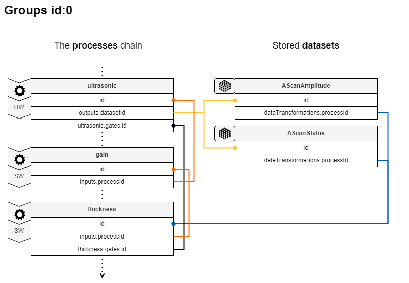
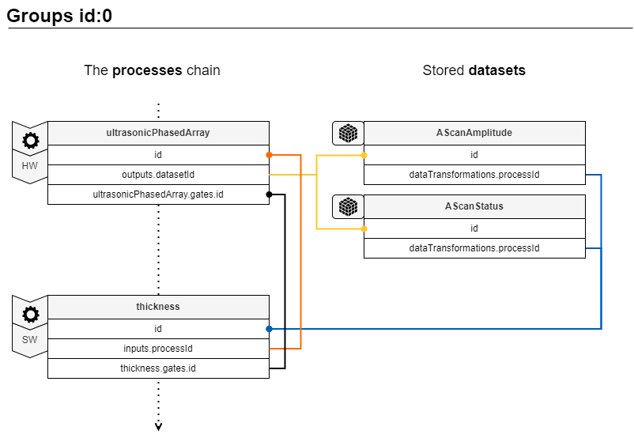
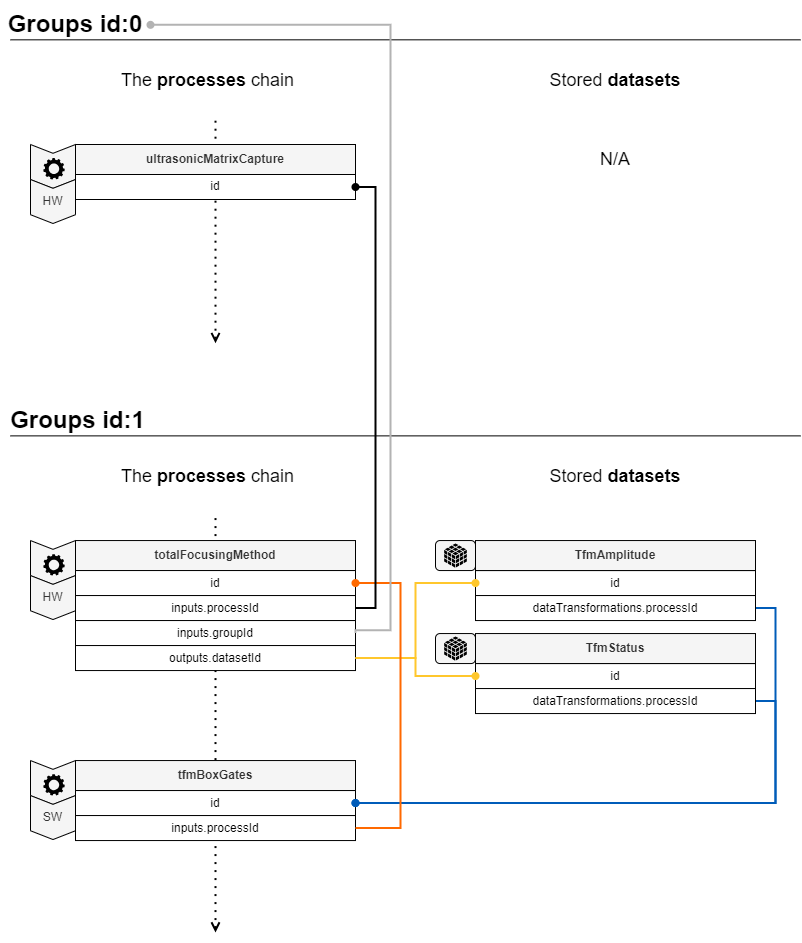

# Groups Related Arrays and Objects

A group comprises datasets and various processing stages that are inherently interconnected. Group identity is defined by its first process (processId=0), which is usually the the raw hardware acquisition process or a processing step that fundamentally changes the nature of the data found in another group (ex. FMC → TFM). A dataset invariably originates from a process.

## **groups** array

The **groups** array describes a group comprising datasets and/or processes.

| Property          | Type    | Description                                                                         |
| :---------------- | :------ | :---------------------------------------------------------------------------------- |
| **id** `required` | integer | The unique group id in the JSON structure                                           |
| **name**          | string  | The group name                                                                      |
| **usage**         | string  | Additional information concerning the use of the group (for example: CouplingCheck) |
| **datasets**      | array   | One or several datasets among [datasets](datasets.md)                               |
| **processes**     | array   | One or several processes among [processes](./processes/index.md)                    |

## Examples of typical groups structures

The following examples illustrate the typical structure and relationships of groups used in ultrasonic inspections. Note that, in these examples, processes are shown in a chain; however, they could also be branched for more complex cases. Only cross-referenced IDs are represented to help clarify the various intra- and inter-group relationships between processes and datasets.

### Conventional ultrasonic testing (UT)

=== "UT"
    This shows a conventional ultrasonic acquisition. Note that the AScanStatus dataset is optional. 

    { width="600" }

=== "UT + Thickness"
    This shows a conventional ultrasonic acquisition with thickness measurement on a gate. Note that the AScanStatus dataset is optional. 

    { width="600" }

=== "UT + Thickness + Gain"
    This shows a conventional ultrasonic acquisition with thickness measurement on a gate and a gain. Note that the AScanStatus dataset is optional. 

    { width="600" }

### Phased array ultrasonic testing (PAUT)

=== "PA One Line Scan"
    This shows a phased array ultrasonic acquisition. Note that the AScanStatus dataset is optional. 

    { width="600" }

=== "PA One Line Scan + Thickness"
    This shows a phased array ultrasonic acquisition with thickness measurement on a gate. Note that the AScanStatus dataset is optional. 

    { width="600" }

=== "PA One Line Scan + Thickness + Gain"

    This shows a phased array ultrasonic acquisition with thickness measurement on a gate and a gain. Note that the AScanStatus dataset is optional. 

    { width="600" }

### Total focusing method (TFM)

=== "TFM"
    This shows a TFM reconstruction by collection of a FMC. Note that the TfmStatus dataset is optional. 

    { width="600" }

=== "TFM + Box Gates"
    This shows a TFM reconstruction of an FMC acquisition with definition of gates defined on the TFM image. Note that the TfmStatus dataset is optional. 

    { width="600" }

=== "TFM + Box Gates + Gain"
    This shows a TFM reconstruction of an FMC acquisition with definition of gates defined on the TFM image and a gain. Note that the TfmStatus dataset is optional. 

    { width="600" }