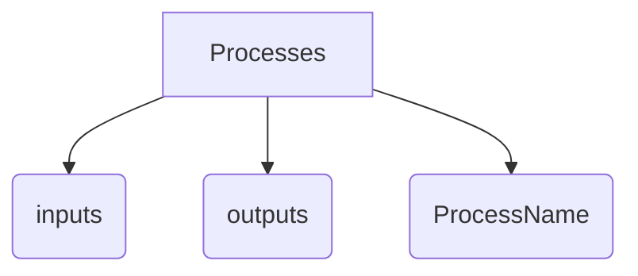

A process describes an operation aimed at creating, modifying, or formatting data, which are ultimately stored or referenced within a dataset. Processes have inputs and outputs and can be directly linked to a dataset or to another process.

A list of processes related to a particular group provides information on how the data was created, including an acquisition instrument configuration, specific hardware process, or software process.

The processes can be chained to create a particular data using a "**processId**" to the previous process in the chain. If the processId is not present, the process is the first in the chain. 

## Processes related arrays and objects

## **processes** array

This array describes multiple processes

| Property           | Type    | Description                                                                                          |
| :----------------- | :------ | :--------------------------------------------------------------------------------------------------- |
| **id** `required`  | integer | The unique process id in the JSON structure                                                          |
| **implementation** | string  | The process implementation type, can be `Software` or `Hardware`                                     |
| **inputs**         | object  | An [inputs](#inputs-object) object describing the different inputs of the process                    |
| **outputs**        | object  | An [outputs](#outputs-object) object describing the different outputs of the process                 |
| **dataMappingId**  | integer | The unique Id of the referenced [dataMappings](../data-mappings.md#datamappings-array) array |
| One of the following sub-object: <ul><li><b><a href="./ultrasonicConventional">ultrasonicConventional*</a></b></li><li><b><a href="./ultrasonicPhasedArray">ultrasonicPhasedArray*</a></b></li><li><b><a href="./ultrasonicMatrixCapture">ultrasonicMatrixCapture*</a></b></li><li><b><a href="./totalFocusingMethod">totalFocusingMethod*</a></b></li><li><b><a href="./tfmBoxGates">tfmBoxGates*</a></b></li><li><b><a href="./thickness">thickness*</a></b></li><li><b><a href="./gain">gain*</a></b></li></ul> |         |      |                                                              |

## **inputs** object

| Property                 | Type    | Description                                                                   |
| :----------------------- | :------ | :---------------------------------------------------------------------------- |
| **groupId** `required`   | integer | A valid group id in the JSON structure                                        |
| **processId** `required` | integer | A valid process id in the JSON structure                                      |
| **outputIds**            | array   | An array containing the specific outputs of the previously referenced process |

## **outputs** object

| Property          | Type    | Description                                                                      |
| :---------------- | :------ | :------------------------------------------------------------------------------- |
| **id** `required` | integer | The unique process output id of the specific process                             |
| **datasetId**     | integer | A valid and unique dataset id for the group                                      |
| **parameters**    | object  | A simple object storing the parameters related to the given ouput of the process |

