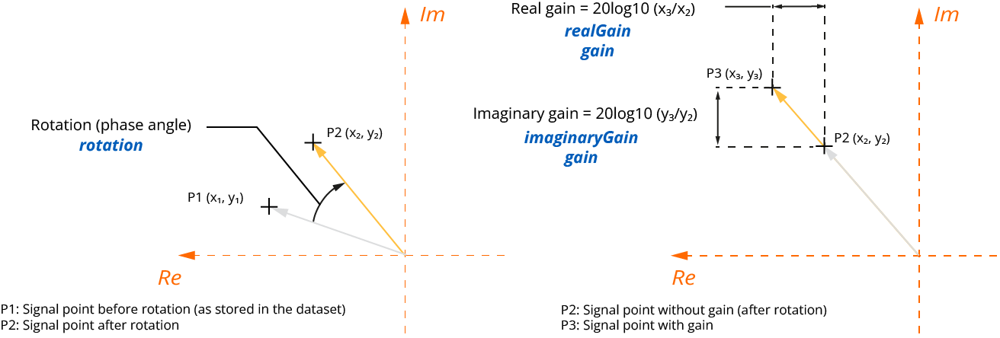
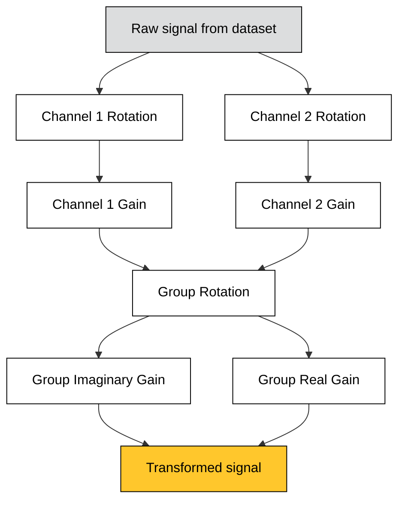

# **impedanceTransformation**
<span class="badge-et">ET</span>
<!-- md:json_type object -->
<!-- md:version 4.3.0 -->

The **impedanceTransformation** object describes an eddy current impedance dataset transformation process.

| Property                     | Type   | Unit | Description                                                                                       |
| :--------------------------- | :----- | :--: | :------------------------------------------------------------------------------------------------ |
| **realGain** `required`      | number |  dB  | Gain applied to the real part of the recorded signal for all channels                             |
| **imaginaryGain** `required` | number |  dB  | Gain applied to the imaginary part of the recorded signal for all channels                        |
| **rotation** `required`      | number |  °   | Rotation (phase angle) applied to the recorded signal                                             |
| **channels**                 | array  |  -   | A [**channels**](#channels) array with per-channel gain and rotation values from normalization    |

## **channels**
<span class="badge-et">ET</span>
<!-- md:json_type array -->
<!-- md:version 4.3.0 -->

The **channels** array stores the normalization information for each individual channel of an eddy current probe. Real and imaginary gains are equal per channel, so only one gain value is stored.

| Property                | Type   | Unit | Description                                    |
| :---------------------- | :----- | :--: | :--------------------------------------------- |
| **id** `required`       | number |  -   | Unique id of the channel                       |
| **gain** `required`     | number |  dB  | Gain value used for normalization              |
| **rotation** `required` | number |  °   | Rotation value used for normalization          |

!!! info "Normalization"
    The primary goal of normalization is to uniformize the sensitivity across all ECA probe channels within a given group. The operator typically scans a reference sample containing a discontinuity engineered to produce a uniform response across all channels (e.g. a long transverse notch or a uniform lift-off variation). The gain and phase rotation of each channel are then adjusted to ensure consistent amplitude and phase responses across all channels.

{ width="600" }

!!! info "Transformation order"
    Channel rotation and gain should be applied **before** group rotation and gains, as shown in the process workflow below.



## Example

```json
"impedanceTransformation": {
    "realGain": 13.420000000000002,
    "imaginaryGain": 13.420000000000002,
    "rotation": 80,
    "channels": [
        {
        "id": 0,
        "gain": 0.0,
        "rotation": 0.0
        },
        {
        "id": 1,
        "gain": 0.0,
        "rotation": 0.0
        }
    ]            
}
```
