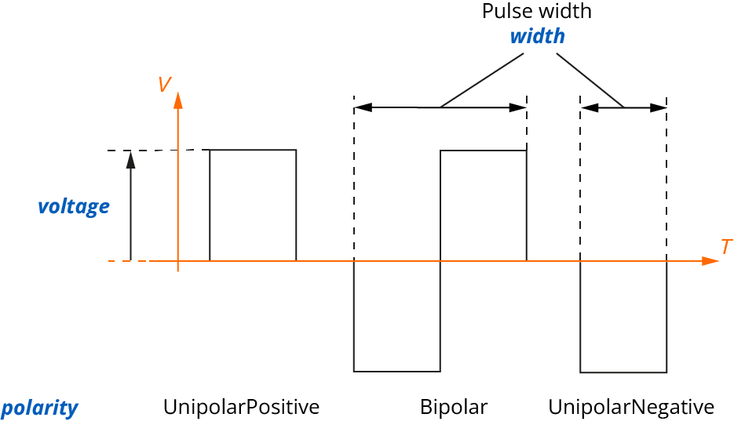

# **ultrasonicPhasedArray**
<span class="badge-ut">UT</span>
<!-- md:json_type object -->

The **ultrasonicPhasedArray** object serves as a conventional phased array acquisition process.


| Property                                                                                                                                                                                                                                        | Type    | Unit | Description                                                                                    |
| :---------------------------------------------------------------------------------------------------------------------------------------------------------------------------------------------------------------------------------------------- | :------ | :--: | :--------------------------------------------------------------------------------------------- |
| **waveMode** `required`                                                                                                                                                                                                                         | string  |  -   | Either: `Longitudinal` or `TransversalVertical`                                                |
| **velocity** `required`                                                                                                                                                                                                                         | number  | m/s  | Material wave speed corresponding to the specified wave mode (used for the beam delay calculation) |
| **wedgeDelay**                                                                                                                                                                                                                                  | number  |  s   | Delay corresponding to the sound propagation within the wedge                                  |
| **rectification**                                                                                                                                                                                                                               | string  |  -   | RF signal rectification type, one of the following: `None`, `Positive`, `Negative`, or `Full`                    |
| **digitizingFrequency**                                                                                                                                                                                                                         | number  |  Hz  | Sampling rate of the saved  A-scans                                                            |
| **ascanSynchroMode**                                                                                                                                                                                                                            | string  |  -   | Type of A-scan syncrhonization, either: `Pulse` or `SynchroGateRelative`                          |
| **ascanCompressionFactor**                                                                                                                                                                                                                      | integer |  -   | Compression factor applied to the A-scans                                                          |
| **gain**                                                                                                                                                                                                                                        | number  |  dB  | Hardware gain applied to all A-scans                                                           |
| **ultrasoundMode**                                                                                                                                                                                                                              | string  |  -   | Ultrasound mode, one of the following: `TrueDepth`, `SoundPath`, or `Time`                                       |
| **referenceAmplitude**                                                                                                                                                                                                                          | number  |  %   | A-scan full-screen height of the reference amplitude                                           |
| **referenceGain**                                                                                                                                                                                                                               | number  |  dB  | Reference gain value from which other gain values will be offset                              |
| **smoothingFilter**                                                                                                                                                                                                                             | number  |  Hz  | Characteristic frequency of the smoothing filter                                               |
| **averagingFactor**                                                                                                                                                                                                                             | integer |  -   | The averaging ratio                                                                          |
| **beams**                                                                                                                                                                                                                                   | array   |  -   | A [**beams**](#beams) array                                                              |
| **digitalBandPassFilter**                                                                                                                                                                                                                   | object  |  -   | A [**digitalBandPassFilter**](#digitalbandpassfilter) object                            |
| **pulse**                                                                                                                                                                                                                                   | object  |  -   | A [**pulse**](#pulse) object                                                            |
| **gates**                                                                                                                                                                                                                                   | object  |  -   | A [**gates**](#gates) object                                                            |
| **calibrationStates**                                                                                                                                                                                                                       | array   |  -   | A [**calibrationStates**](#calibrationstates) array                                      |
| **lawFile**                                                                                                                                                                                                                                 | object  |  -   | A [**lawFile**](#lawfile) object                                                        |
| **focusing** `required`                                                                                                                                                                                                                     | object  |  -   | A [**focusing**](#focusing) object (except for the tandem configuration case)           |
| One of the following  <code>required</code> subobjects: <ul><li><b><a href="#pulseecho">pulseEcho</a></b></li><li><b><a href="#pitchcatch">pitchCatch</a></b></li><li><b><a href="#tandem">tandem</a></b></li></ul> |         |      |                                                                                                |


## **pulseEcho**
<span class="badge-ut">UT</span>
<!-- md:json_type object -->

The **pulseEcho** object describes the probe used in an acquisition pattern where the same probe is used at emission and reception and the associated beam formation.

| Property                                                                                                                                                                                                                                                            | Type    | Description                                                              |
| :------------------------------------------------------------------------------------------------------------------------------------------------------------------------------------------------------------------------------------------------------------------ | :------ | :----------------------------------------------------------------------- |
| **probeId**                                                                                                                                                                                                                                                         | integer | The id of the probe used at emission and reception in a pulse-echo setup |
| One of the following subobjects: <ul><li><b><a href="#linearformation">linearFormation</a></b></li><li><b><a href="#sectorialformation">sectorialFormation</a></b></li><li><b><a href="#compoundformation">compoundFormation</a></b></li></ul> |         |                                                                          |


## **pitchCatch**
<span class="badge-ut">UT</span>
<!-- md:json_type object -->

The **pitchCatch** object describes the probes used in an acquisition pattern where one probe is used at emission and an other at reception and the associated beam formation.

| Property                                                                                                                                                                                                                                                            | Type    | Description                                                 |
| :------------------------------------------------------------------------------------------------------------------------------------------------------------------------------------------------------------------------------------------------------------------ | :------ | :---------------------------------------------------------- |
| **pulserProbeId**                                                                                                                                                                                                                                                   | integer | The id of the probe used at emission in a pitch-catch setup |
| **receiverProbeId**                                                                                                                                                                                                                                                 | integer | The id of the probe used at reception in a pitch-catch setup |
| One of the following subobjects: <ul><li><b><a href="#linearformation">linearFormation</a></b></li><li><b><a href="#sectorialformation">sectorialFormation</a></b></li><li><b><a href="#compoundformation">compoundFormation</a></b></li></ul> |         |                                                             |

## **tandem**
<span class="badge-ut">UT</span>
<!-- md:json_type object -->

The **tandem** object describes a self-tandem acquisition and the associated beam formation.

| Property              | Type    | Unit | Description                                           |
| :-------------------- | :------ | :--: | :---------------------------------------------------- |
| **pulserProbeId**     | integer |  -   | The id of the probe used at emission  in a TOFD setup |
| **receiverProbeId**   | integer |  -   | The id of the probe used at reception in a TOFD setup |
| **pulserFormation**   | object  |  -   | A [singleFormation](#singleformation) object   |
| **receiverFormation** | object  |  -   | A [singleFormation](#singleformation) object   |


### **linearFormation**
<span class="badge-ut">UT</span>
<!-- md:json_type object -->

| Property                 | Type    | Unit | Description                                                                            |
| :----------------------- | :------ | :--: | -------------------------------------------------------------------------------------- |
| **probeFirstElementId** `required`  | integer |  -   | The id of the first element of the probe in the firing sequence                        |
| **probeLastElementId** `required`   | integer |  -   | The id of the last element of the probe in the firing sequence                         |
| **elementStep** `required`          | number  |  -   | The step (number of elements) between each firing sequence                             |
| **elementAperture** `required`      | integer |  -   | The aperture in number of elements                                                     |
| **beamRefractedAngle** `required`   | number  |  °   | The refracted angle of the wavefront in the specimen used for the beam delay calculation |

### **sectorialFormation**
<span class="badge-ut">UT</span>
<!-- md:json_type object -->

| Property                           | Type    | Description                                                     |
| :--------------------------------- | :------ | :-------------------------------------------------------------- |
| **probeFirstElementId** `required` | integer | The id of the first element of the probe in the firing sequence |
| **elementAperture** `required`     | integer | The aperture in number of elements                              |
| **beamRefractedAngles** `required` | object  | A [beamRefractedAngles](#beamrefractedangles)  object    |

#### **beamRefractedAngles**
<span class="badge-ut">UT</span>
<!-- md:json_type object -->

| Property   | Type   | Unit | Description                              |
| :--------- | :----- | :--: | ---------------------------------------- |
| **start** `required`  | number |  °   | Angle start for the beam delay calculation |
| **stop** `required`   | number |  °   | Angle stop for the beam delay calculation  |
| **step** `required`   | number |  °   | Angle step for the beam delay calculation  |

### **compoundFormation**
<span class="badge-ut">UT</span>
<!-- md:json_type object -->

| Property                           | Type    | Description                                                     |
| :--------------------------------- | :------ | :-------------------------------------------------------------- |
| **probeFirstElementId** `required` | integer | The id of the first element of the probe in the firing sequence |
| **probeLastElementId** `required`  | integer | The id of the last element of the probe in the firing sequence  |
| **elementAperture** `required`     | integer | The aperture in number of elements                              |
| **beamRefractedAngles** `required` | number  | A [beamRefractedAngles](#beamrefractedangles)  object    |

### **singleFormation**
<span class="badge-ut">UT</span>
<!-- md:json_type object -->

| Property                           | Type    | Unit | Description                                                                            |
| :--------------------------------- | :------ | :--: | -------------------------------------------------------------------------------------- |
| **probeFirstElementId** `required` | integer |  -   | The id of the first element of the probe in the firing sequence                        |
| **elementAperture** `required`     | integer |  -   | The aperture in number of elements                                                     |
| **beamRefractedAngle** `required`  | number  |  °   | The refracted angle of the wavefront in the specimen used for the beam delay calculation |
| **velocity**                       | number  | m/s  | Material wave speed for the corresponding wave mode used for the beam delay calculation   |
| **focusingDistance**               | number  |  m   | Focusing distance used for the beam delay calculation                                    |


## **pulse**
<span class="badge-ut">UT</span>
<!-- md:json_type object -->

| Property               | Type   | Unit | Description                                                                                                                                                                                         |
| :--------------------- | :----- | :--: | :-------------------------------------------------------------------------------------------------------------------------------------------------------------------------------------------------- |
| **width** `required`   | number |  s   | Time duration, in seconds, of the high-voltage square pulse used to excite the transducer element                                                                                                   |
| **voltage** `required` | number |  V   | Amplitude, in volts, of the square pulse used to excite the transducer element                                                                                                                      |
| **polarity**           | string |  -   | Polarity of the square pulse used to excite the transducer element, one of the following: `Bipolar`, `UnipolarPositive`, or `UnipolarNegative`. A `Bipolar` pulse is assumed to be negative first and then positive. |

{width="50%"}


## **focusing**
<span class="badge-ut">UT</span>
<!-- md:json_type object -->

| Property            | Type   | Unit | Description                                                              |
| :------------------ | :----- | :--: | ------------------------------------------------------------------------ |
| **mode** `required` | string |  -   | Focusing mode, one of the following: `TrueDepth`, `HalfPath`, `Unfocused`, or `Projection` |
| **distance**        | number |  m   | Focusing distance used for the beam delay calculation                      |
| **angle**           | number |  °   | Focusing angle used for the beam delay calculation                         |


## **beams**
<span class="badge-ut">UT</span>
<!-- md:json_type array -->

| Property                      | Type    | Unit | Description                                                                      |
| :---------------------------- | :------ | :--: | -------------------------------------------------------------------------------- |
| **id** `required`             | integer |  -   | The unique id of the beam within the ultrasonicPhasedArray process               |
| **skewAngle** `required`      | number  |  °   | -                                                                                |
| **refractedAngle** `required` | number  |  °   | The refracted angle of the wavefront in the specimen used for this specific beam |
| **beamDelay** `required`      | number  |  s   |                                                                                  |
| **ascanStart** `required`     | number  |  s   | When the recording of the A-scan starts for this beam                                  |
| **acanLength** `required`     | number  |  s   | Time duration of each A-scan for this beam                                         |
| **gainOffset**                | number  |  dB  |                                                                                  |
| **recurrence**                | number  |      |                                                                                  |
| **sumGain**                   | number  |  dB  |                                                                                  |
| **sumGainMode**               | string  |      | Either: `Manual` or `Automatic`                                                     |
| **tcg**                       | object  |  -   | A [tcg](#tcg) object                                                      |
| **pulsers**                   | array   |  -   | A [pulsers](#pulsers) array                                                |
| **receivers**                 | array   |  -   | A [receivers](#receivers) array                                            |

### **tcg**
<span class="badge-ut">UT</span>
<!-- md:json_type object -->

| Property              | Type   | Description                                                      |
| :-------------------- | :----- | :--------------------------------------------------------------- |
| **synchroMode**       | string | Either: `Pulse`, `AscanSynchroRelative` or `SynchroGateRelative` |
| **points** `required` | array  | A TCG [**points**](#points) array                          |

#### **points**
<span class="badge-ut">UT</span>
<!-- md:json_type array -->

The **points** array lists the time-corrected gain (TCG) points, with the corresponding gain to apply for a given time increment. 

| Property            | Type   | Unit | Description               |
| :------------------ | :----- | :--: | :------------------------ |
| **time** `required` | number |  s   | Time increment in seconds |
| **gain** `required` | number |  dB  | Gain in decibels           |

### **pulsers**
<span class="badge-ut">UT</span>
<!-- md:json_type array -->

| Property  | Type    | Unit | Description                                               |
| :-------- | :------ | :--: | --------------------------------------------------------- |
| id        | integer |  -   | The unique id of the pulser associated with the beam      |
| elementId | integer |  -   | The elementId of the probe used by the pulser             |
| delay     | number  |  s   | The associated delay applied to this pulser before firing |

### **receivers**
<span class="badge-ut">UT</span>
<!-- md:json_type array -->

| Property  | Type    | Unit | Description                                                               |
| :-------- | :------ | :--: | ------------------------------------------------------------------------- |
| id        | integer |  -   | The unique id of the receiver associated with the beam                    |
| elementId | integer |  -   | The elementId of the probe used by the receiver                           |
| delay     | number  |  s   | The associated delay applied to this receiver before recording the A-Scan |


## **gates**
<span class="badge-ut">UT</span>
<!-- md:json_type array -->

| Property                         | Type    | Unit | Description                                          |
| :------------------------------- | :------ | :--: | :--------------------------------------------------- |
| **id** `required`                | integer |  -   | Unique id of the gate within the acquisition process |
| **name**                         | string  |  -   | Name of the gate  (e.g., "A", "B", "I" etc.)          |
| **geometry**                     | string  |  -   | Either: `SoundPath` or `TrueDepth`                    |
| **start** `required`             | number  |  s   | Gate starting time                                   |
| **length** `required`            | number  |  s   | Gate time duration                                     |
| **threshold** `required`         | number  |  %   | Threshold level                                      |
| **thresholdPolarity** `required` | string  |  -   | One of the following: `Absolute`, `Positive` or `Negative`          |
| **synchronization** `required`   | object  |  -   | A [synchronization](#synchronization) object  |

### **synchronization**
<span class="badge-ut">UT</span>
<!-- md:json_type object -->

| Property            | Type    | Description                                                                                                                                                      |
| :------------------ | :------ | :--------------------------------------------------------------------------------------------------------------------------------------------------------------- |
| **mode**            | string  | Synchronization mode, either: `Pulse` or `GateRelative`                                                                                                          |
| **triggeringEvent** | string  | When synchronization is performed relative to a gate (`GateRelative`), the synchronization triggering event is either: `Peak` or `Crossing`                            |
| **gateId**          | integer | When synchronization is performed relative to a gate (`GateRelative`), this is the corresponding gate Id in the ultrasonic acquisition process [gates](#gates) object |


## **digitalBandPassFilter**
<span class="badge-ut">UT</span>
<!-- md:json_type object -->

The **digitalBandPassFilter** object describes the band-pass filter parameters applied during acquisition.

| Property                           | Type   | Unit | Description                                                           |
| :--------------------------------- | :----- | :--: | :-------------------------------------------------------------------- |
| **filterType** `required`          | string |  -   | The type of filter, one of the following: `None`, `LowPass`, `HighPass`, or `BandPass` |
| **highCutOffFrequency** `required` | number |  Hz  | High cutoff frequency in Hz                                           |
| **lowCutOffFrequency** `required`  | number |  Hz  | Low cutoff frequency in Hz                                            |
| **characteristic** `required`      | string |  -   | Either: `None` or `TOFD`                                                |

## **calibrationStates**
<span class="badge-ut">UT</span>
<!-- md:json_type array -->

| Property                      | Type   | Description                                           |
| :---------------------------- | :----- | :---------------------------------------------------- |
| **sensitivityCalibration**    | object | A [calibrationState](#calibrationstate) object |
| **tcgCalibration**            | object | A [calibrationState](#calibrationstate) object |
| **velocityCalibration**       | object | A [calibrationState](#calibrationstate) object |
| **wedgeDelayCalibration**     | object | A [calibrationState](#calibrationstate) object |
| **dacCalibration**            | object | A [calibrationState](#calibrationstate) object |
| **dgsCalibration**            | object | A [calibrationState](#calibrationstate) object |
| **tofdWedgeDelayCalibration** | object | A [calibrationState](#calibrationstate) object |

### **calibrationState**
<span class="badge-ut">UT</span>
<!-- md:json_type object -->

Same structure for **sensitivityCalibration**, **tcgCalibration**, **velocityCalibration**, **wedgeDelayCalibration**, **dacCalibration**, **dgsCalibration**, and **tofdWedgeDelayCalibration**.

| Property                  | Type    | Description                                           |
| :------------------------ | :------ | :---------------------------------------------------- |
| **calibrated** `required` | Boolean | Indicate whether the calibration was performed or not |


## **lawFile**
<span class="badge-ut">UT</span>
<!-- md:json_type object -->

| Property                | Type   | Description                                        |
| :---------------------- | :----- | :------------------------------------------------- |
| **filename** `required` | string | Name of the law file                               |
| **path** `required`     | string | The path of the law file inside the HDF5 structure |

## Examples

??? quote "ultrasonicPhasedArray processes examples for different configurations"

    === "Sectorial Scan"
        ``` json
        --8<-- "docs/assets/json/json-metadata/setup/data-model/ultrasonicPhasedArray-PA-Sect.json"
        ``` 
    === "Linear Scan 0°"
        ``` json
        --8<-- "docs/assets/json/json-metadata/setup/data-model/ultrasonicPhasedArray-PA-Lin0.json"
        ```