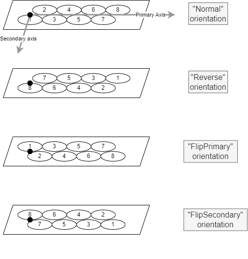
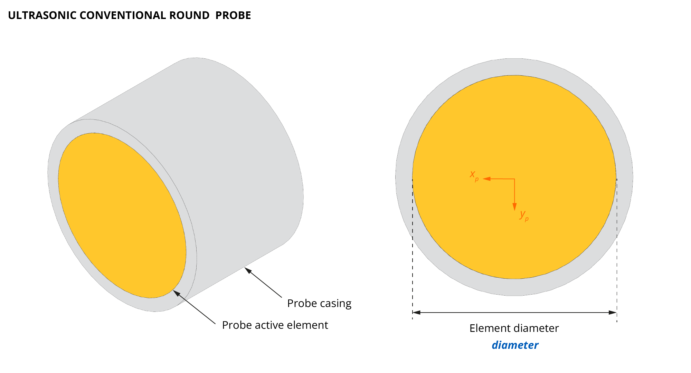
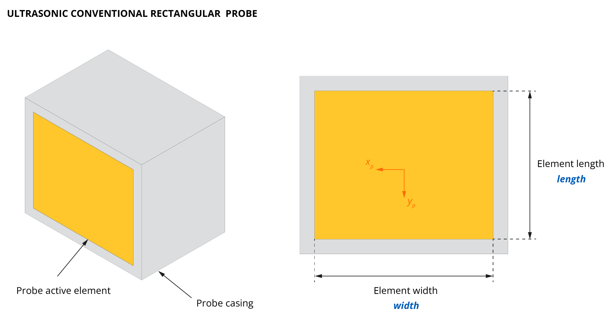
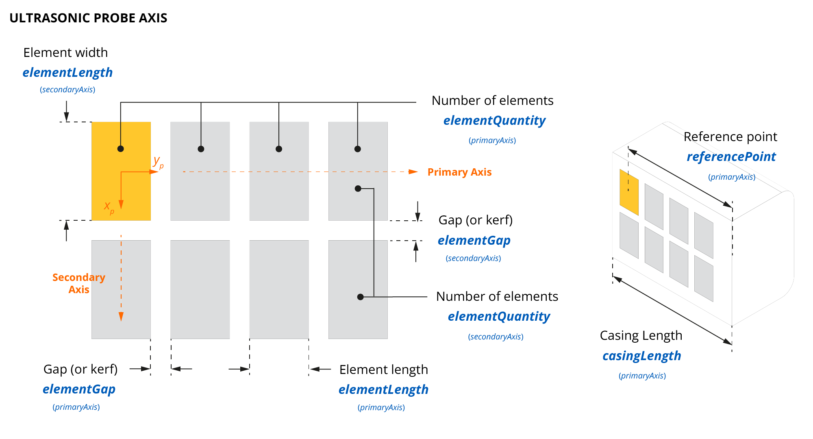
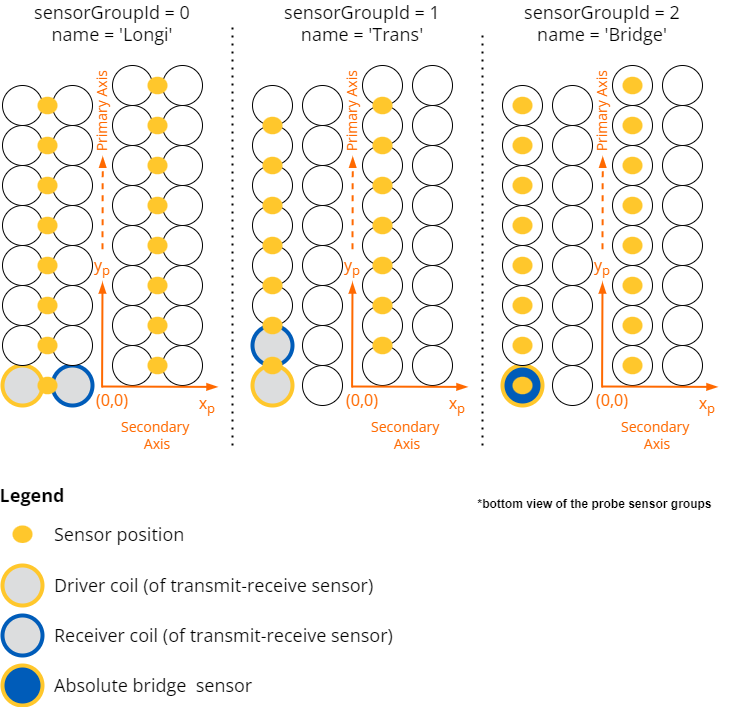

# Probes

<!-- md:json_type array -->

A **probe** is a physical transducer or coil assembly used to inspect materials for flaws. The **probes** array is shared across all supported technologies; technology-specific specifications are described by the required probe type subobject.

<span class="badge-ut">UT</span> Ultrasonic probes generate and receive high-frequency sound waves to detect internal flaws, measure thickness, or characterize materials. A probe can include individual elements (conventional UT) or elements arrays (PAUT). 

<span class="badge-et">ET</span> Eddy current probes induce electromagnetic eddy currents in conductive materials to detect surface and near-surface flaws. A probe can include individual sensors (conventional EC) or sensor arrays (ECA). 

A generic probe object features the following properties.

<table>
<thead>
  <tr>
    <th>Property</th>
    <th>Type</th>
    <th>Description</th>
  </tr>
</thead>
<tbody>
  <tr>
    <td><b>id</b> <code>required</code></td>
    <td>integer</td>
    <td>Unique probe id in the JSON structure</td>
  </tr>
  <tr>
    <td><b>model</b></td>
    <td>string</td>
    <td>Probe model reference</td>
  </tr>
  <tr>
    <td><b>serie</b></td>
    <td>string</td>
    <td>Probe series reference</td>
  </tr>
  <tr>
    <td><b>serialNumber</b></td>
    <td>string</td>
    <td>Probe serial number</td>
  </tr>
  <tr>
    <td><b><a href="#wedgeassociation">wedgeAssociation</a></b></td>
    <td>object</td>
    <td>Association of the probe with a wedge</td>
  </tr>
  <tr>
    <td>
      One of the following <code>required</code> probe type objects:
      <ul>
        <li><b><a href="#conventionalround">conventionalRound</a></b> <span class="badge-ut">UT</span></li>
        <li><b><a href="#conventionalrectangular">conventionalRectangular</a></b> <span class="badge-ut">UT</span></li>
        <li><b><a href="#phasedarraylinear">phasedArrayLinear</a></b> <span class="badge-ut">UT</span></li>
        <li><b><a href="#eddycurrentprobe">eddyCurrentProbe</a></b> <span class="badge-et">ET</span></li>
      </ul>
    </td>
    <td>object</td>
    <td></td>
  </tr>
</tbody>
</table>

## **wedgeAssociation** 
<!-- md:json_type object -->

The **wedgeAssociation** object describes the association of a probe with a wedge.

| Property                          | Type    | Description                                                                        |             Technology             |
| :-------------------------------- | :------ | :--------------------------------------------------------------------------------- | :--------------------------------: |
| **wedgeId** `required`            | integer | Associated wedge id                                                                | <span class="badge-all">All</span> |
| **orientation** `required`        | string  | <span class="badge-ut">UT</span> `Normal` or `Reverse`<br><span class="badge-et">ET</span> `Normal`, `Reverse`, `FlipPrimary`, or `FlipSecondary` | <span class="badge-all">All</span> |
| **mountingLocationId** `required` | integer | Associated mounting location id                                                    |  <span class="badge-ut">UT</span>  |

<span class="badge-et">ET</span> ECA probes made from thin flexible PCB can be flipped and used from the back side, hence the additional `FlipPrimary` and `FlipSecondary` orientation options.

{ width="300" }
/// caption
Probe orientation and effect on sensor positioning within the probe.
///

**Related objects**: [wedges](../data-model/wedges.md), [mountingLocations](../data-model/wedges.md#mountinglocations)

=== "Example UT"

    ``` json
    "wedgeAssociation": {
      "wedgeId": 0,
      "mountingLocationId": 0,
      "orientation": "Normal"
    }
    ``` 

=== "Example ET"

    ``` json
    "wedgeAssociation": {
      "wedgeId": 0,
      "orientation": "Normal"
    }
    ```

## **conventionalRound** 
<span class="badge-ut">UT</span>
<!-- md:json_type object -->

The **conventionalRound** object describes a conventional single-element ultrasonic probe with a round active element.

| Property                        | Type   | Unit | Description                                                          |
| :------------------------------ | :----- | :--: | :------------------------------------------------------------------- |
| **centralFrequency** `required` | number |  Hz  | Central frequency of the probe                                       |
| **diameter** `required`         | number |  m   | Diameter of the probe active element                                 |
| **elements** `required`         | array  |  -   | An [elements](#elements) array (single element in this case)   |



```json title="Example"
"conventionalRound": {
  "centralFrequency": 5000000.0,
  "diameter": 0.00635,
  "elements": [
    {
      "id": 0,
      "acquisitionUnitId": 0,
      "connectorName": "P1"
    }
  ]
}
```

## **conventionalRectangular** 
<span class="badge-ut">UT</span>
<!-- md:json_type object -->

The **conventionalRectangular** object describes a conventional single-element ultrasonic probe with a rectangular active element.

| Property                        | Type   | Unit | Description                                                          |
| :------------------------------ | :----- | :--: | :------------------------------------------------------------------- |
| **centralFrequency** `required` | number |  Hz  | Central frequency of the probe                                       |
| **length** `required`           | number |  m   | Length of the probe's active element                                 |
| **width** `required`            | number |  m   | Width of the probe's active element                                  |
| **elements** `required`         | array  |  -   | An [elements](#elements) array (single element in this case)   |



```json title="Example"
"conventionalRectangular": {
  "length": 0.02,
  "width": 0.01,
  "centralFrequency": 10000000.0,
  "elements": [
    {
      "id": 0,
      "acquisitionUnitId": 0,
      "connectorName": "P1"
    }
  ]
}
```

## **phasedArrayLinear** 
<span class="badge-ut">UT</span>
<!-- md:json_type object -->

The **phasedArrayLinear** object describes a phased array ultrasonic probe with a linear element arrangement.

| Property                        | Type    | Unit | Description                                                                                          |
| :------------------------------ | :------ | :--: | :--------------------------------------------------------------------------------------------------- |
| **centralFrequency** `required` | number  |  Hz  | Central frequency of all elements                                                                    |
| **elements**                    | array   |  -   | An [elements](#elements) array                                                                 |
| **primaryAxis** `required`      | object  |  -   | A [probeAxis](#probeaxis) object describing the primary axis                                  |
| **secondaryAxis** `required`    | object  |  -   | A [probeAxis](#probeaxis) object describing the secondary axis                                |

Supported configurations:

- 1D linear array with flat or curved active face (along primary or secondary axis)
- 2D linear array with flat or curved active face (along primary or secondary axis)

### **elements**
<span class="badge-ut">UT</span> 
<!-- md:json_type array -->

The **elements** array lists the probe elements and their connection properties.

| Property                         |  Type   | Description                                                                               |
| :------------------------------- | :-----: | :---------------------------------------------------------------------------------------- |
| **id** `required`                | integer | Unique id of the probe element                                                            |
| **pinId** `required`             | integer | Pin id to which the element is connected                                                  |
| **acquisitionUnitId** `required` | integer | Unique id of the acquisition unit to which the element is connected                       |
| **connectorName** `required`     | string  | Name of the connector interfacing the element with the acquisition unit                   |
| **primaryIndex**                 | integer | Element numbering along the probe primary axis                                            |
| **secondaryIndex**               | integer | Element numbering along the probe secondary axis                                          |
| **enable**                       | boolean | Whether the element is activated                                                          |

**Related objects**: [acquisitionUnits](../data-model/acquisition-units.md)

### **probeAxis**
<span class="badge-ut">UT</span>
<!-- md:json_type object -->

The **probeAxis** object describes a given probe axis.

| Property                       | Type    | Unit | Description                                                                                              |
| :----------------------------- | :------ | :--: | :------------------------------------------------------------------------------------------------------- |
| **elementGap** `required`      | number  |  m   | Spacing between two adjacent elements                                                                    |
| **elementQuantity** `required` | integer |  -   | Number of elements along this axis                                                                       |
| **elementLength** `required`   | number  |  m   | Length of a single element (constant across all elements)                                                |
| **referencePoint** `required`  | number  |  m   | Distance from the casing edge to the center of the first element along this axis                         |
| **casingLength**               | number  |  m   | Length of the casing embedding the array along this axis                                                 |

Hypotheses:

- Constant `elementLength` and `elementGap` for `elementQuantity` elements along each probe axis.
- Probe surface may be curved along the primary **or** secondary axis, but not both simultaneously.



```json title="Example"
"phasedArrayLinear": {
  "centralFrequency": 5000000.0,
  "elements": [
    {
      "id": 0,
      "pinId": 0,
      "acquisitionUnitId": 0,
      "connectorName": "PA",
      "primaryIndex": 0,
      "secondaryIndex": 0,
      "enabled": true
    },
    {
      "id": 1,
      "pinId": 1,
      "acquisitionUnitId": 0,
      "connectorName": "PA",
      "primaryIndex": 1,
      "secondaryIndex": 0,
      "enabled": true
    },
    {...}
  ],
  "primaryAxis": {
    "elementGap": 0.0,
    "elementQuantity": 64,
    "elementLength": 0.0005,
    "referencePoint": -0.0366,
    "casingLength": 0.04
  },
  "secondaryAxis": {
    "elementGap": 0.0,
    "elementQuantity": 1,
    "elementLength": 0.01,
    "referencePoint": 0.0,
    "casingLength": 2E-06
  }
}
```

## **eddyCurrentProbe** 
<span class="badge-et">ET</span>
<!-- md:json_type object -->
<!-- md:version 4.3.0 -->

The **eddyCurrentProbe** object describes and eddy current probe. Within a probe, sensors are organized into **sensor groups** — sets of sensors meant to be operated together to produce a single inspection result (same flaw response for a given set of acquisition parameters).

| Property                                           | Type  | Unit | Description                                            |
| :------------------------------------------------- | :---- | :--: | :----------------------------------------------------- |
| **[sensorGroups](#sensorgroups)** `required` | array |  -   | Description of each sensor group defined for the probe |


### **sensorGroups** 
<span class="badge-et">ET</span>
<!-- md:json_type array -->
<!-- md:version 4.3.0 -->

Each object under **sensorGroups** describes a specific sensor group.

| Property                                         | Type    | Description                                      |
| :----------------------------------------------- | :------ | :----------------------------------------------- |
| **id** `required`                                | integer | Unique group id                                  |
| **name** `required`                              | string  | Name of the group                                |
| **[sensors](#sensors)** `required`         | array   | Definition of each sensor within the group       |


#### **sensors** 
<span class="badge-et">ET</span>
<!-- md:json_type array -->
<!-- md:version 4.3.0 -->

The **sensors** array enumerates each sensor (channel) object within a sensor group.

| Property                         | Type    | Unit | Description                                                                                |
| :------------------------------- | :------ | :--: | :----------------------------------------------------------------------------------------- |
| **id** `required`                | integer |  -   | Unique id for this sensor                                                                  |
| **acquisitionUnitId** `required` | integer |  -   | Unique id of the acquisition unit to which this sensor is connected                        |
| **primaryOffset** `required`     | number  |  m   | Position of the sensor peak response along the probe primary axis                          |
| **secondaryOffset** `required`   | number  |  m   | Position of the sensor peak response along the probe secondary axis                        |

**Probe coordinate system** — Each sensor is positioned in a surface coordinate system co-planar with the specimen for an in-contact probe at all inspection positions. This assumption is made without approximation for flexible probes (which physically conform to the inspected surface). For rigid probes, only elements with low lift-off variation are expected to be usable, so the co-planar hypothesis leads to only very small aberrations.

- The (0,0) origin is shared across all objects under `sensorGroups`.
- The (0,0) position is arbitrary in the `.nde` file, although in practice it typically aligns with a reference marking on the probe body indicating the beginning of the probe coverage.

{ width="550" }
/// caption
Multiple sensor groups within an ECA probe and the associated coordinate system.
///

!!! info "Coil inversion"
    When coil connections through a multiplexer require inverting polarity, an inverted coil must be rotated 180° prior to data exposure. NDE datasets are saved **after** applying these inversion rotations.

```json title="Example"
"eddyCurrentProbe": {
  "sensorGroups": [
    {
      "id": 0,
      "name": "SUB-ECA-64mm/32",
      "sensors": [
        {
          "id": 0,
          "acquisitionUnitId": 0,
          "primaryOffset": 0.0,
          "secondaryOffset": 0.0
        },
        {
          "id": 1,
          "acquisitionUnitId": 0,
          "primaryOffset": 0.002,
          "secondaryOffset": 0.0
        },
        {
          "id": 2,
          "acquisitionUnitId": 0,
          "primaryOffset": 0.004,
          "secondaryOffset": 0.0
        },
        {
          "id": 3,
          "acquisitionUnitId": 0,
          "primaryOffset": 0.006,
          "secondaryOffset": 0.0
        }
      ]
    }
  ]
}
```

## Examples

??? quote "<span class="badge-ut">UT</span> Phased array probe examples"

    === "5L64-A32"
        ``` json
        --8<-- "docs/assets/json/json-metadata/setup/data-model/probes-5L64-A32.json"
        ``` 
    === "10CCEV35-32-A15"
        ``` json
        --8<-- "docs/assets/json/json-metadata/setup/data-model/probes-10CCEV35-32-A15.json"
        ```
    === "7.5L64-I4"
        ``` json
        --8<-- "docs/assets/json/json-metadata/setup/data-model/probes-7.5L64-I4.json"
        ``` 
    === "7.5L60-PWZ1"
        ``` json
        --8<-- "docs/assets/json/json-metadata/setup/data-model/probes-7.5L60-PWZ1.json"
        ``` 
    === "5DL32-32X12-A26"
        ``` json
        --8<-- "docs/assets/json/json-metadata/setup/data-model/probes-5DL32-32X12-A26.json"
        ```
    === "4DM16X2SM-16X6-A27"
        ``` json
        --8<-- "docs/assets/json/json-metadata/setup/data-model/probes-4DM16X2SM-16X6-A27.json"
        ```
    === "2L8-DGS1"
        ``` json
        --8<-- "docs/assets/json/json-metadata/setup/data-model/probes-2L8-DGS1.json"
        ```

??? quote "<span class="badge-ut">UT</span> Single and dual element probe examples"

    === "V103"
        ``` json
        --8<-- "docs/assets/json/json-metadata/setup/data-model/probes-V103.json"
        ``` 
    === "D713"
        ``` json
        --8<-- "docs/assets/json/json-metadata/setup/data-model/probes-D713.json"
        ```

??? quote "<span class="badge-et">ET</span> Eddy Current Array probe example"

    Full example of an ECA probe definition with 2 groups (_Longi_ and _Trans_) composed of 32 and 30 channels respectively.
    ```json
    --8<-- "docs/assets/json/json-metadata/setup/data-model/eca_probes-example.json"
    ```

??? quote "<span class="badge-et">ET</span> Eddy Current conventional probe examples"

    === "Weld probe"

        ``` json
        "probes": [
          {
            "id": 0,
            "model": "weldProbe",
            "wedgeAssociation": {
              "wedgeId": 0,
              "orientation": "Normal"
            },
            "eddyCurrentProbe": {
              "sensorGroups": [
                {
                  "id": 0,
                  "name": "Flaw",
                  "sensors": [
                    {
                      "id": 0,
                      "acquisitionUnitId": 0,
                      "primaryOffset": 0.0,
                      "secondaryOffset": 0.0
                    }
                  ]
                }
              ]
            }
          }
        ]
        ``` 

    === "Surface Crack"

        ``` json
        "probes": [
          {
            "id": 0,
            "model": "surfaceCrackLEMO16Probe",
            "wedgeAssociation": {
              "wedgeId": 0,
              "orientation": "Normal"
            },
            "eddyCurrentProbe": {
              "sensorGroups": [
                {
                  "id": 0,
                  "name": "Flaw",
                  "sensors": [
                    {
                      "id": 0,
                      "acquisitionUnitId": 0,
                      "primaryOffset": 0.0,
                      "secondaryOffset": 0.0
                    }
                  ]
                }
              ]
            }
          }
        ]
        ```
