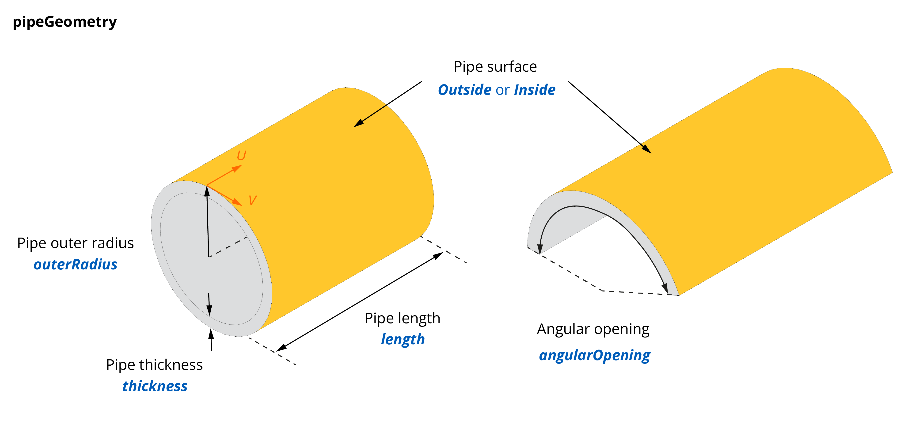

# Specimen Related Arrays and Objects

## **specimens** array

The **specimens** array lists the specimens on which the inspection is performed. 

<table>
<thead>
  <tr>
    <th>Property</th>
    <th>Type</th>
    <th>Description</th>
  </tr>
</thead>
<tbody>
  <tr>
    <td><b>id</b>  <code>required</code></td>
    <td>integer</td>
    <td>The unique specimen id in the JSON structure</td>
  </tr>
  <tr>
    <td>One of the following <code>required</code> sub-object: 
        <ul>
          <li><b><a href="#plategeometry-object">plateGeometry</a></b></li>
          <li><b><a href="#pipegeometry-object">pipeGeometry</a></b></li>
          <li><b><a href="#bargeometry-object">barGeometry</a></b></li>
        </ul>  
    </td>
    <td>object</td>
    <td></td>
  </tr>
  <tr>
    <td><b>weldGeometry</b></td>
    <td>object </td>
    <td>A <a href="#weldgeometry-object">weldGeometry</a> object</td>
  </tr>
  <tr>
    <td><b>customOverlay2D</b></td>
    <td>object</td>
    <td>A <a href="#customoverlay2d-object">customOverlay2D</a> object</td>
  </tr>
</tbody>
</table>


### **plateGeometry** object

The **plateGeometry** object describes a generic plate geometry. 

| Property                 | Type   | Unit | Description                           |
| :----------------------- | :----- | :--: | :------------------------------------ |
| **width**                | number |  m   | The plate width                       |
| **length**               | number |  m   | The plate length                      |
| **thickness** `required` | number |  m   | The plate thickness                   |
| **material** `required`  | object |  -   | A [material](#material-object) object |
| **surfaces** `required`  | array  |  -   | A [surfaces](#surfaces-array) array   |

{ width="400" }

### **pipeGeometry** object

The **pipeGeometry** object describes a generic pipe geometry. 

| Property                 | Type   | Unit | Description                           |
| :----------------------- | :----- | :--: | :------------------------------------ |
| **length**               | number |  m   | The pipe length                       |
| **thickness** `required` | number |  m   | The pipe thickness                    |
| **outerRadius**          | number |  m   | The outer radius of the pipe          |
| **angularOpening**       | number |  °   | The angular opening of the pipe       |
| **material** `required`  | object |  -   | A [material](#material-object) object |
| **surfaces** `required`  | array  |  -   | A [surfaces](#surfaces-array) array   |

{ width="600" }

### **barGeometry** object

The **barGeometry** object describes a generic bar geometry. 

| Property                | Type   | Unit | Description                           |
| :---------------------- | :----- | :--: | :------------------------------------ |
| **length** `required`   | number |  m   | The bar length                        |
| **diameter** `required` | number |  m   | The bar diameter                      |
| **material** `required` | object |  -   | A [material](#material-object) object |
| **surfaces** `required` | array  |  -   | A [surfaces](#surfaces-array) array   |

{ width="400" }

#### **material** object

This object describes generic material properties. 

| Property                        | Type   | Unit  | Description                   |
| :------------------------------ | :----- | :---: | :---------------------------- |
| **name** `required`             | string |   -   | Name of the material          |
| **longitudinalWave** `required` | object |   -   | A [wave](#wave-object) object |
| **transversalWave** `required`  | object |   -   | A [wave](#wave-object) object |
| **density**                     | number | kg/m3 | Density of the material       |

##### **wave** object

The **wave** object describes an ultrasonic wave. 

| Property                       | Type   |   Unit   | Description                             |
| :----------------------------- | :----- | :------: | :-------------------------------------- |
| **nominalVelocity** `required` | number |   m/s    | Speed of sound in the material          |
| **attenuationCoefficient**     | number | dB/m/MHz | Attenuation coefficient in the material |


#### **surfaces** array

This array lists surfaces.

| Property            | Type    | Description                                                         |
| :------------------ | :------ | :------------------------------------------------------------------ |
| **id** `required`   | integer | Id of the surface                                                   |
| **name** `required` | string  | Name of the surface, one of the following: `Top`, `Bottom`, `Inside`, or `Outside` |

Note: 

- plateGeometry: `Top` or `Bottom`
- pipeGeometry: `Inside` or `Outside`
- barGeometry: `Outside`

### **weldGeometry** object

The **weldGeometry** object describes a generic weld geometry. 

| Property                  | Type   | Unit | Description                                                                  |
| :------------------------ | :----- | :--: | :--------------------------------------------------------------------------- |
| **weldAngle** `required`  | number |  °   | The weld angle                                                               |
| **material** `required`   | object |  -   | A [material](#material-object) object                                        |
| **bevelShape** `required` | string |  -   | The bevel shape, one of: `U`, `V`                                            |
| **symmetry** `required`   | string |  -   | The weld symmetry type, one of the following: `Symmetric`, `StraightLeft`, or `StraightRight` |
| **heatAffectedZoneWidth** | number |  m   | The HAZ width                                                                |
| **offset**                | number |  m   |                                                                              |
| **upperCap**              | object |  -   | An [upperCap](#uppercap-object) object                                        |
| **lowerCap**              | object |  -   | A [lowerCap](#lowercap-object) object                                        |
| **fills**                 | object |  -   | A [fills](#fills-array) array                                                |
| **hotPass**               | object |  -   | A [hotPass](#hotpass-object) object                                          |
| **land**                  | object |  -   | A [land](#land-object) object                                                |
| **root**                  | object |  -   | A [root](#root-object) object                                                |


#### **upperCap** object

The **upperCap** object describes a weld upper cap. 

| Property              | Type   | Unit | Description |
| :-------------------- | :----- | :--: | :---------- |
| **width**             | number |  m   |             |
| **height** `required` | number |  m   |             |


#### **lowerCap** object

The **lowerCap** object describes a weld lower cap.

| Property              | Type   | Unit | Description |
| :-------------------- | :----- | :--: | :---------- |
| **width**             | number |  m   |             |
| **height** `required` | number |  m   |             |

#### **fills** array

The **fills** array describes a weld fill.

| Property              | Type   | Unit | Description |
| :-------------------- | :----- | :--: | :---------- |
| **angle** `required`  | number |  °   |             |
| **height** `required` | number |  m   |             |

#### **hotPass** object

The **hotPass** object describes a weld hot pass.

| Property              | Type   | Unit | Description |
| :-------------------- | :----- | :--: | :---------- |
| **angle** `required`  | number |  °   |             |
| **height** `required` | number |  m   |             |

#### **land** object

The **land** object describes a weld land.

| Property              | Type   | Unit | Description |
| :-------------------- | :----- | :--: | :---------- |
| **height** `required` | number |  m   |             |

#### **root** object

The **root** object describes a weld root.

| Property              | Type   | Unit | Description |
| :-------------------- | :----- | :--: | :---------- |
| **angle** `required`  | number |  °   |             |
| **height** `required` | number |  m   |             |

### **customOverlay2D** object

The **customOverlay2D** object describes a generic custom 2D CAD overlay. 

| Property                        | Type   | Unit | Description                                      |
| :------------------------------ | :----- | :--: | :----------------------------------------------- |
| **filename** `required`         | string |  -   | The file name containing the overlay             |
| **format** `required`           | string |  -   | The file format                                  |
| **extension** `required`        | string |  -   | The extension of the file containing the overlay |
| **path** `required`             | string |  -   | The path to the file                             |
| **localScale** `required`       | object |  -   | A [coordinate](#coordinate-object) object        |
| **localTranslation** `required` | object |  -   | A [coordinate](#coordinate-object) object        |
| **translation** `required`      | object |  -   | A [coordinate](#coordinate-object) object        |
| **scale** `required`            | number |  -   | The scale to be applied to the overlay           |
| **rotation** `required`         | number |  -   | The rotation to be applied to the overlay        |
| **width** `required`            | number |  m   |                                                  |
| **thickness** `required`        | number |  m   |                                                  |


#### **coordinate** object

This object describes a generic coordinate system. 

| Property         | Type   | Description |
| :--------------- | :----- | :---------- |
| **x** `required` | string |             |
| **y** `required` | string |             |
| **z** `required` | string |             |

## Example

```json
"specimens": [
  {
    "id": 0,
    "plateGeometry": {
      "width": 0.35000000000000003,
      "length": 0.1,
      "thickness": 0.011,
      "surfaces": [
        {
          "id": 0,
          "name": "Top"
        }
      ],
      "material": {
        "name": "Plexiglass",
        "longitudinalWave": {
          "nominalVelocity": 2700.0,
          "attenuationCoefficient": 0.91
        },
        "transversalVerticalWave": {
          "nominalVelocity": 0.0,
          "attenuationCoefficient": 0.0
        },
        "density": 1.18
      }
    }
  }
]
```