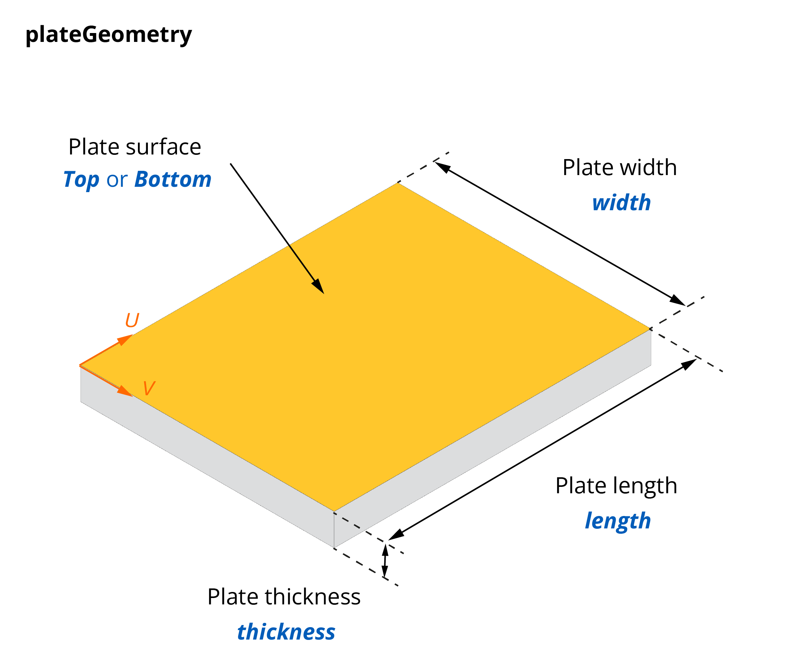
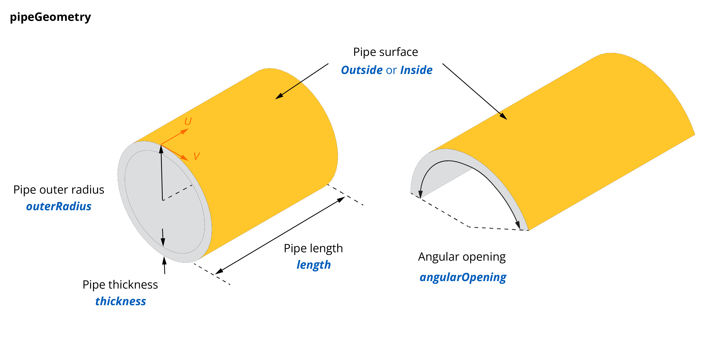
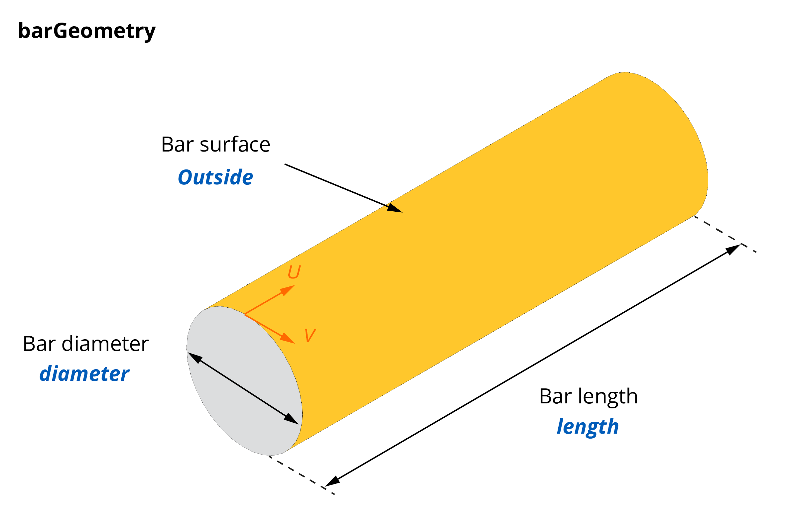

# Specimens

<!-- md:json_type array -->

The **specimens** array lists the specimens on which the inspection is performed.

## **specimens**
<!-- md:json_type array -->

<table>
<thead>
  <tr>
    <th>Property</th>
    <th>Type</th>
    <th>Description</th>
  </tr>
</thead>
<tbody>
  <tr>
    <td><b>id</b> <code>required</code></td>
    <td>integer</td>
    <td>Unique specimen id in the JSON structure</td>
  </tr>
  <tr>
    <td>
      One of the following <code>required</code> geometry objects:
      <ul>
        <li><b><a href="#plategeometry">plateGeometry</a></b></li>
        <li><b><a href="#pipegeometry">pipeGeometry</a></b></li>
        <li><b><a href="#bargeometry">barGeometry</a></b></li>
        <li><b><a href="#unspecifiedgeometry">unspecifiedGeometry</a></b></li>
      </ul>
    </td>
    <td>object</td>
    <td></td>
  </tr>
  <tr>
    <td><b><a href="#weldgeometry">weldGeometry</a></b></td>
    <td>object</td>
    <td>A weldGeometry object</td>
  </tr>
  <tr>
    <td><b><a href="#customoverlay2d">customOverlay2D</a></b></td>
    <td>object</td>
    <td>A customOverlay2D object</td>
  </tr>
</tbody>
</table>

## **plateGeometry**
<!-- md:json_type object -->

The **plateGeometry** object describes a generic plate geometry.

| Property                 | Type   | Unit | Description                    |
| :----------------------- | :----- | :--: | :----------------------------- |
| **width**                | number |  m   | Plate width                    |
| **length**               | number |  m   | Plate length                   |
| **thickness** `required` | number |  m   | Plate thickness                |
| **material**             | object |  -   | A [material](#material) object |
| **surfaces** `required`  | array  |  -   | A [surfaces](#surfaces) array  |

{ width="400" }

## **pipeGeometry**
<!-- md:json_type object -->

The **pipeGeometry** object describes a generic pipe geometry.

| Property                 | Type   | Unit | Description                    |
| :----------------------- | :----- | :--: | :----------------------------- |
| **length**               | number |  m   | Pipe length                    |
| **thickness** `required` | number |  m   | Pipe thickness                 |
| **outerRadius**          | number |  m   | Outer radius of the pipe       |
| **angularOpening**       | number |  °   | Angular opening of the pipe    |
| **material**             | object |  -   | A [material](#material) object |
| **surfaces** `required`  | array  |  -   | A [surfaces](#surfaces) array  |

{ width="600" }

## **barGeometry**
<!-- md:json_type object -->

The **barGeometry** object describes a generic bar geometry.

| Property                | Type   | Unit | Description                    |
| :---------------------- | :----- | :--: | :----------------------------- |
| **length** `required`   | number |  m   | Bar length                     |
| **diameter** `required` | number |  m   | Bar diameter                   |
| **material**            | object |  -   | A [material](#material) object |
| **surfaces** `required` | array  |  -   | A [surfaces](#surfaces) array  |

{ width="400" }

## **unspecifiedGeometry**
<!-- md:json_type object -->

The **unspecifiedGeometry** object is used when the specimen geometry is not known or not relevant to the acquisition. Only the inspectable surfaces are declared; no dimensions or material are provided.

| Property                | Type  | Description                   |
| :---------------------- | :---- | :---------------------------- |
| **surfaces** `required` | array | A [surfaces](#surfaces) array |

### **material**
<!-- md:json_type object -->

The **material** object describes generic material properties.

| Property                        | Type   | Unit  | Description                        |
| :------------------------------ | :----- | :---: | :--------------------------------- |
| **name** `required`             | string |   -   | Name of the material               |
| **longitudinalWave** `required` | object |   -   | A [wave](#wave) object             |
| **transversalWave** `required`  | object |   -   | A [wave](#wave) object             |
| **density**                     | number | kg/m³ | Density of the material            |

#### **wave**
<!-- md:json_type object -->

The **wave** object describes an ultrasonic wave.

| Property                       | Type   |   Unit   | Description                              |
| :----------------------------- | :----- | :------: | :--------------------------------------- |
| **nominalVelocity** `required` | number |   m/s    | Speed of sound in the material           |
| **attenuationCoefficient**     | number | dB/m/MHz | Attenuation coefficient in the material  |

### **surfaces**
<!-- md:json_type array -->

The **surfaces** array lists the inspectable surfaces of the specimen.

| Property          | Type    | Description                                                                |
| :---------------- | :------ | :------------------------------------------------------------------------- |
| **id** `required` | integer | Unique surface id                                                          |
| **name**          | string  | Surface name. Required for `plateGeometry`, `pipeGeometry`, and `barGeometry`; omitted for `unspecifiedGeometry`. |

Valid surface names per geometry type:

- `plateGeometry`: `Top` or `Bottom`
- `pipeGeometry`: `Inside` or `Outside`
- `barGeometry`: `Outside`
- `unspecifiedGeometry`: not applicable

## **weldGeometry**
<!-- md:json_type object -->

The **weldGeometry** object describes a generic weld geometry.

| Property                  | Type   | Unit | Description                                                    |
| :------------------------ | :----- | :--: | :------------------------------------------------------------- |
| **weldAngle** `required`  | number |  °   | Weld angle                                                     |
| **material**              | object |  -   | A [material](#material) object                                 |
| **bevelShape** `required` | string |  -   | Bevel shape: `U` or `V`                                        |
| **symmetry** `required`   | string |  -   | Weld symmetry: `Symmetric`, `StraightLeft`, or `StraightRight` |
| **heatAffectedZoneWidth** | number |  m   | HAZ width                                                      |
| **offset**                | number |  m   |                                                                |
| **upperCap**              | object |  -   | An [upperCap](#uppercap) object                                |
| **lowerCap**              | object |  -   | A [lowerCap](#lowercap) object                                 |
| **fills**                 | array  |  -   | A [fills](#fills) array                                        |
| **hotPass**               | object |  -   | A [hotPass](#hotpass) object                                   |
| **land**                  | object |  -   | A [land](#land) object                                         |
| **root**                  | object |  -   | A [root](#root) object                                         |

### **upperCap**
<!-- md:json_type object -->

| Property              | Type   | Unit | Description |
| :-------------------- | :----- | :--: | :---------- |
| **width**             | number |  m   |             |
| **height** `required` | number |  m   |             |

### **lowerCap**
<!-- md:json_type object -->

| Property              | Type   | Unit | Description |
| :-------------------- | :----- | :--: | :---------- |
| **width**             | number |  m   |             |
| **height** `required` | number |  m   |             |

### **fills**
<!-- md:json_type array -->

| Property              | Type   | Unit | Description |
| :-------------------- | :----- | :--: | :---------- |
| **angle** `required`  | number |  °   |             |
| **height** `required` | number |  m   |             |

### **hotPass**
<!-- md:json_type object -->

| Property              | Type   | Unit | Description |
| :-------------------- | :----- | :--: | :---------- |
| **angle** `required`  | number |  °   |             |
| **height** `required` | number |  m   |             |

### **land**
<!-- md:json_type object -->

| Property              | Type   | Unit | Description |
| :-------------------- | :----- | :--: | :---------- |
| **height** `required` | number |  m   |             |

### **root**
<!-- md:json_type object -->

| Property              | Type   | Unit | Description |
| :-------------------- | :----- | :--: | :---------- |
| **angle** `required`  | number |  °   |             |
| **height** `required` | number |  m   |             |

## **customOverlay2D**
<!-- md:json_type object -->

The **customOverlay2D** object describes a generic custom 2D CAD overlay.

| Property                        | Type   | Unit | Description                                         |
| :------------------------------ | :----- | :--: | :-------------------------------------------------- |
| **filename** `required`         | string |  -   | File name containing the overlay                    |
| **format** `required`           | string |  -   | File format                                         |
| **extension** `required`        | string |  -   | Extension of the file containing the overlay        |
| **path** `required`             | string |  -   | Path to the file                                    |
| **localScale** `required`       | object |  -   | A [coordinate](#coordinate) object                  |
| **localTranslation** `required` | object |  -   | A [coordinate](#coordinate) object                  |
| **translation** `required`      | object |  -   | A [coordinate](#coordinate) object                  |
| **scale** `required`            | number |  -   | Scale to be applied to the overlay                  |
| **rotation** `required`         | number |  -   | Rotation to be applied to the overlay               |
| **width** `required`            | number |  m   |                                                     |
| **thickness** `required`        | number |  m   |                                                     |

### **coordinate**
<!-- md:json_type object -->

| Property         | Type   | Description |
| :--------------- | :----- | :---------- |
| **x** `required` | string |             |
| **y** `required` | string |             |
| **z** `required` | string |             |

## Example

```json
"specimens": [
  {
    "id": 0,
    "plateGeometry": {
      "width": 0.35000000000000003,
      "length": 0.1,
      "thickness": 0.011,
      "surfaces": [
        {
          "id": 0,
          "name": "Top"
        }
      ],
      "material": {
        "name": "Plexiglass",
        "longitudinalWave": {
          "nominalVelocity": 2700.0,
          "attenuationCoefficient": 0.91
        },
        "transversalVerticalWave": {
          "nominalVelocity": 0.0,
          "attenuationCoefficient": 0.0
        },
        "density": 1.18
      }
    }
  }
]
```
