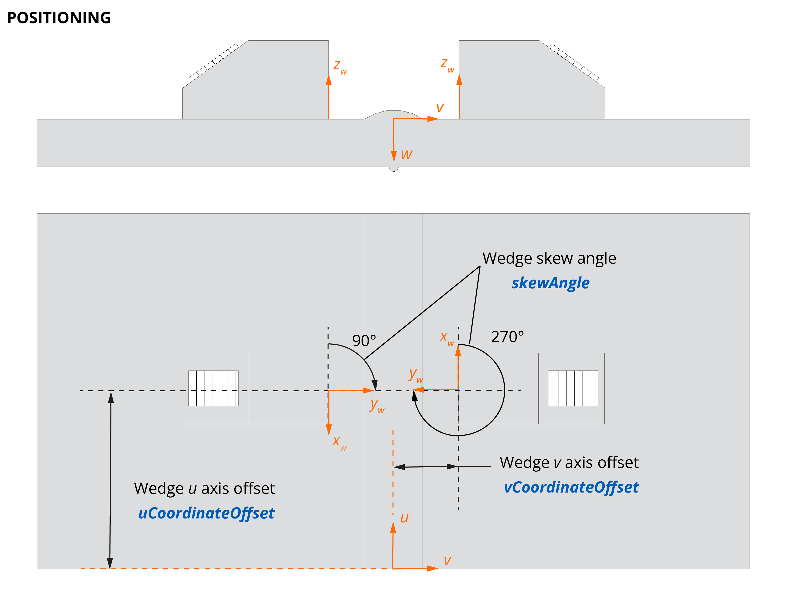
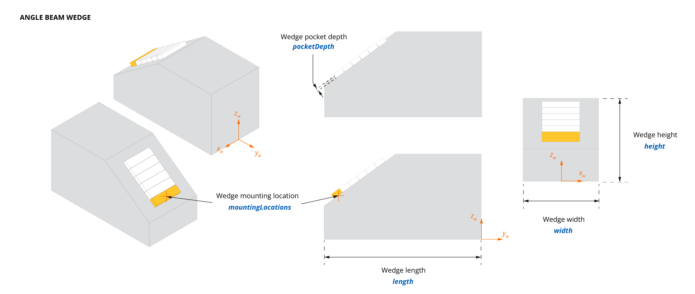
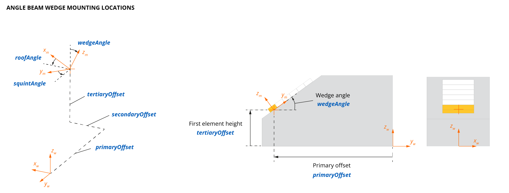

# Wedges

<!-- md:json_type array -->

A **wedge** is an interface maintaining consistent probe positioning relative to the inspected surface. The **wedges** array is shared across all supported technologies; technology-specific geometry is described by the required wedge type subobject.

<span class="badge-ut">UT</span> Ultrasonic wedges direct sound waves into the material at a specific angle, enabling detection of flaws at different orientations and ensuring efficient energy transfer between the probe and the test piece.

<span class="badge-et">ET</span> Eddy current wedges are primarily used to position the probe relative to the specimen. Typically, EC probes are used in direct contact with the part (including some protective tape), in which case a `Contact` wedge model is used. In some situations, a probe may be applied to a pre-formed shape that does not conform to the surface, in which case a specific wedge model may be used.

A generic wedge object features the following properties.

<table>
<thead>
  <tr>
    <th>Property</th>
    <th>Type</th>
    <th>Technology</th>
    <th>Description</th>
  </tr>
</thead>
<tbody>
  <tr>
    <td><b>id</b> <code>required</code></td>
    <td>integer</td>
    <td><span class="badge-all">All</span></td>
    <td>Unique wedge id in the JSON structure, referenced in <a href="../probes#wedgeassociation">wedgeAssociation</a></td>
  </tr>
  <tr>
    <td><b>model</b> <code>required</code></td>
    <td>string</td>
    <td><span class="badge-all">All</span></td>
    <td>Wedge model reference</td>
  </tr>
  <tr>
    <td><b>serie</b></td>
    <td>string</td>
    <td><span class="badge-ut">UT</span></td>
    <td>Wedge series reference</td>
  </tr>
  <tr>
    <td><b>serialNumber</b></td>
    <td>string</td>
    <td><span class="badge-all">All</span></td>
    <td>Wedge serial number</td>
  </tr>
  <tr>
    <td><b><a href="#positioning">positioning</a></b> <code>required</code></td>
    <td>object</td>
    <td><span class="badge-all">All</span></td>
    <td>Wedge position with respect to the specimen surface</td>
  </tr>
  <tr>
    <td>
      One of the following <code>required</code> wedge type objects:
      <ul>
        <li><b><a href="#anglebeamwedge">angleBeamWedge</a></b> <span class="badge-ut">UT</span></li>
        <li><b><a href="#fluidcolumn">fluidColumn</a></b> <span class="badge-ut">UT</span></li>
      </ul>
    </td>
    <td>object</td>
    <td><span class="badge-ut">UT</span></td>
    <td></td>
  </tr>
</tbody>
</table>

**Related objects**: [wedgeAssociation](probes.md#wedgeassociation)

## **positioning**
<!-- md:json_type object -->

The **positioning** object describes the wedge position with respect to the specimen and its surface.

| Property                         | Type    | Description                                                       |
| :------------------------------- | :------ | :---------------------------------------------------------------- |
| **specimenId** `required`       | integer | Related specimen id (plate, pipe, bar)                            |
| **surfaceId** `required`         | integer | Related surface id (plate surface, pipe surface, bar surface)     |
| **uCoordinateOffset** `required` | number  | Offset relative to the $u$ axis                                   |
| **vCoordinateOffset** `required` | number  | Offset relative to the $v$ axis or coordinate object              |
| **skewAngle** `required`         | number  | Skew angle in degrees                                             |

**Related objects**: [specimens](specimens.md#specimens), [surfaces](specimens.md#surfaces)

{width="500px"}

## **angleBeamWedge**
<span class="badge-ut">UT</span>
<!-- md:json_type object -->

The **angleBeamWedge** object describes an angle beam wedge.

| Property                            | Type   | Unit | Description                                                           |
| :---------------------------------- | :----- | :--: | :-------------------------------------------------------------------- |
| **width** `required`                | number |  m   | Width of the wedge                                                    |
| **height** `required`               | number |  m   | Height of the wedge                                                   |
| **length** `required`               | number |  m   | Length of the wedge                                                   |
| **longitudinalVelocity** `required` | number | m/s  | Longitudinal velocity of ultrasound waves inside the wedge material   |
| **mountingLocations** `required`    | array  |  -   | A [mountingLocations](#mountinglocations) array                       |
| **pocketDepth**                     | number |  m   | Pocket depth of the wedge                                             |

Hypotheses and conventions:

- Wedge body and contact surface are considered symmetrical.
- The wedge contact surface (with the specimen) is flat or curved with a single radius of curvature.
- The probe contact surface is flat.
- The positioning of the probe first element on a given wedge, the *mounting location*, is standardized by design of the probe/wedge assembly.
- The wedge coordinate system $(x_w, y_w, z_w)$ origin is centered at the bottom of its front face (see figure below).
- The $(y_w)$ axis is aligned with the wedge length, $(x_w)$ with the wedge width, and $(z_w)$ with the wedge height.



**Flat wedges** — For flat wedges, the above rules apply straightforwardly with no ambiguity in probe positioning.

**Curved wedges** — Wedges for tubular components typically have a matching curved surface which requires additional conventions. Typical configurations are axial outer diameter (AOD) or circumferential outer diameter (COD). The curved face is handled by redefining the *tertiary offset* and specifying the actual wedge curvature in the wedge object. The tertiary offset is currently expressed for a flat wedge machined to the desired curvature.

## **fluidColumn**
<span class="badge-ut">UT</span>
<!-- md:json_type object -->

The **fluidColumn** object describes a fluid column between the probe and the specimen, similarly to the [angleBeamWedge](#anglebeamwedge) object.

| Property                            | Type   | Unit | Description                                                           |
| :---------------------------------- | :----- | :--: | :-------------------------------------------------------------------- |
| **nominalHeight** `required`        | number |  m   | Nominal height of the fluid column                                    |
| **longitudinalVelocity** `required` | number | m/s  | Longitudinal velocity of ultrasound waves inside the fluid            |
| **mountingLocations** `required`    | array  |  -   | A [mountingLocations](#mountinglocations) array                       |

### **mountingLocations**
<span class="badge-ut">UT</span>
<!-- md:json_type array -->

The **mountingLocations** array describes the mounting location(s) of the wedge.

| Property                       | Type    | Unit   | Description                                                                          |
| :----------------------------- | :------ | :----: | :----------------------------------------------------------------------------------- |
| **id** `required`              | integer | -      | Mounting location id referenced in [wedgeAssociation](probes.md#wedgeassociation)   |
| **wedgeAngle** `required`      | number  | degree | Wedge angle                                                                          |
| **squintAngle**                | number  | degree | Wedge squint angle                                                                   |
| **roofAngle**                  | number  | degree | Wedge roof angle                                                                     |
| **primaryOffset** `required`   | number  | m      | Wedge primary offset                                                                 |
| **secondaryOffset** `required` | number  | m      | Wedge secondary offset                                                               |
| **tertiaryOffset** `required`  | number  | m      | Wedge tertiary offset                                                                |

Hypotheses and conventions:

- A probe is maintained in position on a wedge through an interface face — the *mounting location* — whose origin $(x_m, y_m, z_m)$ is defined by **primaryOffset**, **secondaryOffset**, and **tertiaryOffset** plus three angles:
  - **wedgeAngle** $\beta$: Angle between the normal of the interface face $z_m$ and the $z_w$ axis.
  - **squintAngle** $\alpha$: Angle between the projection of the probe primary axis on the $x_w$/$y_w$ plane $y_m$ and the $y_w$ axis.
  - **roofAngle** $\gamma$: Angle between $x_m$ and $x_w$, defined by a rotation around the probe primary axis.
- The wedge **skew angle** is the angle between the wedge and the **u** axis on the surface of the part at the wedge origin.
- The probe $(x_p, y_p, z_p)$ origin and orientation in $(x_w,y_w,z_w)$ coordinates result from the successive application of the offsets and angles above. The origin of the probe coordinate system is the center of the first probe element.
- Multiple **mountingLocations** can be defined on a single wedge, e.g. for Dual Linear Array (DLA) or Dual Matrix Array (DMA) probes.



## Examples

??? quote "<span class="badge-ut">UT</span> Phased array wedge examples"

    === "SA32-N55S"
        ``` json
        --8<-- "docs/assets/json/json-metadata/setup/data-model/wedges-SA32-N55S.json"
        ``` 
    === "SA15-N30S-IH 2-3-5"
        ``` json
        --8<-- "docs/assets/json/json-metadata/setup/data-model/wedges-SA15-N30S-IH 2-3-5.json"
        ```
    === "HydroFORM"
        ``` json
        --8<-- "docs/assets/json/json-metadata/setup/data-model/wedges-HydroFORM.json"
        ``` 
    === "SPWZ1-N60L-IHC"
        ``` json
        --8<-- "docs/assets/json/json-metadata/setup/data-model/wedges-SPWZ1-N60L-IHC.json"
        ``` 
    === "SA26-DN55L-FD25-SS-IHC-AOD24"
        ``` json
        --8<-- "docs/assets/json/json-metadata/setup/data-model/wedges-SA26-DN55L-FD25-SS-IHC-AOD24.json"
        ```
    === "SA27-DN55L-FD15-IHC-AOD18"
        ``` json
        --8<-- "docs/assets/json/json-metadata/setup/data-model/wedges-SA27-DN55L-FD15-IHC-AOD18.json"
        ```
    === "Integrated wedge"
        ``` json
        --8<-- "docs/assets/json/json-metadata/setup/data-model/wedges-XAIW-0012.json"
        ```

??? quote "<span class="badge-ut">UT</span> Single and dual element wedge examples"

    === "ST1-25L-IHC"
        ``` json
        --8<-- "docs/assets/json/json-metadata/setup/data-model/wedges-ST1-25L-IHC.json"
        ``` 
    === "10CCEV35-32-A15"
        ``` json
        --8<-- "docs/assets/json/json-metadata/setup/data-model/probes-D713.json"
        ```

??? quote "<span class="badge-et">ET</span> Eddy current wedge example"

    ``` json
    --8<-- "docs/assets/json/json-metadata/setup/data-model/wedges-EC.json"
    ```
