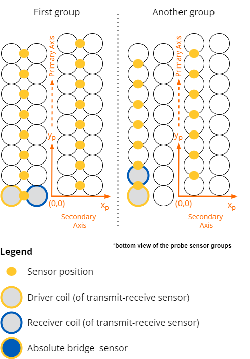

# Nomenclature and Definitions

## Ultrasonic Testing (UT/PAUT)

### General definitions

#### **Ultrasonic Testing (UT)**
Non-destructive testing technique that uses high-frequency sound waves to detect internal discontinuities or to measure material thickness. A single transducer is typically used.

#### **Phased Array Ultrasonic Testing (PAUT)**
Advanced UT technique using a probe with multiple elements that can be electronically controlled to steer, focus, and scan the beam without physically moving the probe.

#### **Full Matrix Capture (FMC)**
Acquisition mode where every element transmits individually while all elements receive, capturing the complete set of elementary A-scans for post-processing (e.g. TFM).

#### **Total Focusing Method (TFM)**
Post-processing reconstruction algorithm applied to FMC data that synthetically focuses the beam at every point of a reconstruction grid.

#### **Plane Wave Imaging (PWI)**
Acquisition mode where unfocused plane waves are transmitted and received by all elements, enabling high frame-rate imaging.

### Probe and beam definitions

#### **Element**
Individual piezoelectric transducer unit within a probe. In PAUT, multiple elements are combined and electronically controlled to form a beam.

#### **Aperture**
The set of elements that are actively used for a given transmission or reception event.

#### **Pitch**
Center-to-center distance between adjacent elements in an array probe.

#### **Focal law**
Set of time delays applied to each element of a phased array probe to steer and/or focus the ultrasonic beam at a desired angle and depth.

#### **Refracted angle**
Angle of the ultrasonic beam in the inspected material, measured from the normal to the surface.

#### **Wedge delay**
Time offset applied to account for the travel time of the ultrasonic beam through the wedge material before entering the specimen.

#### **Wave mode**
Type of ultrasonic wave propagating in the material. Common modes are:

- **Longitudinal (L)**: Particle motion is parallel to the propagation direction.
- **Transversal (T)**: Particle motion is perpendicular to the propagation direction (also called shear wave).

### Acquisition and scan types

#### **A-scan**
Time-based waveform representing the amplitude of the ultrasonic signal received by the probe as a function of time (or depth). It is the fundamental data unit.

#### **C-scan**
Image of the inspected area where the displayed value (e.g. peak amplitude or time-of-flight) is extracted from the A-scan within a defined gate.

#### **Gate**
Time window applied to an A-scan to extract amplitude, time-of-flight, or other characteristics from a specific region of interest.

#### **Pulse-echo**
Acquisition mode where the same element(s) are used for both transmission and reception.

#### **Pitch-catch**
Acquisition mode where different element(s) are used for transmission and reception, allowing inspection of different propagation paths.

#### **TOFD (Time-of-Flight Diffraction)**
Technique using two probes in pitch-catch configuration where diffracted signals from crack tips are used to size and locate defects.

#### **Linear scan**
PAUT scan type where the focal laws sequentially shift the active aperture along the array, producing a B-scan image.

#### **Sectorial scan (S-scan)**
PAUT scan type where the beam is steered over a range of angles at a fixed aperture, producing a fan-shaped image.

#### **Compound scan**
PAUT scan type combining both aperture shifting and angular steering.

### Signal processing and calibration

#### **TCG (Time-Corrected Gain)**
Amplification profile applied as a function of time to compensate for signal attenuation with depth, ensuring uniform sensitivity throughout the inspected volume.

#### **DAC (Distance-Amplitude Correction)**
Calibration curve that accounts for signal amplitude variation as a function of distance for reflectors of equal size, used to set acceptance thresholds.

#### **Digitizing frequency**
Sampling rate of the analog-to-digital converter (ADC), expressed in Hz.

#### **Rectification**
Processing step applied to the A-scan waveform to convert the RF signal into a unipolar (half-wave or full-wave rectified) signal.

---

## Eddy Current Testing (ECT/ECA)
### General definitions

#### **Eddy Current Testing (ECT)**
Probe and instrumentation technology based on having sensor(s) each individually providing scan coverage.

#### **Eddy Current Array (ECA)**
Probe and instrumentation technology based on having multiple identical sensors working together in order to achieve a given scan.

### Probe-related definitions

#### **Physical component**
Basic building blocks of an array probe, including active components such as coils, GMR, AMR or Hall effect probes, and passive components such as ferromagnetic and/or conductive parts whose shape and location are purposely designed to modify a sensor's response.

#### **Element**
Arrangement of physical component(s) which has a basic function of excitation or reception. Components can be re-used for multiple elements; for example, a coil can be an excitation element in one time slot and a component of a reception element in other time slots.

#### **Sensor**
Physical and electronic arrangement of excitation element and reception elements designed to provide the desired detection and measurement of physical properties based on the principles of eddy current testing.

#### **Pattern** *(specific to arrays)*
Physical sensors distribution within an array on the sensor surface. For example, a given sensor's pattern could be described by a set of primary axis and secondary axis offsets relative to a reference position. Multiple sensor groups can co-exist in the same probe with a defined pattern for each.

### Instrumentation-related definitions

#### **Input**
Physical analog connection on the acquisition unit corresponding to the entry point of sensor(s) reading measurements.

#### **Time-slot (or Context)**
When using time multiplexing to add more channels on a given input, this is a specific time frame when a given input is connected to a specific sensor.

#### **Channel**
Specific band of eddy current inspection data related to the combined use of a sensor and inspection parameters (frequency, gain, drive parameters, calibration parameters, filtering, etc.). A channel can also be the result of processes applied on other channels (e.g. MIX).

#### **Digitizing frequency [Hz]**
Acquisition frequency of the Analog to Digital Converter (ADC).

#### **Test frequency [Hz]**
Carrier frequency of the sine wave leading to the generation of eddy currents.

#### **Samples**
Specific impedance readings that are the final outputs of the whole demodulation process.

!!! note
    For Eddy Current Array applications: for a given channel there is no more than one sample per time slot.

#### **Measurement rate [sample/s]**
Rate of generation of samples; without further precision, this is for one specific input and one specific frequency.

#### **Instrument measurement rate [sample/s]**
Rate of generation of samples for a whole instrument.

#### **Channel measurement rate [sample/s]**
Rate of generation of samples for one specific channel.

#### **Strip chart**
By channel, uniformly distributed series of samples, where the uniform distribution can be over time (i.e. fixed frequency in Hertz) or over distance (i.e. fixed spatial frequency in 1/meter). Real and imaginary components of the signal are typically displayed separately after phase rotation by the user to isolate relevant signal on one component.

#### **Impedance plane**
Diagram displaying samples where the time or position axis is compressed and the user sees the complex representation of the data for the multiple points of a strip chart.
