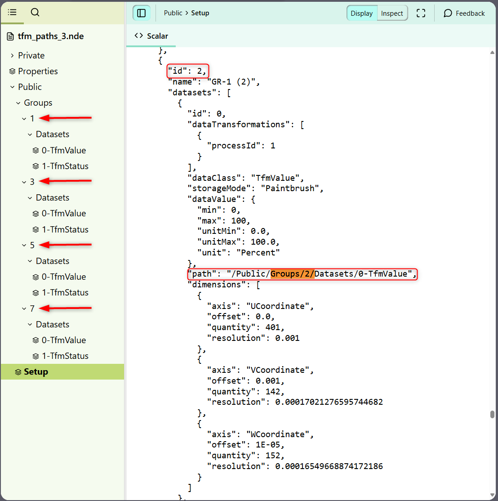

# OmniScan&trade; MXU Software

Specific information related to how the OmniScan X3 and X4 products save .nde files will be documented on this page. 

## CHANGELOG

Any change or correction regarding the way the OmniScan X3 and X4 flaw detectors save data in the .nde format will be logged in this section. 

### [MXU 6.2.0](https://ims.evidentscientific.com/en/downloads?product=OmniScan+X4) - <small>August 26, 2025</small> { id="6.1.0" }

#### Changed

- For a One-Line Scan in 0° with overlap configuration, the [dataMappings](../../json-metadata/setup/data-model/data-mappings.md) object is now aligned with the Raster Scan in 0° with overlap case. This includes a second axis to the description of the [discreteGrid](../../json-metadata/setup/data-model/data-mappings.md#discretegrid-object) object dimensions, but without 'motionDeviceId' specified.
  
    ??? quote "Example"

        === "Before"

            ``` json
            "dataMappings": [
            {
            "id": 0,
            "specimenId": 0,
            "surfaceId": 0,
            "discreteGrid": {
                "scanPattern": "OneLineScan",
                "uCoordinateOrientation": "Length",
                "dimensions": [
                    {
                        "axis": "UCoordinate",
                        "motionDeviceId": 0,
                        "name": "Scan",
                        "offset": 0.0,
                        "quantity": 301,
                        "resolution": 0.001
                    }
                ]
            }
            }
            ]
            ```

        === "After"

            ``` json
            "dataMappings": [
            {
            "id": 0,
            "specimenId": 0,
            "surfaceId": 0,
            "discreteGrid": {
                "scanPattern": "OneLineScan",
                "uCoordinateOrientation": "Length",
                "dimensions": [
                    {
                        "axis": "UCoordinate",
                        "motionDeviceId": 0,
                        "name": "Scan",
                        "offset": 0.0,
                        "quantity": 301,
                        "resolution": 0.001
                    },
                    {
                        "axis": "VCoordinate",
                        "name": "Index",
                        "offset": 0.0017500000000000016,
                        "quantity": 57,
                        "resolution": 0.0005
                    }
                ]
            }
            }
            ]
            ```

#### Fixed

- Following the fix introduced in MXU 6.1.0, resaving files with invalid HDF5 Groups Ids, when multiple TFM groups were configured, now correctly update the paths in the [JSON-formatted Setup dataset](../../json-metadata/setup/index.md).
- Offsets in the [beams](../../json-metadata/setup/data-model/groups/datasets.md#beams-array) array of datasets were previously set incorrectly for probe skew angles of 0° and 180°. This has been corrected for all new files saved or resaved with this version.

### [MXU 6.1.0](https://ims.evidentscientific.com/en/downloads?product=OmniScan+X4) - <small>April 23, 2025</small> { id="6.1.0" }

#### Added

- New dataset format export for phased array angle beam raster scanning. See [NDE 4.1 changelog](../../versioning/changelog.md#4.1.0) section. 
- Change of scanning axis for specific configurations, such as ToFD parallel scanning and Raster scanning at 0°. See [NDE 4.1 changelog](../../versioning/changelog.md#4.1.0) section. 

#### Fixed

- In some cases, [Groups Ids](../../hdf5-structure/public-group.md#groups-group-and-subgroups) were assigned incorrectly in the HDF5 structure **when multiple TFM groups were configured** (see example below), resulting in a mismatch with the [JSON-formatted Setup dataset](../../json-metadata/setup/index.md) information.

    ??? info "Details - Invalid HDF5 Groups Ids when multiple TFM groups configured"   

        { width="500" }

        **Impacted files**

        For files created with **MXU version 6.0.2**, and when multiple TFM groups were configured, you may need to update your file reading routine due to a mismatch between:

        - The group `id`s and dataset `path`s in the [JSON-formatted Setup dataset](../../json-metadata/setup/index.md), and  
        - The actual group `id`s present in the HDF5 structure.

        **Identifying the Issue**

        This mismatch typically appears when [totalFocusingMethod](../../json-metadata/setup/data-model/groups/processes/totalFocusingMethod.md) groups reference group `id`s and dataset `path`s that **do not exist** in the HDF5 file structure. For example, the JSON Setup might refer to the `/Public/Groups/2/Datasets/...` path, while the HDF5 structure only contains `/Public/Groups/1/`, `/Public/Groups/3/`, etc. Note that the groups and datasets appear in the same order in both the HDF5 structure and the JSON Setup, but the group id may not match — which is the root cause of the issue.

        **Workaround**

        As a workaround, you can **remap sequentially the dataset paths** for each [totalFocussingMethod](../../json-metadata/setup/data-model/groups/processes/totalFocusingMethod.md) group, based on their order, to match the correct group `id`s in the HDF5 file structure. This approach ensures that the datasets referenced in the Setup correctly align with those in the HDF5 structure, regardless of mismatched group numbers.

        Example Remapping Table:

        | Groups listed in HDF5 structure | TFM datasets original paths     |  TFM datasets corrected paths   | Comment                                          |
        | :-----------------------------: | :------------------------------ | :-----------------------------: | ------------------------------------------------ |
        |                1                | `/Public/Groups/1/Datasets/...` | `/Public/Groups/1/Datasets/...` | HDF5 Group exists. No path update needed.        |
        |                3                | `/Public/Groups/2/Datasets/...` | `/Public/Groups/3/Datasets/...` | HDF5 Group does not exist. Path update required. |
        |                5                | `/Public/Groups/3/Datasets/...` | `/Public/Groups/5/Datasets/...` | HDF5 Group exists. Path update required.         |
        |               ...               | ...                             |               ...               | ...                                              |

