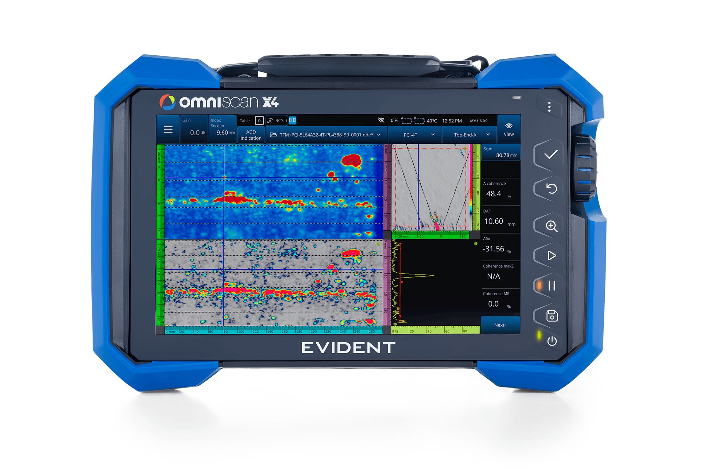

# Supporting Software

Software that reads or writes .nde files are listed on this page. Depending on the level of integration and specialization, some software will only be compatible with .nde files produced with a specific instrument or software (mainly in cases where the [Private](../hdf5-structure/private-group.md) section is used). However, data access and interoperability is still provided through the [Public](../hdf5-structure/public-group.md) section of the file. 

Feel free to [reach out to us](mailto:nde_support@evidentscientific.com) if you want your software to be added to this list. 

# EVIDENT products

-   :evident-omniscan:{ .lg .middle } __MXU__

    ---

    

    The onboard software powering the OmniScan product line.

    ---

    [:material-history: Changelog](evident/omniscan-mxu.md)

    :material-file: Write OmniScan X3 and X4 .nde files

-   :evident-omnipc:{ .lg .middle } __OmniPC&trade;__

    ---

    

    The embedded companion analysis tool of the OmniScan product line.
    
    ---

    [:material-download: Download](https://ims.evidentscientific.com/en/downloads?product=OmniPC+6)

    :material-file: Read OmniScan X3 and X4 .nde files

-   :evident-aeroview:{ .lg .middle } __AeroView&trade;__

    ---

    

    A comprehensive acquisition and analysis software for the aerospace industry.
    
    ---

    [:material-arrow-right: Learn more](https://ims.evidentscientific.com/en/products/software/aeroview)

    :material-file: Read/Write .nde files

-   :evident-weldsight:{ .lg .middle } __WeldSight&trade;__

    ---
    

    A comprehensive acquisition and analysis software for advanced weld inspections.
    
    ---

    [:material-arrow-right: Learn more](https://ims.evidentscientific.com/en/products/software/aeroview)

    :material-file: Read OmniScan .nde files

