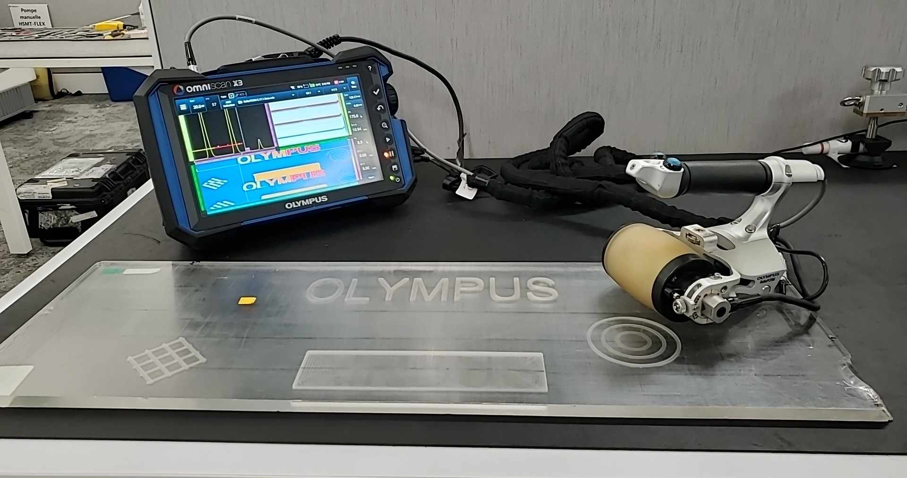

Below you can find example files in .nde version 3.3 and 4.0 for some common use cases. 

!!! warning
    Files provided as examples only. They are not intended to be used with an official software release. 

## Manual weld scanning using conventional ultrasound

{width="300"}

In this example, a weld bead on a 26 mm thick stainless steel plate is manually scanned using a [C550](https://www.olympus-ims.com/en/shop/item/269-productId.570436202.html) 3.5 MHz single-element angle beam transducer mounted on a SPE2-60S-IHC 39° wedge. The probe's position is recorded using an encoder.  

| File name        | 3.3                     | 4.0                     |
| ---------------- | ----------------------- | ----------------------- |
| ManualWeldUT.nde | [Download](https://nde-public-files.s3.ca-central-1.amazonaws.com/3.3/General+Weld/ManualWeldUT.nde) - [View](https://myhdf5.hdfgroup.org/view?url=https://nde-public-files.s3.ca-central-1.amazonaws.com/3.3/General+Weld/ManualWeldUT.nde) | [Download](https://nde-public-files.s3.ca-central-1.amazonaws.com/4.0/pre-release/ManualWeldUT-4.0.nde) - [View](https://myhdf5.hdfgroup.org/view?url=https://nde-public-files.s3.ca-central-1.amazonaws.com/4.0/pre-release/ManualWeldUT-4.0.nde) |

## Manual weld scanning using phased array ultrasound

{width="300"}

In this example, a weld bead on a 26 mm thick stainless steel plate is manually scanned using a [2.25L16-A10](https://www.olympus-ims.com/en/shop/item/269-productId.570438268.html) 2.25 MHz 16-element probe mounted on a SA10-N55S 2.25L16 36° wedge. The probe's position is recorded using an encoder.  

| File name                    | 3.3                     | 4.0                     |
| ---------------------------- | ----------------------- | ----------------------- |
| ManualWeldPA.nde             | [Download](https://nde-public-files.s3.ca-central-1.amazonaws.com/3.3/General+Weld/ManualWeldPA.nde) - [View](https://myhdf5.hdfgroup.org/view?url=https://nde-public-files.s3.ca-central-1.amazonaws.com/3.3/General+Weld/ManualWeldPA.nde) | [Download](https://nde-public-files.s3.ca-central-1.amazonaws.com/4.0/pre-release/ManualWeldPA-4.0.nde) - [View](https://myhdf5.hdfgroup.org/view?url=https://nde-public-files.s3.ca-central-1.amazonaws.com/4.0/pre-release/ManualWeldPA-4.0.nde) |

## Wheel probe scanning using phased array ultrasound

{width="300"}

In this example, a 12 mm thick plexiglass plate engraved with letters is scanned using the [RollerFORM](https://www.olympus-ims.com/en/rollerform/) scanner and a 3.5L64-IWP1 3.5 MHz 64-element probe. The probe's position is recorded using the scanner encoder. 

| File name      | 3.3                     | 4.0                     |
| -------------- | ----------------------- | ----------------------- |
| RollerFORM.nde | [Download](https://nde-public-files.s3.ca-central-1.amazonaws.com/3.3/General+Mapping/RollerFORM.nde) - [View](https://myhdf5.hdfgroup.org/view?url=https://nde-public-files.s3.ca-central-1.amazonaws.com/3.3/General+Mapping/RollerFORM.nde) | [Download](https://nde-public-files.s3.ca-central-1.amazonaws.com/4.0/pre-release/RollerFORM-4.0.nde) - [View](https://myhdf5.hdfgroup.org/view?url=https://nde-public-files.s3.ca-central-1.amazonaws.com/4.0/pre-release/RollerFORM-4.0.nde) |

## X-Y raster scanning using the otal focusing method

In this example, a 11 mm thick plexiglass plate engraved wiht letters is scanned using the [GLIDER](https://www.olympus-ims.com/en/scanners/glider-scanner/) scanner and a 5L64-NW1 5 MHz 64-element probe. The probe's position is recorded using the scanner encoder. 

| File name      | 3.3                     | 4.0                     |
| -------------- | ----------------------- | ----------------------- |
| TFM_Raster.nde | [Download](https://nde-public-files.s3.ca-central-1.amazonaws.com/3.3/General+Mapping/TFM_Raster.nde) - [View](https://myhdf5.hdfgroup.org/view?url=https://nde-public-files.s3.ca-central-1.amazonaws.com/3.3/General+Mapping/TFM_Raster.nde) | [Download](https://nde-public-files.s3.ca-central-1.amazonaws.com/4.0/pre-release/TFM_Raster-4.0.nde) - [View](https://myhdf5.hdfgroup.org/view?url=https://nde-public-files.s3.ca-central-1.amazonaws.com/4.0/pre-release/TFM_Raster-4.0.nde) |