## Motivations

Versions of the .nde file format prior to version 4.0 offered limited support for the eddy current modality, advanced ultrasonic features, and future developments. Therefore, an update introducing breaking changes was necessary to establish a more flexible structure capable of seamlessly adapting to and accommodating new requirements or needs, while still maintaining a high level of standardization. For example, this new structure enables intergroup relationships within the JSON Setup dataset while preserving the simplicity of straightforward use cases.

## New concepts

NDE version 4.0 introduces a new way of structuring the .nde file format as well as some new concepts.

Within the JSON formatted **Setup** dataset:

- **DataClass** – Enables quick identification of the type of data associated with a Dataset. This attribute is standardized, documented, and included in the description of a datasets array item in the JSON Setup dataset structure. This was not standardized in previous versions and only had similar functionalities through the naming of previous dataset object subobjects. 

- **Processes** – A better way to describe how parameters are applied during acquisition or analysis and their impact on the resulting datasets. This object is standardized, documented, and added to the JSON Setup dataset structure. This was not standardized in previous versions and only had a similar component in the description of the acquisition parameters found in the dataset object of the JSON Setup dataset structure.

The JSON formatted **Properties** dataset: The approach for handling file-wide metadata was changed to adopt the same as the rest of the acquisition metadata with the Setup dataset. Hence, all metadata previously stored as HDF5 attributes at the root of the file are now stored within the Properties dataset, still located at the root of the file, and can be validated against a dedicated JSON Schema. [See below](#addition-of-the-json-properties-dataset) for more information.


!!! note
    To avoid confusion between [HDF5 Groups](https://portal.hdfgroup.org/hdf5/v1_14_4/_h5_g__u_g.html#sec_group) and [Groups](#updated-groups-structure-with-datasets-and-processes) defined within the .nde standard, the term "path" will be preferred to designate an HDF5 Group. 


## Modifications to the HDF structure 

The overall spirit of the HDF structure remains unchanged with a container for nonstandardized application usage (**/Private**) and a standardized container for the data and setup or any contextual information that describes the data (**/Public**). 

- The name of those root containers has been slightly revisited to be more meaningful, hence the previous **/Applications** section is renamed **/Private**
   and the previous **/Domain** section is renamed **/Public**.

<!--- { width="600" } --->

- Groups, that may contain inspection data but also other context information, were previously found under the **/Domain/DataGroups** path. They are now stored under the **/Public/Groups** path to reflect the JSON Setup dataset structure as illustrated below. 

    ``` mermaid
    flowchart TD
        subgraph tre["Version 4.0"]
        direction LR
        .nde4[.nde]:::root --> Private["/Private"]:::group
        .nde4[.nde] --> Public["/Public*"]:::group
        .nde4[.nde] --> Properties["/Properties*"]:::dataset
        Public["/Public*"] --> Setup4["/Setup*"]:::dataset
        Public["/Public*"] --> Groups4["/Groups"]:::group
        style tre color:#000000
        classDef root fill:#005cb9,stroke:#000000,color:#000000
        classDef group fill:#ffc72c,stroke:#000000,color:#000000
        classDef dataset fill:#fff,stroke:#000000,color:#000000
        end
        subgraph "Version 3.3"
        direction LR
        .nde3[.nde]:::root --> Applications["/Applications"]:::group
        .nde3[.nde] --> Domain["/Domain*"]:::group
        Domain["/Domain*"] --> Setup3["/Setup*"]:::dataset
        Domain["/Domain*"] --> Groups3["/Groups"]:::group
        classDef root fill:#005cb9,stroke:#000000,color:#000000
        classDef group fill:#ffc72c,stroke:#000000,color:#000000
        classDef dataset fill:#fff,stroke:#000000,color:#000000
        end
    ```


- Datasets, that contain inspection data, were previously stored following a **../[DataGroupId] + /Dataset + /[DatasetId] + /[DatasetType]** path chain. They are now stored using the **../[GroupId] + /Datasets + /[DatasetId-DataClass]** path chain, to simplify the access to data and reflect the JSON Setup dataset structure as illustrated in the example below.

    ``` mermaid
    flowchart TD
        subgraph "Version 4.0"
            direction LR
            Groups4[Groups]:::gen --> 04[0]:::gen
            04 --> Datasets4[Datasets]:::gen
            Datasets4[Datasets] --> 0-AScanAmplitude:::gen
            Datasets4[Datasets] --> 1-AScanStatus:::gen
            Datasets4[Datasets] --> 2-FiringSource:::gen
            classDef gen fill:#fff,stroke:#000000,color:#000000
        end
        subgraph "Version 3.3"
            direction LR
            DataGroups3[DataGroups]:::gen --> 03_1[0]:::gen
            03_1 --> Dataset3[Dataset]:::gen
            Dataset3[Dataset] --> 03_2[0]:::gen
            03_2 --> Amplitude:::gen
            03_2 --> Status:::gen
            Dataset3[Dataset] --> 13_2[1]:::gen
            13_2 --> FiringSource:::gen
            classDef gen fill:#fff,stroke:#000000,color:#000000
        end
    ``` 


<!--- { width="800" } --->

<!---  { width="600" } --->


## Modifications to the JSON Setup dataset 

### Updated groups structure with datasets **and processes**

The concept of process is introduced and added to the description of groups, making the groups structure more standardized and enabling distinction between the information relative to the data contained in datasets and the parameters used to create or modify these datasets. 

Processes are described by their *id*, their *inputs* and *outputs* and a specific object listing all its *parameters*. Previous acquisition parameters objects—such as *paut*—and nested softwareProcess objects—such as *thickness*—are now converted to processes array items. By adopting this more general structure, the possibilities are endless and intergroup relationships enabled. Hence, processes can be chained and may have other processes as input, as illustrated in the example below.

``` mermaid
    flowchart TD
    subgraph "Group 1"
    Process1Gr1[⚙️ Process 1]:::gen --> Process2Gr1[⚙️ Process 2]:::gen
    Process1Gr1[⚙️ Process 1] ----> Dataset1Gr1[📊 Dataset 1]:::gen
    Process2Gr1[⚙️ Process 2] --> Process3Gr1[⚙️ Process 3]:::gen
    Process3Gr1[⚙️ Process 3] --> Dataset2Gr1[📊 Dataset 2]:::gen
    classDef gen fill:#fff,stroke:#000000,color:#000000
    end
    subgraph "Group 2"
    Process1Gr1:::gen --> Process1Gr2[⚙️ Process 1]:::gen
    Process1Gr2[⚙️ Process 1] ----> Dataset1Gr2[📊 Dataset 1]:::gen
    Process1Gr2[⚙️ Process 1] ----> Dataset2Gr2[📊 Dataset 2]:::gen
    Process1Gr2[⚙️ Process 1] ----> Dataset3Gr2[📊 Dataset 3]:::gen
    classDef gen fill:#fff,stroke:#000000,color:#000000
    end

```



Here is an example showing the difference between a typical JSON Setup dataset structure in version 3.3 and version 4.0 with the new groups structure:

=== "4.0"

    ``` json
    {
    "$schema": "./NDE-FileFormat-Schema-4.0.0.json",
    "version": "4.0.0",
    "scenario": "General Mapping",
    "groups": [
        {
        "id": 0,
        "name": "GR-1",
        "datasets": [],
        "processes": [
            {
            "id":0,
            "inputs": [],
            "outputs": [],
            "dataMappingId": 0,
            "ultrasonicPhasedArray": {}, // (1)!
            }
        ]
        }
    ],
    "acquisitionUnits": [],
    "motionDevices": [],
    "dataMappings": [], // (2)!
    "specimens": [],
    "probes": [],
    "wedges": []
    }
    ```
    
    1. The same **paut** object as defined in version 3.3, renamed **ultrasonicPhasedArray**, is now nested inside a process object. 
    2. **dataEncodings** is renamed **dataMappings** in version 4.0 to avoid confusion with other encoding types.

=== "3.3"

    ``` json
    {
    "$schema": "./NDE-FileFormat-Schema-3.3.0.json",
    "version": "3.3.0",
    "scenario": "General Mapping",
    "groups": [
        {
        "id": 0,
        "name": "GR-1",
        "paut": {},
        "dataset": [],
        }
    ],
    "acquisitionUnits": [],
    "motionDevices": [],
    "dataEncodings": [],
    "specimens": [],
    "probes": [],
    "wedges": []
    }
    ```

<!--
Hence, it is now easier to distinguish metadata related to a HDF Dataset (with matching datasets objects in the JSON Setup dataset) and metadata related to the acquisition or post-processing of the information stored in a HDF Dataset. 
 

-->

Additionnaly, the role of each group structure layer is clearly defined: 

- **Group**: A group comprises datasets and processes that are inherently interconnected. A group's identity is defined by its first process (processes[{"id": 0}]). A dataset invariably originates from a process.

- **Dataset**: A dataset is the minimum description of the content of a container for data of a homogeneous nature, characterized by standardized data classes, with its volume potentially necessitating storage within the HDF5 structure. Through the process it originates, it establishes a connection between the data and physical reality (time and space).

- **Process**: A process describes an operation aimed at creating, modifying, or formatting data, which are ultimately stored or referenced within a dataset. Processes have inputs and outputs and can be directly linked to a dataset or to another process. 


### New **processes** structure

The new concept of processes is introduced as an array comprising as many items as required to describe the processes chain leading to a dataset. Previous acquisition parameters objects—such as *paut*—and nested softwareProcess objects—such as *thickness*—are now converted to processes array items.

The **processes** array:

| Property                           | Description                                                                                                |
| ---------------------------------- | ---------------------------------------------------------------------------------------------------------- |
| id* [number]                       | The unique id of the process inside its parent group                                                       |
| inputs [object]                    | An object listing the group, process, and output id used as inputs of the process.                          |
| outputs [object]                   | An object listing the dataset id and, if needed, the specific parameters of this output.                   |
| implementation [string]            | Type of implementation for this process, typically `Hardware` or `Sotfware`                                |4
| dataMappingId [integer]            | The unique id of the dataMapping object related to the process                                             |
| `process specific object` [object] | A specific object to describe process parameters, such as `ultrasonicPhasedArray` or `ultrasonicThickness` |

Here is an example showing the difference between a specific *paut* acquisition object in version 3.3 and the new processes array in version 4.0 with the corresponding *ultrasonicPhasedArray* and *ultrasonicThickness* objects:

=== "4.0"

    ``` json
    "processes": [
        {
          "inputs": [],
          "outputs": [],
          "id": 0, 
          "implementation": "Hardware", 
          "dataMappingId": 0,
          "ultrasonicPhasedArray": {
            "pulseEcho": {},
            "waveMode": "Longitudinal",
            "..."}
        },
        {
          "inputs": [],
          "outputs": [],
          "id": 1,
          "implementation": "Software",
          "thickness": {
            "min": 0.00275,
            "..."
          }
        }
    ]
    ```

=== "3.3"

    ``` json
    "paut": {
        "pulseEcho": {},
        "waveMode": "Longitudinal",
        "..."
        "softwareProcess": {
          "thickness": {
            "min": 0.00275
          }
        }
      }
    ```


### Updated **datasets** structure 

The structure of datasets was also modified to be more general and versatile. Note that the dataset object is now plural—*dataset***s**—and is an array with standardize structure comprising an *id*, a *dataTransformations* array, a *dataClass* and—inherited from version 3.3—a *path* and a *dimensions* object. 

**Datasets** array—replacing the previous **dataset** object:

| Property                    | Description                                                                                                                                        |
| --------------------------- | -------------------------------------------------------------------------------------------------------------------------------------------------- |
| id* [number]                | The unique id of the dataset inside its parent group                                                                                               |
| dataTransformations [array] | A dataTransformations array references the last process of each process chain in charge of transforming the data to be displayed.                  |
| dataClass* [string]         | The dataClass of the dataset, such as `AScanAmplitude`, `AScanStatus`, or `FiringSource`                                                            |
| storageMode [string]        | The type of storage of mode, such as `Paintbrush` or `Independent`                                                                                 |
| dataValue [object]          | The values the dataset can take, both raw values and values converted to the corresponding unit                                                    |
| path* [string]              | The path to the dataset in the HDF structure                                                                                                       |
| dimensions* [object]        | A dimension object describing the dimensions of the HDF5 dataset and information relative to the specimen surface grid through the referenced axis |

    
Here is an example showing the difference between a typical dataset object in version 3.3 and the new datasets array in version 4.0:


=== "4.0"

    ``` json
    "datasets": [
        {
        "id": 0,
        "dataTransformations":[
          {
            "processId": 0
          }
        ],
        "dataClass": "AScanAmplitude",
        "storageMode": "Paintbrush",
        "dataValue": {
            "min": 0, 
            "max": 32767, 
            "unitMin": 0.0, 
            "unitMax": 200.0, 
            "unit": "Percent"
        },
        "path": "/Public/Groups/0/Datasets/0-AScanAmplitude",
        "dimensions": [...],
        }
    ]
    ```

=== "3.3"

    ``` json
    "dataset": {
        "ascan": {
          "velocity": 2700.0,
          "skewAngle": 0.0,
          "refractedAngle": 0.0,
          "amplitude": {
            "dataSampling": {
              "min": 0,
              "max": 32767
            },
            "dataValue": {
              "min": 0,
              "max": 200,
              "unit": "Percent"
            },
            "path": "/Domain/DataGroups/0/Datasets/0/Amplitude",
            "dimensions": [...]
          }
        },
        "overwriteCriteria": "Last",
        "storageMode": "Paintbrush"
    }
    ```


### **dataEncodings** is renamed and updated

The **dataEncodings** object is renamed **dataMappings** to avoid confusion with other types of encoding.
Its structure is slightly modified with *specimenId* and *surfaceId* properties moved up one level in the JSON structure.

=== "4.0"

    ``` json
    "dataMappings": [
    {
      "id": 0,
      "specimenId": 0,
      "surfaceId": 0,
      "discreteGrid": {
        "scanPattern": "OneLineScan",
        "uCoordinateOrientation": "Length",
        "dimensions": [
            {
            "axis": "UCoordinate",
            "name": "Scan",
            "offset": 0.0,
            "quantity": 301,
            "resolution": 0.001
            }
        ]}
    }]
    ```

=== "3.3"

    ``` json
    "dataEncodings": [
    {
      "id": 0,
      "discreteGrid": {
        "specimenId": 0,
        "surfaceId": 0,
        "scanPattern": "OneLineScan",
        "uCoordinateOrientation": "Length",
        "dimensions": [
            {
            "axis": "UCoordinate",
            "name": "Scan",
            "offset": 0.0,
            "quantity": 301,
            "resolution": 0.001
            }
        ]}
    }]
    ```

## Addition of the JSON Properties dataset

Previously, file-wide metadata were stored as HDF5 attributes at the root of the file. 

=== "3.3"

    <figure markdown="span">
    {width="400"}
    </figure>


=== "4.0"

    <figure markdown="span">
    {width="700"}
    </figure>


To allow more flexibility and scalibility in the future, these file-wide metadata are transfered to a new JSON-formatted dataset named **Properties** and located at the root of the HDF5 hierarchy. Currently, this JSON-formatted dataset contains the same information as previous attributes in a **file** object as well as a new **methods** array to specify the NDT methods covered in the file (as described by [ASNT](https://www.asnt.org/what-is-nondestructive-testing/methods)). More objects will be added to the **Properties** dataset in the near future. 

``` json
{
   "file":{
      "createdByAppName": "MXU",
      "createdByAppVersion": "5.18.1.0",   
      "createdByAppCompany": "Evident",   
      "creationDate": "2024-03-12T20:28:30+01:00",
      "creationFormatVersion": "4.0.0-Dev",    
      "modifiedByAppName": "MXU",
      "modifiedByAppVersion": "5.18.1.0",   
      "modifiedByAppCompany": "Evident",   
      "modificationDate": "2024-03-12T20:32:30+01:00",
      "formatVersion": "4.0.0-Dev",    
      "notice": "Pre-release Version",
   },
   "methods":["UT"]
}
```

## Support of advanced ultrasonic acquisitions

Advanced ultrasonic acquisitions such as FMC, HMC, PWI, and Sparse Array are supported through a dedicated **ultrasonicMatrixCapture** process object in the JSON Setup dataset. The acquired elementary A-scans will be stacked and stored in a **AScanAmplitude** dataset. 


## Enriched documentation

The overall documentation will be enriched with more detailed explanations, additionnal examples and code snippets, new and standardized illustrations, and step-by-step guides for simple cases. 

## Coming soon

- Support of C-scan data
- Support of the eddy current modality
- ... and much more !


